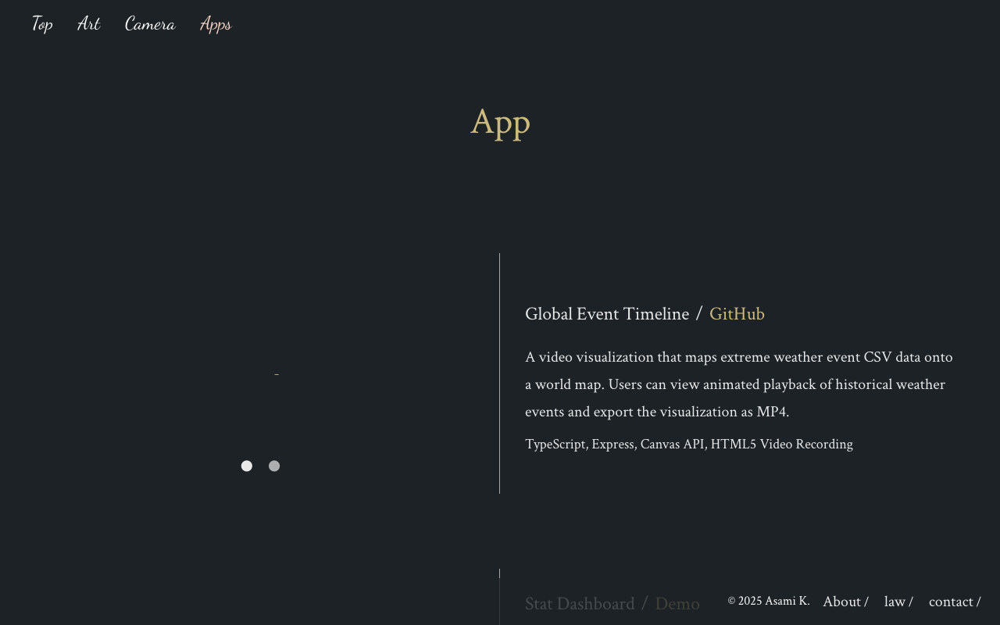
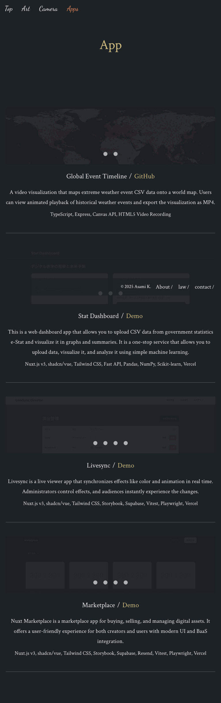
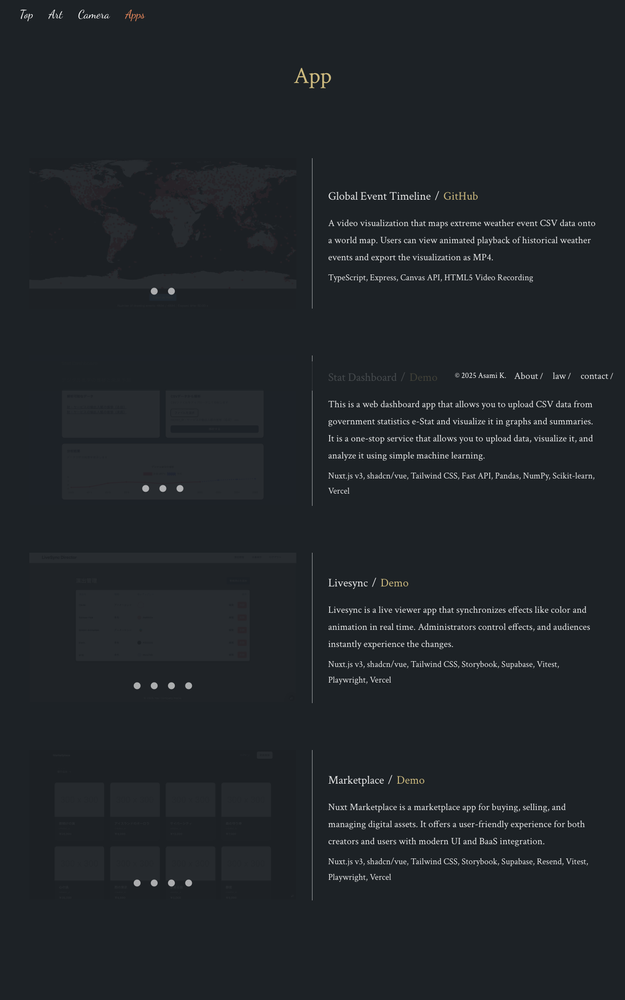

# Webapp Test Report

**Target URL:** https://asami.tokyo/apps
**Date:** 2025-11-20 22:32:46
**Status:** ❌ FAIL

## 1. Test Plan
## QAテストシナリオ: asami.tokyo/apps

このテストシナリオは、`https://asami.tokyo/apps` ページの主要な機能、表示、インタラクションを網羅的に検証することを目的としています。正常系、異常系、および境界値のテストケースを含み、Playwrightによる自動化を想定した手順と期待結果を記述します。

---

### 1. ページ全体の表示と基本機能のテスト

#### 1.1. ページロードとタイトル表示

*   **目的:** `https://asami.tokyo/apps` ページが正しくロードされ、適切なページタイトルが表示されることを確認する。
*   **手順:**
    1.  ブラウザで `https://asami.tokyo/apps` にアクセスする。
*   **期待される結果:**
    1.  ページが正常にロードされる (HTTPステータスコード200)。
    2.  ページタイトルが「Apps」またはそれに類する内容 (例: "Asami K. - Apps") で表示される。
*   **Playwright自動化のポイント:**
    *   `await page.goto('https://asami.tokyo/apps');`
    *   `await expect(page).toHaveTitle(/Apps/i);`
    *   `await expect(page).toHaveURL('https://asami.tokyo/apps');`

#### 1.2. ヘッダーナビゲーションの表示とリンク検証

*   **目的:** ヘッダー部分のナビゲーションメニューが正しく表示され、各リンクが適切なURLに遷移することを確認する。
*   **手順:**
    1.  `https://asami.tokyo/apps` にアクセスする。
    2.  ヘッダー内の「Top」リンクが表示されていることを確認し、クリックする。
    3.  URLが `https://asami.tokyo/` に遷移することを確認する。
    4.  ブラウザの「戻る」ボタンで「Apps」ページに戻る。
    5.  「Art」リンクが表示されていることを確認し、クリックする。
    6.  URLが `https://asami.tokyo/art` に遷移することを確認する。
    7.  ブラウザの「戻る」ボタンで「Apps」ページに戻る。
    8.  「Camera」リンクが表示されていることを確認し、クリックする。
    9.  URLが `https://asami.tokyo/camera` に遷移することを確認する。
    10. ブラウザの「戻る」ボタンで「Apps」ページに戻る。
    11. 「Apps」リンクが表示されていることを確認する（現在のページ）。
*   **期待される結果:**
    1.  「Top」「Art」「Camera」「Apps」の各ナビゲーションリンクがヘッダーに表示される。
    2.  各リンククリック後、期待されるURLに正確に遷移する。
    3.  「Apps」リンクは現在のページを示すため、クリックしてもURLは `https://asami.tokyo/apps` のままである (またはクリック不能)。
*   **Playwright自動化のポイント:**
    *   `await page.locator('header nav a:has-text("Top")').click();`
    *   `await expect(page).toHaveURL('https://asami.tokyo/');`
    *   `await page.goBack();` (各リンクに対して繰り返す)
    *   `await expect(page.locator('header nav a:has-text("Apps")')).toBeVisible();`

#### 1.3. フッターコンテンツの表示とリンク検証

*   **目的:** フッター部分に著作権表示とナビゲーションリンクが正しく表示され、各リンクが適切なURLに遷移することを確認する。
*   **手順:**
    1.  `https://asami.tokyo/apps` にアクセスする。
    2.  フッター部分が表示されていることを確認する。
    3.  著作権表示「© 2025 Asami K.」が表示されていることを確認する。
    4.  「About」リンクが表示されていることを確認し、クリックする。
    5.  URLが `https://asami.tokyo/about` に遷移することを確認する。
    6.  ブラウザの「戻る」ボタンで「Apps」ページに戻る。
    7.  「law」リンクが表示されていることを確認し、クリックする。
    8.  URLが `https://asami.tokyo/law` に遷移することを確認する。
    9.  ブラウザの「戻る」ボタンで「Apps」ページに戻る。
    10. 「contact」リンクが表示されていることを確認し、クリックする。
    11. URLが `https://asami.tokyo/contact` に遷移することを確認する。
*   **期待される結果:**
    1.  フッターがページの最下部に表示される。
    2.  「© 2025 Asami K.」が正確に表示される。
    3.  「About」「law」「contact」の各リンクがクリック可能であり、それぞれ期待されるURLに遷移する。
*   **Playwright自動化のポイント:**
    *   `await expect(page.locator('footer')).toBeVisible();`
    *   `await expect(page.locator('footer').getByText('© 2025 Asami K.')).toBeVisible();`
    *   `await page.locator('footer a:has-text("About")').click();`
    *   `await expect(page).toHaveURL('https://asami.tokyo/about');`
    *   `await page.goBack();` (各リンクに対して繰り返す)

---

### 2. 各アプリケーション紹介セクションのテスト

#### 2.1. 「Global Event Timeline」カードの表示とコンテンツ検証

*   **目的:** 「Global Event Timeline」アプリケーションの紹介カードが正しく表示され、タイトル、説明、技術スタック、GitHubリンクが正しいことを確認する。
*   **手順:**
    1.  `https://asami.tokyo/apps` にアクセスする。
    2.  「Global Event Timeline」のカード（またはセクション）が表示されていることを確認する。
    3.  タイトル「Global Event Timeline」が表示されていることを確認する。
    4.  説明テキスト「A video visualization that maps extreme weather event CSV data onto a world map. Users can view animated playback of historical weather events and export the visualization as MP4.」が表示されていることを確認する。
    5.  技術スタック「TypeScript, Express, Canvas API, HTML5 Video Recording」が表示されていることを確認する。
    6.  「GitHub」リンクが表示されていることを確認し、クリックする。
    7.  URLがGitHubの関連リポジトリURL（例: `https://github.com/ユーザー名/リポジトリ名`）に遷移することを確認する。
*   **期待される結果:**
    1.  カードがページ内に表示される。
    2.  タイトル、説明、技術スタックのテキストが正確に表示される。
    3.  「GitHub」リンクがクリック可能であり、GitHubの関連リポジトリURLに遷移する。
*   **Playwright自動化のポイント:**
    *   `const card = page.locator('section').filter({ has: page.locator('h2:has-text("Global Event Timeline")') });` (カードを特定する適切なセレクタを使用)
    *   `await expect(card).toBeVisible();`
    *   `await expect(card.locator('h2')).toContainText('Global Event Timeline');`
    *   `await expect(card.locator('p').nth(0)).toContainText('A video visualization that maps extreme weather event CSV data onto a world map.');`
    *   `await expect(card.locator('p').nth(1)).toContainText('TypeScript, Express, Canvas API, HTML5 Video Recording');`
    *   `await card.locator('a:has-text("GitHub")').click();`
    *   `await expect(page).toHaveURL(/github\.com/);`

#### 2.2. 「Stat Dashboard」カードの表示とコンテンツ検証

*   **目的:** 「Stat Dashboard」アプリケーションの紹介カードが正しく表示され、タイトル、説明、技術スタック、Demoリンクが正しいことを確認する。
*   **手順:**
    1.  `https://asami.tokyo/apps` にアクセスする。
    2.  「Stat Dashboard」のカードが表示されていることを確認する。
    3.  タイトル「Stat Dashboard」が表示されていることを確認する。
    4.  説明テキスト「This is a web dashboard app that allows you to upload CSV data from government statistics e-Stat and visualize it in graphs and summaries. It is a one-stop service that allows you to upload data, visualize it, and analyze it using simple machine learning.」が表示されていることを確認する。
    5.  技術スタック「Nuxt.js v3, shadcn/vue, Tailwind CSS, Fast API, Pandas, NumPy, Scikit-learn, Vercel」が表示されていることを確認する。
    6.  「Demo」リンクが表示されていることを確認し、クリックする。
    7.  URLがデモアプリケーションのURL（例: `https://stat-dashboard.example.com`）に遷移することを確認する。
*   **期待される結果:**
    1.  カードがページ内に表示される。
    2.  タイトル、説明、技術スタックのテキストが正確に表示される。
    3.  「Demo」リンクがクリック可能であり、デモアプリケーションのURLに遷移する。
*   **Playwright自動化のポイント:** 2.1と同様のパターンでセレクタとテキスト内容を調整。

#### 2.3. 「Livesync」カードの表示とコンテンツ検証

*   **目的:** 「Livesync」アプリケーションの紹介カードが正しく表示され、タイトル、説明、技術スタック、Demoリンクが正しいことを確認する。
*   **手順:**
    1.  `https://asami.tokyo/apps` にアクセスする。
    2.  「Livesync」のカードが表示されていることを確認する。
    3.  タイトル「Livesync」が表示されていることを確認する。
    4.  説明テキスト「Livesync is a live viewer app that synchronizes effects like color and animation in real time. Administrators control effects, and audiences instantly experience the changes.」が表示されていることを確認する。
    5.  技術スタック「Nuxt.js v3, shadcn/vue, Tailwind CSS, Storybook, Supabase, Vitest, Playwright, Vercel」が表示されていることを確認する。
    6.  「Demo」リンクが表示されていることを確認し、クリックする。
    7.  URLがデモアプリケーションのURL（例: `https://livesync.example.com`）に遷移することを確認する。
*   **期待される結果:**
    1.  カードがページ内に表示される。
    2.  タイトル、説明、技術スタックのテキストが正確に表示される。
    3.  「Demo」リンクがクリック可能であり、デモアプリケーションのURLに遷移する。
*   **Playwright自動化のポイント:** 2.1と同様のパターンでセレクタとテキスト内容を調整。

#### 2.4. 「Marketplace」カードの表示とコンテンツ検証

*   **目的:** 「Marketplace」アプリケーションの紹介カードが正しく表示され、タイトル、説明、技術スタック、Demoリンクが正しいことを確認する。
*   **手順:**
    1.  `https://asami.tokyo/apps` にアクセスする。
    2.  「Marketplace」のカードが表示されていることを確認する。
    3.  タイトル「Marketplace」が表示されていることを確認する。
    4.  説明テキスト「Nuxt Marketplace is a marketplace app for buying, selling, and managing digital assets. It offers a user-friendly experience for both creators and users with modern UI and BaaS integration.」が表示されていることを確認する。
    5.  技術スタック「Nuxt.js v3, shadcn/vue, Tailwind CSS, Storybook, Supabase, Resend, Vitest, Playwright, Vercel」が表示されていることを確認する。
    6.  「Demo」リンクが表示されていることを確認し、クリックする。
    7.  URLがデモアプリケーションのURL（例: `https://marketplace.example.com`）に遷移することを確認する。
*   **期待される結果:**
    1.  カードがページ内に表示される。
    2.  タイトル、説明、技術スタックのテキストが正確に表示される。
    3.  「Demo」リンクがクリック可能であり、デモアプリケーションのURLに遷移する。
*   **Playwright自動化のポイント:** 2.1と同様のパターンでセレクタとテキスト内容を調整。

#### 2.5. アプリケーションカード内の"lens"アイコンの表示

*   **目的:** 各アプリケーションカードに表示されている"lens"アイコン（画像）が正しく表示されていることを確認する。
*   **手順:**
    1.  `https://asami.tokyo/apps` にアクセスする。
    2.  各アプリケーションカードに配置されている「lens」アイコンが表示されていることを確認する。
    3.  画像が壊れていないことを確認する。
*   **期待される結果:**
    1.  すべての「lens」アイコンが正常に表示される。
    2.  画像の読み込みエラーが発生しておらず、プレースホルダーや壊れた画像アイコンが表示されない。
*   **Playwright自動化のポイント:**
    *   `const images = page.locator('img[alt="lens"]');`
    *   `await expect(images.count()).toBeGreaterThan(0);` (画像が存在することを確認)
    *   `for (const img of await images.all()) { await expect(img).toBeVisible(); }` (すべての画像が表示されていることを確認)
    *   視覚的な回帰テストとして `await expect(page).toHaveScreenshot({ fullPage: true });` を実行し、事前に用意したゴールデンマスターと比較する。

---

### 3. レスポンシブデザインのテスト (境界値)

#### 3.1. スマートフォンビューポートでのレイアウト検証

*   **目的:** スマートフォンサイズのビューポートでページレイアウトが崩れず、コンテンツが適切に表示されることを確認する。
*   **手順:**
    1.  ビューポートサイズをスマートフォン相当（例: 幅375px, 高さ667px）に設定し、`https://asami.tokyo/apps` にアクセスする。
    2.  ヘッダー、フッター、各アプリケーションカードの表示、テキストの折り返し、画像の表示位置が適切かを確認する。
*   **期待される結果:**
    1.  ヘッダーがレスポンシブデザインに対応し、例えばハンバーガーメニューが表示される、または要素が適切に配置される。
    2.  各アプリケーションカードが縦一列に配置されるなど、スマートフォンに適したレイアウトで表示される。
    3.  テキストや画像が画面からはみ出したり、不自然な位置に表示されたりしない。
*   **Playwright自動化のポイント:**
    *   `await page.setViewportSize({ width: 375, height: 667 });`
    *   `await page.goto('https://asami.tokyo/apps');`
    *   `await expect(page).toHaveScreenshot('smartphone-layout.png', { fullPage: true });` (視覚的比較)

#### 3.2. タブレットビューポートでのレイアウト検証

*   **目的:** タブレットサイズのビューポートでページレイアウトが崩れず、コンテンツが適切に表示されることを確認する。
*   **手順:**
    1.  ビューポートサイズをタブレット相当（例: 幅768px, 高さ1024px）に設定し、`https://asami.tokyo/apps` にアクセスする。
    2.  ヘッダー、フッター、各アプリケーションカードの表示、テキストの折り返し、画像の表示位置が適切かを確認する。
*   **期待される結果:**
    1.  タブレットに適したレイアウトでヘッダー、フッターが表示される。
    2.  各アプリケーションカードが2列や1列など、タブレットに適した配置で表示される。
    3.  テキストや画像が画面からはみ出したり、不自然な位置に表示されたりしない。
*   **Playwright自動化のポイント:**
    *   `await page.setViewportSize({ width: 768, height: 1024 });`
    *   `await page.goto('https://asami.tokyo/apps');`
    *   `await expect(page).toHaveScreenshot('tablet-layout.png', { fullPage: true });` (視覚的比較)

---

### 4. 異常系テスト

#### 4.1. 存在しないURLへのアクセス

*   **目的:** 存在しないURLにアクセスした場合に、適切なエラーページが表示されることを確認する。
*   **手順:**
    1.  `https://asami.tokyo/apps/nonexistent-page` のような、存在しないと想定されるURLにアクセスする。
*   **期待される結果:**
    1.  ウェブサーバーまたはアプリケーションによって提供される404エラーページが表示される。
    2.  エラーページに「Not Found」「ページが見つかりません」などの適切なメッセージが表示される。
    3.  HTTPステータスコードが404である。
*   **Playwright自動化のポイント:**
    *   `const response = await page.goto('https://asami.tokyo/apps/nonexistent-page', { waitUntil: 'domcontentloaded' });`
    *   `expect(response?.status()).toBe(404);`
    *   `await expect(page.locator('h1, h2, p').filter({ hasText: /Not Found|ページが見つかりません/i })).toBeVisible();`

#### 4.2. 外部サイトへのリンク切れチェック (簡易版)

*   **目的:** アプリケーション紹介カードの「Demo」や「GitHub」リンクがリンク切れを起こしていないか、遷移後のHTTPステータスコードが正常であることを確認する。
*   **手順:**
    1.  `https://asami.tokyo/apps` にアクセスする。
    2.  各アプリケーションカードの「Demo」または「GitHub」リンクを特定する。
    3.  各リンクをクリックし、遷移先のページがロードされた後、HTTPステータスコードが200番台であることを確認する。
    4.  各リンククリック後、元の「Apps」ページに戻る。
*   **期待される結果:**
    1.  すべてのリンククリック後、遷移先のページが正常にロードされ、HTTPステータスコードが200番台（成功）である。
    2.  リンク先のページでエラーメッセージや404ページが表示されない。
*   **Playwright自動化のポイント:**
    *   リンクをループ処理し、各リンクで以下を実行:
        *   `const [response] = await Promise.all([ page.waitForNavigation(), linkLocator.click() ]);`
        *   `expect(response?.status()).toBe(200);`
        *   `await page.goBack();`
    *   **注意点:** 外部サイトへの大量アクセスを避けるため、このテストはテスト環境でのみ実行するか、特定のリンクに限定することが推奨されます。また、外部サイトの稼働状況に依存するため、安定性に欠ける場合があります。

#### 4.3. 画像読み込みエラー

*   **目的:** ページ内の画像がすべて正常に読み込まれていることを確認する。
*   **手順:**
    1.  `https://asami.tokyo/apps` にアクセスする。
    2.  ページ上のすべての画像（特に"lens"アイコン）が表示されているか、壊れた画像アイコンが表示されていないか確認する。
*   **期待される結果:**
    1.  すべての画像が正常に表示され、読み込みエラーが発生していない。
*   **Playwright自動化のポイント:**
    *   `page.on('requestfailed', request => { if (request.resourceType() === 'image') { console.error('Image failed to load:', request.url()); } });` (リクエスト失敗をコンソールに出力)
    *   `const brokenImages = await page.$$eval('img', (imgs) => imgs.filter(img => img.naturalWidth === 0 && img.naturalHeight === 0).map(img => img.src));`
    *   `expect(brokenImages).toEqual([]);` (壊れた画像がないことを確認)
    *   最も堅牢なのは `await expect(page).toHaveScreenshot({ fullPage: true });` によるビジュアルリグレッションテスト。

---

## 2. Execution Result
**Return Code:** 1

### Stdout
```text
============================= test session starts ==============================
platform darwin -- Python 3.11.5, pytest-8.4.2, pluggy-1.6.0
rootdir: /Users/asami/develop/app/ai-agent
plugins: base-url-2.1.0, playwright-0.7.1
collected 13 items

tests/generated/20251120_221722_asami_tokyo/test_asami_tokyo_apps.py FF. [ 23%]
FFFFF...F.                                                               [100%]

=================================== FAILURES ===================================
_______________________ test_page_load_and_title_display _______________________

page = <Page url='https://asami.tokyo/apps'>

    def test_page_load_and_title_display(page: Page):
        """
        1.1. ページロードとタイトル表示
        目的: `https://asami.tokyo/apps` ページが正しくロードされ、適切なページタイトルが表示されることを確認する。
        """
        try:
            # Action: Navigate to the apps page
            response = page.goto(APPS_URL)
    
            # Assert: Page loaded successfully (HTTP status code 200)
            assert response.status == 200, f"Expected 200 status, got {response.status} for {APPS_URL}"
    
            # Assert: Page title contains "Apps" (case-insensitive partial match)
            # Comment: Verifying the page title for correctness.
>           expect(page).to_have_title(re.compile("Apps", re.IGNORECASE))
E           AssertionError: Page title expected to be 're.compile('Apps', re.IGNORECASE)'
E           Actual value: App | asami.tokyo 
E           Call log:
E             - Expect "to_have_title" with timeout 5000ms
E               9 × unexpected value "App | asami.tokyo"

tests/generated/20251120_221722_asami_tokyo/test_asami_tokyo_apps.py:42: AssertionError
_______________________ test_header_navigation_and_links _______________________

page = <Page url='https://asami.tokyo/apps'>

    def test_header_navigation_and_links(page: Page):
        """
        1.2. ヘッダーナビゲーションの表示とリンク検証
        目的: ヘッダー部分のナビゲーションメニューが正しく表示され、各リンクが適切なURLに遷移することを確認する。
        """
        try:
            # Action: Navigate to the apps page
            page.goto(APPS_URL)
    
            # Test "Top" link
            # Comment: Verifying "Top" link visibility and navigation.
            top_link = page.get_by_role("link", name=re.compile("Top", re.IGNORECASE))
>           expect(top_link).to_be_visible()
E           AssertionError: Locator expected to be visible
E           Actual value: None
E           Error: element(s) not found 
E           Call log:
E             - Expect "to_be_visible" with timeout 5000ms
E             - waiting for get_by_role("link", name=re.compile(r"Top", re.IGNORECASE))

tests/generated/20251120_221722_asami_tokyo/test_asami_tokyo_apps.py:66: AssertionError
_______________________ test_global_event_timeline_card ________________________

page = <Page url='https://asami.tokyo/apps'>

    def test_global_event_timeline_card(page: Page):
        """
        2.1. 「Global Event Timeline」カードの表示とコンテンツ検証
        目的: 「Global Event Timeline」アプリケーションの紹介カードが正しく表示され、タイトル、説明、技術スタック、GitHubリンクが正しいことを確認する。
        """
        try:
            # Action: Navigate to the apps page
            page.goto(APPS_URL)
    
            # Locate the card using its heading
            card_title = "Global Event Timeline"
            # Comment: Locating the specific application card using its heading.
            card_locator = page.locator("section").filter(has=page.get_by_role("heading", name=re.compile(card_title, re.IGNORECASE)))
    
            # Assert: Card is visible
            # Comment: Verifying the card itself is displayed.
            expect(card_locator).to_be_visible()
            # Assert: Title is correct
            # Comment: Checking the main title of the card.
>           expect(card_locator.get_by_role("heading")).to_contain_text(card_title)
E           AssertionError: Locator expected to contain text 'Global Event Timeline'
E           Actual value: None
E           Error: strict mode violation: locator("section").filter(has=get_by_role("heading", name=re.compile(r"Global Event Timeline", re.IGNORECASE))).get_by_role("heading") resolved to 5 elements:
E               1) <h1 class="text-center text-accent q-mt-none mb-[3rem] text-[2rem] sm:text-[3rem] sm:mb-[7.5rem]">…</h1> aka get_by_role("heading", name="App")
E               2) <h2>Global Event Timeline</h2> aka get_by_role("heading", name="Global Event Timeline")
E               3) <h2>Stat Dashboard</h2> aka get_by_role("heading", name="Stat Dashboard")
E               4) <h2>Livesync</h2> aka get_by_role("heading", name="Livesync")
E               5) <h2>Marketplace</h2> aka get_by_role("heading", name="Marketplace")
E            
E           Call log:
E             - Expect "to_contain_text" with timeout 5000ms
E             - waiting for locator("section").filter(has=get_by_role("heading", name=re.compile(r"Global Event Timeline", re.IGNORECASE))).get_by_role("heading")

tests/generated/20251120_221722_asami_tokyo/test_asami_tokyo_apps.py:174: AssertionError
___________________________ test_stat_dashboard_card ___________________________

page = <Page url='https://asami.tokyo/apps'>

    def test_stat_dashboard_card(page: Page):
        """
        2.2. 「Stat Dashboard」カードの表示とコンテンツ検証
        目的: 「Stat Dashboard」アプリケーションの紹介カードが正しく表示され、タイトル、説明、技術スタック、Demoリンクが正しいことを確認する。
        """
        try:
            # Action: Navigate to the apps page
            page.goto(APPS_URL)
    
            card_title = "Stat Dashboard"
            # Comment: Locating the specific application card using its heading.
            card_locator = page.locator("section").filter(has=page.get_by_role("heading", name=re.compile(card_title, re.IGNORECASE)))
    
            # Assert: Card is visible
            expect(card_locator).to_be_visible()
            # Assert: Title is correct
>           expect(card_locator.get_by_role("heading")).to_contain_text(card_title)
E           AssertionError: Locator expected to contain text 'Stat Dashboard'
E           Actual value: None
E           Error: strict mode violation: locator("section").filter(has=get_by_role("heading", name=re.compile(r"Stat Dashboard", re.IGNORECASE))).get_by_role("heading") resolved to 5 elements:
E               1) <h1 class="text-center text-accent q-mt-none mb-[3rem] text-[2rem] sm:text-[3rem] sm:mb-[7.5rem]">…</h1> aka get_by_role("heading", name="App")
E               2) <h2>Global Event Timeline</h2> aka get_by_role("heading", name="Global Event Timeline")
E               3) <h2>Stat Dashboard</h2> aka get_by_role("heading", name="Stat Dashboard")
E               4) <h2>Livesync</h2> aka get_by_role("heading", name="Livesync")
E               5) <h2>Marketplace</h2> aka get_by_role("heading", name="Marketplace")
E            
E           Call log:
E             - Expect "to_contain_text" with timeout 5000ms
E             - waiting for locator("section").filter(has=get_by_role("heading", name=re.compile(r"Stat Dashboard", re.IGNORECASE))).get_by_role("heading")

tests/generated/20251120_221722_asami_tokyo/test_asami_tokyo_apps.py:224: AssertionError
______________________________ test_livesync_card ______________________________

page = <Page url='https://asami.tokyo/apps'>

    def test_livesync_card(page: Page):
        """
        2.3. 「Livesync」カードの表示とコンテンツ検証
        目的: 「Livesync」アプリケーションの紹介カードが正しく表示され、タイトル、説明、技術スタック、Demoリンクが正しいことを確認する。
        """
        try:
            # Action: Navigate to the apps page
            page.goto(APPS_URL)
    
            card_title = "Livesync"
            # Comment: Locating the specific application card using its heading.
            card_locator = page.locator("section").filter(has=page.get_by_role("heading", name=re.compile(card_title, re.IGNORECASE)))
    
            # Assert: Card is visible
            expect(card_locator).to_be_visible()
            # Assert: Title is correct
>           expect(card_locator.get_by_role("heading")).to_contain_text(card_title)
E           AssertionError: Locator expected to contain text 'Livesync'
E           Actual value: None
E           Error: strict mode violation: locator("section").filter(has=get_by_role("heading", name=re.compile(r"Livesync", re.IGNORECASE))).get_by_role("heading") resolved to 5 elements:
E               1) <h1 class="text-center text-accent q-mt-none mb-[3rem] text-[2rem] sm:text-[3rem] sm:mb-[7.5rem]">…</h1> aka get_by_role("heading", name="App")
E               2) <h2>Global Event Timeline</h2> aka get_by_role("heading", name="Global Event Timeline")
E               3) <h2>Stat Dashboard</h2> aka get_by_role("heading", name="Stat Dashboard")
E               4) <h2>Livesync</h2> aka get_by_role("heading", name="Livesync")
E               5) <h2>Marketplace</h2> aka get_by_role("heading", name="Marketplace")
E            
E           Call log:
E             - Expect "to_contain_text" with timeout 5000ms
E             - waiting for locator("section").filter(has=get_by_role("heading", name=re.compile(r"Livesync", re.IGNORECASE))).get_by_role("heading")

tests/generated/20251120_221722_asami_tokyo/test_asami_tokyo_apps.py:272: AssertionError
____________________________ test_marketplace_card _____________________________

page = <Page url='https://asami.tokyo/apps'>

    def test_marketplace_card(page: Page):
        """
        2.4. 「Marketplace」カードの表示とコンテンツ検証
        目的: 「Marketplace」アプリケーションの紹介カードが正しく表示され、タイトル、説明、技術スタック、Demoリンクが正しいことを確認する。
        """
        try:
            # Action: Navigate to the apps page
            page.goto(APPS_URL)
    
            card_title = "Marketplace"
            # Comment: Locating the specific application card using its heading.
            card_locator = page.locator("section").filter(has=page.get_by_role("heading", name=re.compile(card_title, re.IGNORECASE)))
    
            # Assert: Card is visible
            expect(card_locator).to_be_visible()
            # Assert: Title is correct
>           expect(card_locator.get_by_role("heading")).to_contain_text(card_title)
E           AssertionError: Locator expected to contain text 'Marketplace'
E           Actual value: None
E           Error: strict mode violation: locator("section").filter(has=get_by_role("heading", name=re.compile(r"Marketplace", re.IGNORECASE))).get_by_role("heading") resolved to 5 elements:
E               1) <h1 class="text-center text-accent q-mt-none mb-[3rem] text-[2rem] sm:text-[3rem] sm:mb-[7.5rem]">…</h1> aka get_by_role("heading", name="App")
E               2) <h2>Global Event Timeline</h2> aka get_by_role("heading", name="Global Event Timeline")
E               3) <h2>Stat Dashboard</h2> aka get_by_role("heading", name="Stat Dashboard")
E               4) <h2>Livesync</h2> aka get_by_role("heading", name="Livesync")
E               5) <h2>Marketplace</h2> aka get_by_role("heading", name="Marketplace")
E            
E           Call log:
E             - Expect "to_contain_text" with timeout 5000ms
E             - waiting for locator("section").filter(has=get_by_role("heading", name=re.compile(r"Marketplace", re.IGNORECASE))).get_by_role("heading")

tests/generated/20251120_221722_asami_tokyo/test_asami_tokyo_apps.py:320: AssertionError
_______________________ test_application_card_lens_icons _______________________

page = <Page url='https://asami.tokyo/apps'>

    def test_application_card_lens_icons(page: Page):
        """
        2.5. アプリケーションカード内の"lens"アイコンの表示
        目的: 各アプリケーションカードに表示されている"lens"アイコン（画像）が正しく表示されていることを確認する。
        """
        try:
            # Action: Navigate to the apps page
            page.goto(APPS_URL)
    
            # Locate all images with alt text "lens"
            # Comment: Finding all image elements expected to be "lens" icons.
            lens_icons = page.locator('img[alt="lens"]')
    
            # Assert: At least one lens icon exists and is visible
            # Comment: Ensuring there's at least one such icon and it renders.
>           expect(lens_icons.first()).to_be_visible()
                   ^^^^^^^^^^^^^^^^^^
E           TypeError: 'Locator' object is not callable

tests/generated/20251120_221722_asami_tokyo/test_asami_tokyo_apps.py:367: TypeError
___________________________ test_external_link_check ___________________________

page = <Page url='https://asami.tokyo/apps'>

    def test_external_link_check(page: Page):
        """
        4.2. 外部サイトへのリンク切れチェック (簡易版)
        目的: アプリケーション紹介カードの「Demo」や「GitHub」リンクがリンク切れを起こしていないか、遷移後のHTTPステータスコードが正常であることを確認する。
        """
        try:
            # Action: Navigate to the apps page
            page.goto(APPS_URL)
    
            # Define all external links to check
            external_links = [
                {"card_title": "Global Event Timeline", "link_name": "GitHub", "expected_url_regex": r"https://github\.com/"},
                {"card_title": "Stat Dashboard", "link_name": "Demo", "expected_url_regex": r"https://stat-dashboard\.example\.com"},
                {"card_title": "Livesync", "link_name": "Demo", "expected_url_regex": r"https://livesync\.example\.com"},
                {"card_title": "Marketplace", "link_name": "Demo", "expected_url_regex": r"https://marketplace\.example\.com"},
            ]
    
            for link_info in external_links:
                card_title = link_info["card_title"]
                link_name = link_info["link_name"]
                expected_url_regex = link_info["expected_url_regex"]
    
                # Locate the specific link within its card
                # Comment: Finding the target link for each external destination.
                card_locator = page.locator("section").filter(has=page.get_by_role("heading", name=re.compile(card_title, re.IGNORECASE)))
                target_link = card_locator.get_by_role("link", name=re.compile(link_name, re.IGNORECASE))
    
                # Assert: Link is visible before clicking
                # Comment: Ensuring the link is interactable.
                expect(target_link).to_be_visible()
    
                # Action: Click the link and wait for navigation to the external URL
                # Use 'load' event to ensure the external page has fully loaded
                # Comment: Clicking the link and waiting for the new page to load.
>               with page.expect_navigation(url=re.compile(expected_url_regex, re.IGNORECASE), wait_until="load") as navigation_info:

tests/generated/20251120_221722_asami_tokyo/test_asami_tokyo_apps.py:496: 
_ _ _ _ _ _ _ _ _ _ _ _ _ _ _ _ _ _ _ _ _ _ _ _ _ _ _ _ _ _ _ _ _ _ _ _ _ _ _ _ 
.venv/lib/python3.11/site-packages/playwright/_impl/_sync_base.py:85: in __exit__
    self._event.value
.venv/lib/python3.11/site-packages/playwright/_impl/_sync_base.py:59: in value
    raise exception
_ _ _ _ _ _ _ _ _ _ _ _ _ _ _ _ _ _ _ _ _ _ _ _ _ _ _ _ _ _ _ _ _ _ _ _ _ _ _ _ 

    async def continuation() -> Optional[Response]:
>       event = await waiter.result()
                ^^^^^^^^^^^^^^^^^^^^^
E       playwright._impl._errors.TimeoutError: Timeout 30000ms exceeded.
E       =========================== logs ===========================
E       waiting for navigation to "re.compile('https://github\\.com/', re.IGNORECASE)" until 'load'
E       ============================================================

.venv/lib/python3.11/site-packages/playwright/_impl/_frame.py:239: TimeoutError

During handling of the above exception, another exception occurred:

page = <Page url='https://asami.tokyo/apps'>

    def test_external_link_check(page: Page):
        """
        4.2. 外部サイトへのリンク切れチェック (簡易版)
        目的: アプリケーション紹介カードの「Demo」や「GitHub」リンクがリンク切れを起こしていないか、遷移後のHTTPステータスコードが正常であることを確認する。
        """
        try:
            # Action: Navigate to the apps page
            page.goto(APPS_URL)
    
            # Define all external links to check
            external_links = [
                {"card_title": "Global Event Timeline", "link_name": "GitHub", "expected_url_regex": r"https://github\.com/"},
                {"card_title": "Stat Dashboard", "link_name": "Demo", "expected_url_regex": r"https://stat-dashboard\.example\.com"},
                {"card_title": "Livesync", "link_name": "Demo", "expected_url_regex": r"https://livesync\.example\.com"},
                {"card_title": "Marketplace", "link_name": "Demo", "expected_url_regex": r"https://marketplace\.example\.com"},
            ]
    
            for link_info in external_links:
                card_title = link_info["card_title"]
                link_name = link_info["link_name"]
                expected_url_regex = link_info["expected_url_regex"]
    
                # Locate the specific link within its card
                # Comment: Finding the target link for each external destination.
                card_locator = page.locator("section").filter(has=page.get_by_role("heading", name=re.compile(card_title, re.IGNORECASE)))
                target_link = card_locator.get_by_role("link", name=re.compile(link_name, re.IGNORECASE))
    
                # Assert: Link is visible before clicking
                # Comment: Ensuring the link is interactable.
                expect(target_link).to_be_visible()
    
                # Action: Click the link and wait for navigation to the external URL
                # Use 'load' event to ensure the external page has fully loaded
                # Comment: Clicking the link and waiting for the new page to load.
                with page.expect_navigation(url=re.compile(expected_url_regex, re.IGNORECASE), wait_until="load") as navigation_info:
                    target_link.click()
    
                # Assert: URL has navigated to the expected external site
                # Comment: Verifying the browser is on the correct external URL.
                expect(page).to_have_url(re.compile(expected_url_regex, re.IGNORECASE))
    
                # Assert: The response status is 200 (success)
                # Comment: Checking that the external page loaded without an HTTP error.
                assert navigation_info.value.status == 200, \
                    f"Link '{link_name}' for '{card_title}' returned status {navigation_info.value.status} " \
                    f"at {page.url} instead of 200."
    
                # Action: Go back to the apps page to test the next link
                page.go_back()
                # Comment: Confirming return to the original page before checking the next link.
                expect(page).to_have_url(APPS_URL)
    
            page.screenshot(path=os.path.join(SAVE_DIR, "4_2_external_links_check.png"))
    
        except Error as e:
>           pytest.fail(f"Playwright error during external link check test: {e}")
E           Failed: Playwright error during external link check test: Timeout 30000ms exceeded.
E           =========================== logs ===========================
E           waiting for navigation to "re.compile('https://github\\.com/', re.IGNORECASE)" until 'load'
E           ============================================================

tests/generated/20251120_221722_asami_tokyo/test_asami_tokyo_apps.py:517: Failed
=========================== short test summary info ============================
FAILED tests/generated/20251120_221722_asami_tokyo/test_asami_tokyo_apps.py::test_page_load_and_title_display
FAILED tests/generated/20251120_221722_asami_tokyo/test_asami_tokyo_apps.py::test_header_navigation_and_links
FAILED tests/generated/20251120_221722_asami_tokyo/test_asami_tokyo_apps.py::test_global_event_timeline_card
FAILED tests/generated/20251120_221722_asami_tokyo/test_asami_tokyo_apps.py::test_stat_dashboard_card
FAILED tests/generated/20251120_221722_asami_tokyo/test_asami_tokyo_apps.py::test_livesync_card
FAILED tests/generated/20251120_221722_asami_tokyo/test_asami_tokyo_apps.py::test_marketplace_card
FAILED tests/generated/20251120_221722_asami_tokyo/test_asami_tokyo_apps.py::test_application_card_lens_icons
FAILED tests/generated/20251120_221722_asami_tokyo/test_asami_tokyo_apps.py::test_external_link_check
========================= 8 failed, 5 passed in 53.40s =========================

```

### Stderr
```text

```

## 3. Screenshots

**Total Screenshots:** 13

### 1 3 Footer Content


### 3 1 Smartphone Layout


### 3 2 Tablet Layout


### 4 1 Nonexistent Url


### 4 3 Image Loading


### Art-Tc-008 Mobile Screenshot


### Art-Tc-009 Tablet Screenshot


### Art-Tc-010 Desktop Screenshot


### Fail Screenshot Tc 001 Page Load And Title


### Fail Screenshot Tc 002 Main Content Display


### Fail Screenshot Tc 003 Top Link Navigation


### Fail Screenshot Tc 004 Art Link Navigation


### Fail Screenshot Tc 005 Apps Link Navigation


