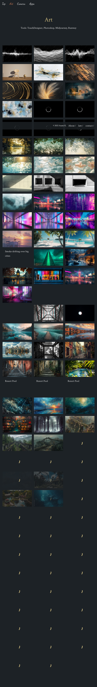

# Webapp Test Report

**Target URL:** https://asami.tokyo/camera
**Date:** 2025-11-20 22:29:46
**Status:** ❌ FAIL

## 1. Test Plan
## Webページテストシナリオ: `https://asami.tokyo/camera`

### 1. はじめに

このドキュメントは、指定されたURL `https://asami.tokyo/camera` のWebページに対する網羅的なテストシナリオを記述します。主な機能の特定、正常系・異常系・境界値の考慮、Playwrightでの自動化可能性に焦点を当てています。

*   **目的:** ページの品質保証、機能の網羅的な検証、ユーザーエクスペリエンスの向上。
*   **テスト対象URL:** `https://asami.tokyo/camera`
*   **テスト範囲:**
    *   ページの表示と基本要素の検証
    *   グローバルナビゲーションの機能検証
    *   「Tools」セクションのリンク検証
    *   ギャラリー/作品リストの表示とインタラクション検証
    *   フッターの表示とリンク検証
*   **テスト環境:**
    *   ブラウザ: Chromium (Playwrightデフォルト)
    *   OS: 任意

### 2. テストシナリオサマリー

| 機能カテゴリ             | 正常系 | 異常系/境界値 | 合計 |
| :----------------------- | :----- | :------------ | :--- |
| ページロードと基本表示   | 2      | 0             | 2    |
| グローバルナビゲーション | 3      | 1             | 4    |
| Toolsセクション          | 4      | 1             | 5    |
| ギャラリー/作品表示      | 3      | 1             | 4    |
| フッター                 | 3      | 0             | 3    |
| **合計**                 | **15** | **3**         | **18** |

### 3. テストシナリオ詳細

#### 3.1. ページロードと基本表示テスト

**機能概要:** ページが正しくロードされ、主要なコンテンツが期待通りに表示されることを確認します。

| TC-ID | テスト目的                               | テスト手順                                                                                                                                                                                                               | 期待される結果                                                                                                                                                                         | Playwright自動化のポイント                                                                                                                                                                                                                                                                                                                                                                                                  |
| :---- | :--------------------------------------- | :----------------------------------------------------------------------------------------------------------------------------------------------------------------------------------------------------------------------- | :------------------------------------------------------------------------------------------------------------------------------------------------------------------------------------- | :-------------------------------------------------------------------------------------------------------------------------------------------------------------------------------------------------------------------------------------------------------------------------------------------------------------------------------------------------------------------------------------------------------------------- |
| TC-001 | ページの正常ロードとタイトル表示           | 1. `https://asami.tokyo/camera` にアクセスする。                                                                                                                                                                         | 1. ページがHTTP 200 OKでロードされる。<br>2. ブラウザのタイトルが「Camera - asami.tokyo」または類似の適切なタイトルである。<br>3. ページの主要コンテンツ（ヘッダー、ナビゲーション、コンテンツ領域、フッター）が表示される。 | `page.goto('https://asami.tokyo/camera');`<br>`expect(page.status()).toBe(200);`<br>`expect(page).toHaveTitle(/Camera/);`<br>`expect(page.getByRole('navigation')).toBeVisible();`<br>`expect(page.getByRole('contentinfo')).toBeVisible();` (フッターのロールを想定) |
| TC-002 | 主要なページコンテンツの表示確認           | 1. `https://asami.tokyo/camera` にアクセスする。<br>2. ページの主要な見出し、ナビゲーション、Toolsセクション、ギャラリーアイテム、フッターが表示されていることを確認する。                                                | 1. ページタイトル「Camera」が表示される。<br>2. グローバルナビゲーション（Top, Art, Camera, Apps）が表示される。<br>3. 「Tools」セクションのヘッダーと各ツール名が表示される。<br>4. ギャラリーアイテム（例: Water's Edge, stream）が表示される。<br>5. フッター（© 2025 Asami K., About / law / contact）が表示される。 | `expect(page.getByRole('heading', { name: 'Camera' })).toBeVisible();`<br>`expect(page.getByText('Tools:')).toBeVisible();`<br>`expect(page.getByText('Water\'s Edge').first()).toBeVisible();`<br>`expect(page.getByText('© 2025 Asami K.')).toBeVisible();` |

#### 3.2. グローバルナビゲーションテスト

**機能概要:** ヘッダーに表示されるグローバルナビゲーションリンクが正しく機能し、適切なページへ遷移することを確認します。

| TC-ID | テスト目的                                   | テスト手順                                                                                                                                                                     | 期待される結果                                                                                                                                             | Playwright自動化のポイント                                                                                                                                                                                                    |
| :---- | :------------------------------------------- | :--------------------------------------------------------------------------------------------------------------------------------------------------------------------- | :--------------------------------------------------------------------------------------------------------------------------------------------------------- | :-------------------------------------------------------------------------------------------------------------------------------------------------------------------------------------------------------------------------- |
| TC-003 | 「Top」リンクの正常動作確認                    | 1. `https://asami.tokyo/camera` にアクセスする。<br>2. 「Top」リンクをクリックする。                                                                                      | 1. トップページ (`https://asami.tokyo/` または `/`) へ遷移する。<br>2. トップページの主要コンテンツが正しく表示される。                                     | `await page.getByRole('link', { name: 'Top' }).click();`<br>`expect(page).toHaveURL(/asami.tokyo\/?$/);`<br>`expect(page.getByRole('heading').first()).toBeVisible();` (トップページのタイトルなど)                                |
| TC-004 | 「Art」リンクの正常動作確認                    | 1. `https://asami.tokyo/camera` にアクセスする。<br>2. 「Art」リンクをクリックする。                                                                                      | 1. 「Art」ページ (`https://asami.tokyo/art` または類似) へ遷移する。<br>2. 「Art」ページの主要コンテンツが正しく表示される。                               | `await page.getByRole('link', { name: 'Art' }).click();`<br>`expect(page).toHaveURL(/asami.tokyo\/art/);`<br>`expect(page.getByRole('heading', { name: 'Art' })).toBeVisible();`                                          |
| TC-005 | 「Apps」リンクの正常動作確認                   | 1. `https://asami.tokyo/camera` にアクセスする。<br>2. 「Apps」リンクをクリックする。                                                                                     | 1. 「Apps」ページ (`https://asami.tokyo/apps` または類似) へ遷移する。<br>2. 「Apps」ページの主要コンテンツが正しく表示される。                             | `await page.getByRole('link', { name: 'Apps' }).click();`<br>`expect(page).toHaveURL(/asami.tokyo\/apps/);`<br>`expect(page.getByRole('heading', { name: 'Apps' })).toBeVisible();`                                         |
| TC-006 | 「Camera」リンク（現在ページ）の挙動確認 (境界値) | 1. `https://asami.tokyo/camera` にアクセスする。<br>2. 現在のページを示す「Camera」リンク（またはテキスト）をクリックする。 (リンクであると仮定。リンクでなければクリック不可) | 1. ページが再読み込みされるか、または何も起こらない。<br>2. URLは `https://asami.tokyo/camera` のままである。<br>3. ページコンテンツに変更がない。 | `await page.getByRole('link', { name: 'Camera', exact: true }).click();`<br>`expect(page).toHaveURL(/asami.tokyo\/camera/);`<br>`expect(page.getByRole('heading', { name: 'Camera' })).toBeVisible();` (再読み込み後の要素確認) |

#### 3.3. Toolsセクションテスト

**機能概要:** 撮影機材や編集ソフトの一覧が正しく表示され、それぞれのリンクが機能することを確認します。

| TC-ID | テスト目的                                   | テスト手順                                                                                                                                                                                                 | 期待される結果                                                                                                                                                                    | Playwright自動化のポイント                                                                                                                                                                                                                                                                                                                      |
| :---- | :------------------------------------------- | :------------------------------------------------------------------------------------------------------------------------------------------------------------------------------------------------- | :-------------------------------------------------------------------------------------------------------------------------------------------------------------------------------- | :---------------------------------------------------------------------------------------------------------------------------------------------------------------------------------------------------------------------------------------------------------------------------------------------------------------------------------------------- |
| TC-007 | 各ツール名の表示確認                           | 1. `https://asami.tokyo/camera` にアクセスする。<br>2. 「Tools」セクションにあるすべてのツール名（DJI Osmo Pocket 3, DJI Action 2, Google Pixel 8 Pro, Davinci Resolve）が表示されていることを確認する。 | 1. すべてのツール名がページの「Tools」セクションに表示される。                                                                                                                     | `expect(page.getByText('DJI Osmo Pocket 3')).toBeVisible();`<br>`expect(page.getByText('DJI Action 2')).toBeVisible();`<br>`expect(page.getByText('Google Pixel 8 Pro')).toBeVisible();`<br>`expect(page.getByText('Davinci Resolve')).toBeVisible();` |
| TC-008 | 「DJI Osmo Pocket 3」リンクの正常動作確認      | 1. `https://asami.tokyo/camera` にアクセスする。<br>2. 「DJI Osmo Pocket 3」リンクをクリックする。                                                                                                     | 1. 新しいタブでDJI Osmo Pocket 3の公式サイトまたは製品ページが開く（`target="_blank"`の場合）。<br>2. 遷移先のURLがDJI Osmo Pocket 3に関連するものである。                      | `const [newPage] = await Promise.all([`<br>`  page.waitForEvent('popup'),`<br>`  page.getByRole('link', { name: 'DJI Osmo Pocket 3' }).click(),`<br>`]);`<br>`expect(newPage.url()).toMatch(/dji\.com.*pocket-3/i);` (正規表現でURL検証) |
| TC-009 | 「DJI Action 2」リンクの正常動作確認           | 1. `https://asami.tokyo/camera` にアクセスする。<br>2. 「DJI Action 2」リンクをクリックする。                                                                                                         | 1. 新しいタブでDJI Action 2の公式サイトまたは製品ページが開く。<br>2. 遷移先のURLがDJI Action 2に関連するものである。                                                              | `const [newPage] = await Promise.all([page.waitForEvent('popup'), page.getByRole('link', { name: 'DJI Action 2' }).click()]);`<br>`expect(newPage.url()).toMatch(/dji\.com.*action-2/i);`                                 |
| TC-010 | 「Google Pixel 8 Pro」リンクの正常動作確認     | 1. `https://asami.tokyo/camera` にアクセスする。<br>2. 「Google Pixel 8 Pro」リンクをクリックする。                                                                                                   | 1. 新しいタブでGoogle Pixel 8 Proの公式サイトまたは製品ページが開く。<br>2. 遷移先のURLがGoogle Pixel 8 Proに関連するものである。                                                 | `const [newPage] = await Promise.all([page.waitForEvent('popup'), page.getByRole('link', { name: 'Google Pixel 8 Pro' }).click()]);`<br>`expect(newPage.url()).toMatch(/store\.google\.com.*pixel-8-pro/i);`                         |
| TC-011 | 「Davinci Resolve」リンクの正常動作確認        | 1. `https://asami.tokyo/camera` にアクセスする。<br>2. 「Davinci Resolve」リンクをクリックする。                                                                                                       | 1. 新しいタブでDavinci Resolveの公式サイトまたは製品ページが開く。<br>2. 遷移先のURLがDavinci Resolveに関連するものである。                                                      | `const [newPage] = await Promise.all([page.waitForEvent('popup'), page.getByRole('link', { name: 'Davinci Resolve' }).click()]);`<br>`expect(newPage.url()).toMatch(/blackmagicdesign\.com.*davinci-resolve/i);`                 |

#### 3.4. ギャラリー/作品表示テスト

**機能概要:** ページに表示される写真や動画のギャラリーアイテムが正しく表示され、それぞれのインタラクションが機能することを確認します。

| TC-ID | テスト目的                                           | テスト手順                                                                                                                                                                                                                                                                                                                                                         | 期待される結果                                                                                                                                                                                                                                                                                                                            | Playwright自動化のポイント                                                                                                                                                                                                                                                                                                                                                                                                                                                                                                                                                              |
| :---- | :--------------------------------------------------- | :----------------------------------------------------------------------------------------------------------------------------------------------------------------------------------------------------------------------------------------------------------------------------------------------------------------------------------------------------------------- | :------------------------------------------------------------------------------------------------------------------------------------------------------------------------------------------------------------------------------------------------------------------------------------------------------------------------------------------ | :-------------------------------------------------------------------------------------------------------------------------------------------------------------------------------------------------------------------------------------------------------------------------------------------------------------------------------------------------------------------------------------------------------------------------------------------------------------------------------------------------------------------------------------------------------------------------------------- |
| TC-012 | 全てのギャラリーアイテムの表示確認                   | 1. `https://asami.tokyo/camera` にアクセスする。<br>2. ページに記載されている全ての作品タイトル（Water's Edge, stream, walk in sunset, sunset coast, Port Tower, Palm Tree, ship enters the port, Sunset with bird）が表示されていることを確認する。各「Water's Edge」が個別の要素として表示されていることも確認する。 | 1. すべての作品タイトルがページに表示される。<br>2. 各タイトルには対応するサムネイル画像が紐づいており、正しくロードされ表示されている。<br>3. 「Water's Edge」というテキストの要素が11個表示される。                                                                                                                  | `expect(page.getByText('Water\'s Edge')).toHaveCount(11);`<br>`expect(page.getByText('stream')).toBeVisible();`<br>`expect(page.getByText('walk in sunset')).toBeVisible();`<br>`expect(page.getByRole('img', { name: /Water's Edge/ }).first()).toBeVisible();` (画像が紐づいていると仮定) |
| TC-013 | 各ギャラリーアイテムのクリック動作確認 (正常系)      | 1. `https://asami.tokyo/camera` にアクセスする。<br>2. 最初の「Water's Edge」アイテムをクリックする。<br>3. 「stream」アイテムをクリックする。                                                                                                                                                                                                         | 1. 「Water's Edge」クリック後、画像拡大表示モーダルまたは詳細ページが表示される。<br>2. 表示されたコンテンツが「Water's Edge」に関連するものである。<br>3. 「stream」クリック後も同様に、詳細が表示され、コンテンツが「stream」に関連するものである。<br>4. モーダルの場合、閉じることができる。                                   | `await page.getByText('Water\'s Edge').first().click();`<br>`expect(page.locator('.modal-content')).toBeVisible();` (モーダルを想定)<br>`expect(page.locator('.modal-content h2')).toHaveText(/Water's Edge/);`<br>`await page.keyboard.press('Escape');` (モーダルを閉じる想定) |
| TC-014 | 各「Water's Edge」アイテムのユニーク性確認 (境界値) | 1. `https://asami.tokyo/camera` にアクセスする。<br>2. 最初の「Water's Edge」アイテムをクリックし、表示内容を確認する。<br>3. 2番目の「Water's Edge」アイテムをクリックし、表示内容を確認する。<br>4. 同様に、全ての「Water's Edge」アイテムについて表示内容を確認する。                                                                       | 1. 各「Water's Edge」アイテムをクリックすると、異なる画像や詳細コンテンツが表示される。<br> (もし同じコンテンツが表示される場合は、これは設計上の意図かバグか確認が必要)                  | `const waterEdges = page.getByText('Water\'s Edge');`<br>`for (let i = 0; i < await waterEdges.count(); i++) {`<br>`  await waterEdges.nth(i).click();`<br>`  await expect(page.locator('.modal-image')).toHaveCount(1);` (画像が1つ表示されることを確認)<br>`  // ここで表示される画像のURLやテキストが過去のものと異なることを検証`<br>`  await page.keyboard.press('Escape');`<br>`}` |

#### 3.5. フッターテスト

**機能概要:** ページのフッターが表示され、著作権情報とナビゲーションリンクが正しく機能することを確認します。

| TC-ID | テスト目的                     | テスト手順                                                                                                                                                                                                                          | 期待される結果                                                                                                                                                                                                  | Playwright自動化のポイント                                                                                                                                                                                                                                                                                                                                                           |
| :---- | :----------------------------- | :-------------------------------------------------------------------------------------------------------------------------------------------------------------------------------------------------------------------------- | :-------------------------------------------------------------------------------------------------------------------------------------------------------------------------------------------------------------- | :----------------------------------------------------------------------------------------------------------------------------------------------------------------------------------------------------------------------------------------------------------------------------------------------------------------------------------------------------------------------------------- |
| TC-015 | 著作権表示の確認               | 1. `https://asami.tokyo/camera` にアクセスする。<br>2. フッターに「© 2025 Asami K.」という著作権表示があることを確認する。                                                                                                 | 1. 「© 2025 Asami K.」がフッターに表示される。<br>**備考:** 著作権年号が未来 (`2025`) であるため、これが意図的なものか、または誤りであるかを確認する必要がある。これはQAからの指摘事項となる。 | `expect(page.getByText('© 2025 Asami K.')).toBeVisible();`                                                                                                                                                                                                                                                                                                                          |
| TC-016 | 「About」リンクの正常動作確認    | 1. `https://asami.tokyo/camera` にアクセスする。<br>2. フッターの「About」リンクをクリックする。                                                                                                                               | 1. 「About」ページ (`https://asami.tokyo/about` または類似) へ遷移する。<br>2. 「About」ページの主要コンテンツが正しく表示される。                                                                      | `await page.getByRole('contentinfo').getByRole('link', { name: 'About' }).click();`<br>`expect(page).toHaveURL(/asami.tokyo\/about/);`<br>`expect(page.getByRole('heading', { name: 'About' })).toBeVisible();` (遷移先のページタイトルを想定)                                                                                                    |
| TC-017 | 「contact」リンクの正常動作確認 | 1. `https://asami.tokyo/camera` にアクセスする。<br>2. フッターの「contact」リンクをクリックする。                                                                                                                              | 1. 「contact」ページ (`https://asami.tokyo/contact` または類似) へ遷移する。<br>2. 「contact」ページの主要コンテンツ（フォームなど）が正しく表示される。                                                | `await page.getByRole('contentinfo').getByRole('link', { name: 'contact' }).click();`<br>`expect(page).toHaveURL(/asami.tokyo\/contact/);`<br>`expect(page.getByRole('heading', { name: 'Contact' })).toBeVisible();` (遷移先のページタイトルを想定。コンタクトフォームなどの要素も確認可能)                                                             |
| TC-018 | 「law」リンクの正常動作確認      | 1. `https://asami.tokyo/camera` にアクセスする。<br>2. フッターの「law」リンクをクリックする。 (コンテンツ抜粋では「law」だが、一般的なサイトでは「legal」や「privacy」など。ここでは「law」ページを想定) | 1. 「law」ページ (`https://asami.tokyo/law` または類似) へ遷移する。<br>2. 「law」ページの主要コンテンツ（法的情報など）が正しく表示される。                                                          | `await page.getByRole('contentinfo').getByRole('link', { name: 'law' }).click();`<br>`expect(page).toHaveURL(/asami.tokyo\/law/);`<br>`expect(page.getByRole('heading', { name: 'Law' })).toBeVisible();` (遷移先のページタイトルを想定。コンテンツの存在も確認可能)                                                                                       |

## 2. Execution Result
**Return Code:** 124

### Stdout
```text
b'============================= test session starts ==============================\nplatform darwin -- Python 3.11.5, pytest-8.4.2, pluggy-1.6.0\nrootdir: /Users/asami/develop/app/ai-agent\nplugins: base-url-2.1.0, playwright-0.7.1\ncollected 18 items\n\ntests/generated/20251120_221722_asami_tokyo/test_asami_tokyo_camera.py F [  5%]\nFFFF'
```

### Stderr
```text

TimeoutExpired: Test execution exceeded 120 seconds.
```

## 3. Screenshots

**Total Screenshots:** 8

### Art-Tc-008 Mobile Screenshot


### Art-Tc-009 Tablet Screenshot


### Art-Tc-010 Desktop Screenshot


### Fail Screenshot Tc 001 Page Load And Title


### Fail Screenshot Tc 002 Main Content Display


### Fail Screenshot Tc 003 Top Link Navigation


### Fail Screenshot Tc 004 Art Link Navigation


### Fail Screenshot Tc 005 Apps Link Navigation


