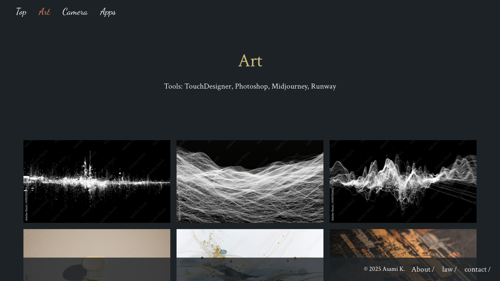

# Webapp Test Report

**Target URL:** https://asami.tokyo/apps
**Date:** 2025-11-20 23:05:15
**Status:** ❌ FAIL

## 1. Test Plan
WebページのURLとコンテンツを分析し、Playwrightで自動化可能な網羅的なテストシナリオを最大10個作成します。

---

# Webページテストシナリオ: `https://asami.tokyo/apps`

## ページの主要な機能

このページは、開発者 Asami K. 氏のWebアプリケーションポートフォリオであり、主に以下の機能を提供します。

1.  **アプリケーション情報の表示**:
    *   各アプリケーションのタイトル、目的、技術スタックが正確かつ明確に表示されます。
    *   関連するアイコンや視覚要素が正しくロードされ表示されます。
2.  **デモリンクへのナビゲーション**:
    *   "Stat Dashboard", "Livesync", "Marketplace" の各アプリケーションには、デモページへの内部リンクが提供されており、クリックすると正しく遷移します。
3.  **グローバルナビゲーション**:
    *   ページ全体のフッターやヘッダーに配置されたナビゲーション要素 (例: "Top", "Art", "Apps", "GitHub", "About" など) が正しく機能し、関連ページへ遷移します。
4.  **レスポンシブデザイン**:
    *   異なるデバイスサイズ (特にモバイル) での表示が崩れることなく、コンテンツが適切にレイアウトされ、情報が可読性を保ちます。

---

## テストシナリオ (最大10個)

### 1. ページロードと主要アプリケーション情報の表示確認 (正常系)

*   **目的**: ページが正常にロードされ、主要なアプリケーションのタイトルと説明文が正しく表示されることを確認します。
*   **手順**:
    1.  ブラウザで `https://asami.tokyo/apps` にアクセスします。
*   **期待される結果**:
    *   ページタイトルに "Apps" が含まれていること。
    *   "Global Event Timeline", "Stat Dashboard", "Livesync", "Marketplace" の各タイトルがページ内に表示されていること。
    *   それぞれのアプリケーションの説明文が正確に表示されていること。
*   **Playwrightでの自動化のポイント**:
    *   `await page.goto('https://asami.tokyo/apps');`
    *   `await expect(page).toHaveTitle(/Apps/);`
    *   `await expect(page.locator('h3:has-text("Global Event Timeline")')).toBeVisible();`
    *   `await expect(page.locator('text=A video visualization that maps extreme weather event CSV data onto a world map.')).toBeVisible();`

### 2. "Stat Dashboard" デモリンクの動作確認 (正常系)

*   **目的**: "Stat Dashboard" アプリケーションのデモリンクが正しく機能し、対応するデモページへ遷移することを確認します。
*   **手順**:
    1.  `https://asami.tokyo/apps` にアクセスします。
    2.  "Stat Dashboard" セクションにある "Demo" リンクをクリックします。
*   **期待される結果**:
    *   ブラウザのURLが現在のドメインの `/demo` パス (例: `https://asami.tokyo/demo`) を含むものに遷移すること。
    *   デモページの内容が表示されること（具体的な内容の確認は別途デモページのテストが必要）。
*   **Playwrightでの自動化のポイント**:
    *   `await page.goto('https://asami.tokyo/apps');`
    *   `await page.locator('h3:has-text("Stat Dashboard")').locator('a:has-text("Demo")').click();`
    *   `await expect(page).toHaveURL(/.*\/demo/);`

### 3. "Livesync" デモリンクの動作確認 (正常系)

*   **目的**: "Livesync" アプリケーションのデモリンクが正しく機能し、対応するデモページへ遷移することを確認します。
*   **手順**:
    1.  `https://asami.tokyo/apps` にアクセスします。
    2.  "Livesync" セクションにある "Demo" リンクをクリックします。
*   **期待される結果**:
    *   ブラウザのURLが現在のドメインの `/demo` パス (例: `https://asami.tokyo/demo`) を含むものに遷移すること。
    *   デモページの内容が表示されること。
*   **Playwrightでの自動化のポイント**:
    *   `await page.goto('https://asami.tokyo/apps');`
    *   `await page.locator('h3:has-text("Livesync")').locator('a:has-text("Demo")').click();`
    *   `await expect(page).toHaveURL(/.*\/demo/);`

### 4. "Marketplace" デモリンクの動作確認 (正常系)

*   **目的**: "Marketplace" アプリケーションのデモリンクが正しく機能し、対応するデモページへ遷移することを確認します。
*   **手順**:
    1.  `https://asami.tokyo/apps` にアクセスします。
    2.  "Marketplace" セクションにある "Demo" リンクをクリックします。
*   **期待される結果**:
    *   ブラウザのURLが現在のドメインの `/demo` パス (例: `https://asami.tokyo/demo`) を含むものに遷移すること。
    *   デモページの内容が表示されること。
*   **Playwrightでの自動化のポイント**:
    *   `await page.goto('https://asami.tokyo/apps');`
    *   `await page.locator('h3:has-text("Marketplace")').locator('a:has-text("Demo")').click();`
    *   `await expect(page).toHaveURL(/.*\/demo/);`

### 5. グローバルナビゲーション "GitHub" リンクの動作確認 (正常系/外部サイト)

*   **目的**: グローバルナビゲーション（フッターまたはヘッダー）にある "GitHub" リンクが正しく機能し、開発者のGitHubプロフィールページへ遷移することを確認します。
*   **手順**:
    1.  `https://asami.tokyo/apps` にアクセスします。
    2.  ページ内の "GitHub" リンクをクリックします。
*   **期待される結果**:
    *   ブラウザがGitHubのURL (`https://github.com/` を含む) のページに遷移すること。
    *   新しいタブで開かれる場合は、新しいタブのURLが正しいこと。
*   **Playwrightでの自動化のポイント**:
    *   `await page.goto('https://asami.tokyo/apps');`
    *   `const [newPage] = await Promise.all([`
    *   `  page.waitForEvent('popup'), // 新しいタブ/ウィンドウが開くのを待つ`
    *   `  page.locator('a[href*="github.com"]').click()`
    *   `]);`
    *   `await expect(newPage).toHaveURL(/.*github.com\/.*/);`

### 6. グローバルナビゲーション "Apps" のアクティブ状態確認 (正常系)

*   **目的**: 現在アクセスしているページが "Apps" ページであることを示すUI要素 (例: アクティブ状態のリンク) が正しく表示されていることを確認します。
*   **手順**:
    1.  `https://asami.tokyo/apps` にアクセスします。
*   **期待される結果**:
    *   グローバルナビゲーション内の "Apps" リンクが、他のリンクと異なるスタイル (例: 異なる色、下線、特定のCSSクラス) で強調表示されていること。
*   **Playwrightでの自動化のポイント**:
    *   `await page.goto('https://asami.tokyo/apps');`
    *   `const appsLink = page.locator('nav a[href="/apps"]');` // セレクタは実際のHTML構造に合わせる
    *   `await expect(appsLink).toHaveCSS('color', 'rgb(XXX, YYY, ZZZ)');` // 例: 赤色で強調されている場合。実際のCSSプロパティと値を確認
    *   `await expect(appsLink).toHaveClass(/active|current/);` // もしアクティブを示すCSSクラスがある場合

### 7. レスポンシブデザインの確認 (モバイルビュー) (境界値)

*   **目的**: ページが一般的なモバイルデバイスのビューポートサイズで適切に表示され、レイアウトが崩れていないことを確認します。
*   **手順**:
    1.  ブラウザで `https://asami.tokyo/apps` にアクセスします。
    2.  ビューポートのサイズを一般的なモバイルサイズ (例: 幅 375px, 高さ 667px) に設定します。
*   **期待される結果**:
    *   主要なアプリケーション情報がビューポート内に収まり、適切に配置されていること。
    *   テキストがはみ出したり、要素が重なったりせず、可読性が保たれていること。
    *   フッターなど、重要なナビゲーション要素が正しく表示されていること。
*   **Playwrightでの自動化のポイント**:
    *   `await page.goto('https://asami.tokyo/apps');`
    *   `await page.setViewportSize({ width: 375, height: 667 });`
    *   `await expect(page).toHaveScreenshot('apps-mobile-layout.png', { fullPage: true });` // ベースライン画像との比較で視覚的リグレッションを検出

### 8. アプリケーション関連アイコンの表示確認 (正常系)

*   **目的**: 各アプリケーションのセクションに表示される関連アイコンや画像 (コンテンツ中の「lens」と記述されている視覚要素) が正しくロードされ、表示されていることを確認します。
*   **手順**:
    1.  `https://asami.tokyo/apps` にアクセスします。
*   **期待される結果**:
    *   "Global Event Timeline", "Stat Dashboard", "Livesync", "Marketplace" の各セクションに、`lens` と表示されているアイコン要素がページ内に存在し、表示されていること。
*   **Playwrightでの自動化のポイント**:
    *   `await page.goto('https://asami.tokyo/apps');`
    *   `await expect(page.locator('section').filter({ hasText: 'Global Event Timeline' }).locator('text="lens"').first()).toBeVisible();`
    *   他のアプリケーションセクションについても同様に確認します。

### 9. 技術スタックの表示確認 (正常系)

*   **目的**: 各アプリケーションで利用されている技術スタックのリストが正しく表示されていることを確認します。
*   **手順**:
    1.  `https://asami.tokyo/apps` にアクセスします。
*   **期待される結果**:
    *   例えば "Stat Dashboard" のセクションに "Nuxt.js v3, shadcn/vue, Tailwind CSS, Fast API, Pandas, NumPy, Scikit-learn, Vercel" というテキストが正確に表示されていること。
    *   他のアプリケーションについても、それぞれの技術スタックが記述通りに表示されていること。
*   **Playwrightでの自動化のポイント**:
    *   `await page.goto('https://asami.tokyo/apps');`
    *   `await expect(page.locator('h3:has-text("Stat Dashboard") + p:has-text("Nuxt.js v3, shadcn/vue, Tailwind CSS, Fast API, Pandas, NumPy, Scikit-learn, Vercel")')).toBeVisible();`

### 10. フッターの著作権表示の確認 (正常系)

*   **目的**: ページ下部のフッターに表示される著作権情報が最新かつ正しい内容であることを確認します。
*   **手順**:
    1.  `https://asami.tokyo/apps` にアクセスします。
*   **期待される結果**:
    *   ページ下部に "© 2025 Asami K." というテキストが表示されていること。
*   **Playwrightでの自動化のポイント**:
    *   `await page.goto('https://asami.tokyo/apps');`
    *   `await expect(page.locator('footer')).toContainText('© 2025 Asami K.');`

---

## 2. Execution Result
**Return Code:** 1

### Stdout
```text
============================= test session starts ==============================
platform darwin -- Python 3.11.5, pytest-8.4.2, pluggy-1.6.0
rootdir: /Users/asami/develop/app/ai-agent
plugins: base-url-2.1.0, playwright-0.7.1
collected 10 items

tests/generated/20251120_225329_asami_tokyo/test_asami_tokyo_apps.py FFF [ 30%]
F.FFFF.                                                                  [100%]

=================================== FAILURES ===================================
_______________________ test_page_load_and_main_app_info _______________________

page = <Page url='https://asami.tokyo/apps'>

    def test_page_load_and_main_app_info(page: Page):
        """
        シナリオ1: ページが正常にロードされ、主要なアプリケーションのタイトルと説明文が正しく表示されることを確認します。
        """
        try:
            # 4. `page.goto("https://asami.tokyo/apps")` を必ず含めてください。
            # 9. `page.goto()` の後は、必ず期待するURLに遷移したことを確認してください。
            response = page.goto(BASE_URL)
    
            # Primitive value assertions use standard Python assert
            assert response.status == 200, f"Expected 200 OK status, got {response.status} for {BASE_URL}"
            # 9. 予期しないリダイレクトが発生する可能性があるため、アサーション前にURLをチェックしてください。
            expect(page).to_have_url(BASE_URL)
    
            # 3. デバッグのしやすさ: 期待するページタイトルに "Apps" が含まれているか確認
            # 1. 厳密な判定を避ける: テキスト判定には `exact=True` を絶対に使わないでください。
            #    Webサイトのテキストは頻繁に変更されるため、部分一致や正規表現を使ってください。
>           expect(page).to_have_title(re.compile(r"Apps", re.IGNORECASE))
E           AssertionError: Page title expected to be 're.compile('Apps', re.IGNORECASE)'
E           Actual value: App | asami.tokyo 
E           Call log:
E             - Expect "to_have_title" with timeout 5000ms
E               9 × unexpected value "App | asami.tokyo"

tests/generated/20251120_225329_asami_tokyo/test_asami_tokyo_apps.py:46: AssertionError
________________________ test_stat_dashboard_demo_link _________________________

page = <Page url='https://asami.tokyo/apps'>

    def test_stat_dashboard_demo_link(page: Page):
        """
        シナリオ2: "Stat Dashboard" アプリケーションのデモリンクが正しく機能し、対応するデモページへ遷移することを確認します。
        """
        try:
            page.goto(BASE_URL)
            expect(page).to_have_url(BASE_URL)
    
            # 3. デバッグのしやすさ: "Stat Dashboard" セクションのデモリンクをクリック
            # 2. ロケータの優先順位: `get_by_role` と `locator().filter()` の組み合わせで特定のリンクを特定
            # 8. セレクタの注意点: 部分一致が必要な場合は `filter(has_text="...")` を使用
            stat_dashboard_section = page.locator("section").filter(
                has=page.get_by_role("heading", name="Stat Dashboard", level=3, exact=False)
            )
>           expect(stat_dashboard_section.get_by_role("link", name="Demo", exact=False)).to_be_visible()
E           AssertionError: Locator expected to be visible
E           Actual value: None
E           Error: element(s) not found 
E           Call log:
E             - Expect "to_be_visible" with timeout 5000ms
E             - waiting for locator("section").filter(has=get_by_role("heading", name="Stat Dashboard", level=3)).get_by_role("link", name="Demo")

tests/generated/20251120_225329_asami_tokyo/test_asami_tokyo_apps.py:80: AssertionError
___________________________ test_livesync_demo_link ____________________________

page = <Page url='https://asami.tokyo/apps'>

    def test_livesync_demo_link(page: Page):
        """
        シナリオ3: "Livesync" アプリケーションのデモリンクが正しく機能し、対応するデモページへ遷移することを確認します。
        """
        try:
            page.goto(BASE_URL)
            expect(page).to_have_url(BASE_URL)
    
            # 3. デバッグのしやすさ: "Livesync" セクションのデモリンクをクリック
            # 2. ロケータの優先順位: `get_by_role` と `locator().filter()` の組み合わせで特定のリンクを特定
            livesync_section = page.locator("section").filter(
                has=page.get_by_role("heading", name="Livesync", level=3, exact=False)
            )
>           expect(livesync_section.get_by_role("link", name="Demo", exact=False)).to_be_visible()
E           AssertionError: Locator expected to be visible
E           Actual value: None
E           Error: element(s) not found 
E           Call log:
E             - Expect "to_be_visible" with timeout 5000ms
E             - waiting for locator("section").filter(has=get_by_role("heading", name="Livesync", level=3)).get_by_role("link", name="Demo")

tests/generated/20251120_225329_asami_tokyo/test_asami_tokyo_apps.py:103: AssertionError
__________________________ test_marketplace_demo_link __________________________

page = <Page url='https://asami.tokyo/apps'>

    def test_marketplace_demo_link(page: Page):
        """
        シナリオ4: "Marketplace" アプリケーションのデモリンクが正しく機能し、対応するデモページへ遷移することを確認します。
        """
        try:
            page.goto(BASE_URL)
            expect(page).to_have_url(BASE_URL)
    
            # 3. デバッグのしやすさ: "Marketplace" セクションのデモリンクをクリック
            # 2. ロケータの優先順位: `get_by_role` と `locator().filter()` の組み合わせで特定のリンクを特定
            marketplace_section = page.locator("section").filter(
                has=page.get_by_role("heading", name="Marketplace", level=3, exact=False)
            )
>           expect(marketplace_section.get_by_role("link", name="Demo", exact=False)).to_be_visible()
E           AssertionError: Locator expected to be visible
E           Actual value: None
E           Error: element(s) not found 
E           Call log:
E             - Expect "to_be_visible" with timeout 5000ms
E             - waiting for locator("section").filter(has=get_by_role("heading", name="Marketplace", level=3)).get_by_role("link", name="Demo")

tests/generated/20251120_225329_asami_tokyo/test_asami_tokyo_apps.py:126: AssertionError
______________________ test_apps_navigation_active_state _______________________

page = <Page url='https://asami.tokyo/apps'>

    def test_apps_navigation_active_state(page: Page):
        """
        シナリオ6: 現在アクセスしているページが "Apps" ページであることを示すUI要素
        (例: アクティブ状態のリンク) が正しく表示されていることを確認します。
        """
        try:
            page.goto(BASE_URL)
            expect(page).to_have_url(BASE_URL)
    
            # 3. デバッグのしやすさ: "Apps" ナビゲーションリンクがアクティブ状態であることを確認
            # 2. ロケータの優先順位: `get_by_role` を使用
            # 多くのサイトではアクティブなリンクに `aria-current="page"` が設定されるため、これをチェック
            # または、CSSクラス `active` や `current` が付与される場合もある
            apps_link = page.get_by_role("link", name="Apps", exact=False)
>           expect(apps_link).to_be_visible()
E           AssertionError: Locator expected to be visible
E           Actual value: None
E           Error: element(s) not found 
E           Call log:
E             - Expect "to_be_visible" with timeout 5000ms
E             - waiting for get_by_role("link", name="Apps")

tests/generated/20251120_225329_asami_tokyo/test_asami_tokyo_apps.py:177: AssertionError
______________________ test_responsive_design_mobile_view ______________________

page = <Page url='https://asami.tokyo/apps'>

    def test_responsive_design_mobile_view(page: Page):
        """
        シナリオ7: ページが一般的なモバイルデバイスのビューポートサイズで適切に表示され、
        レイアウトが崩れていないことを確認します。主要な要素がビューポート内に存在することを確認します。
        """
        try:
            page.goto(BASE_URL)
            expect(page).to_have_url(BASE_URL)
    
            # 3. デバッグのしやすさ: ビューポートをモバイルサイズに設定
            # 7. 禁止事項: `page.viewport_size` の代わりに `page.set_viewport_size()` を使う
            page.set_viewport_size({"width": 375, "height": 667})
    
            # 11. スクリーンショットの保存: テストファイルと同じディレクトリに保存
            page.screenshot(path=os.path.join(SAVE_DIR, "apps-mobile-layout.png"), full_page=True)
    
            # 3. デバッグのしやすさ: モバイルビューでも主要なアプリケーションタイトルがビューポート内に見えるか確認
            # 7. 禁止事項: `to_be_visible()` は要素が見えないがスクロールすれば見える場合にも成功する可能性がある
            # `to_be_in_viewport()` は、要素がビューポート内に表示されていることを確認
>           expect(page.get_by_role("heading", name="Global Event Timeline", level=3, exact=False)).to_be_in_viewport()
E           AssertionError: Locator expected to be in viewport
E           Actual value: None
E           Error: element(s) not found 
E           Call log:
E             - Expect "to_be_in_viewport" with timeout 5000ms
E             - waiting for get_by_role("heading", name="Global Event Timeline", level=3)

tests/generated/20251120_225329_asami_tokyo/test_asami_tokyo_apps.py:202: AssertionError
____________________________ test_app_icons_display ____________________________

page = <Page url='https://asami.tokyo/apps'>

    def test_app_icons_display(page: Page):
        """
        シナリオ8: 各アプリケーションのセクションに表示される関連アイコンや画像 (コンテンツ中の「lens」と記述されている視覚要素)
        が正しくロードされ、表示されていることを確認します。
        """
        try:
            page.goto(BASE_URL)
            expect(page).to_have_url(BASE_URL)
    
            # 3. デバッグのしやすさ: "Global Event Timeline" セクションに 'lens' アイコンが表示されているか確認
            # 8. セレクタの注意点: `page.locator("section").filter(has=...)` と `get_by_text()` を組み合わせて使用
            expect(page.locator("section").filter(
                has=page.get_by_role("heading", name="Global Event Timeline", level=3, exact=False)
>           ).get_by_text("lens", exact=False)).to_be_visible()
                                                ^^^^^^^^^^^^^^^
E           AssertionError: Locator expected to be visible
E           Actual value: None
E           Error: element(s) not found 
E           Call log:
E             - Expect "to_be_visible" with timeout 5000ms
E             - waiting for locator("section").filter(has=get_by_role("heading", name="Global Event Timeline", level=3)).get_by_text("lens")

tests/generated/20251120_225329_asami_tokyo/test_asami_tokyo_apps.py:225: AssertionError
___________________________ test_tech_stack_display ____________________________

page = <Page url='https://asami.tokyo/apps'>

    def test_tech_stack_display(page: Page):
        """
        シナリオ9: 各アプリケーションで利用されている技術スタックのリストが正しく表示されていることを確認します。
        """
        try:
            page.goto(BASE_URL)
            expect(page).to_have_url(BASE_URL)
    
            # 3. デバッグのしやすさ: "Stat Dashboard" の技術スタックが表示されているか確認
            # 2. ロケータの優先順位: 1. `get_by_role` と CSSセレクタの組み合わせ `locator('+ p')`
            # 7. 禁止事項: `to_have_text()` の代わりに `to_contain_text()` を使用
            # 1. 厳密な判定を避ける: 正規表現で部分一致
            stat_dashboard_tech_stack = page.get_by_role("heading", name="Stat Dashboard", level=3, exact=False).locator('+ p')
>           expect(stat_dashboard_tech_stack).to_contain_text(
                re.compile(r"Nuxt.js v3, shadcn/vue, Tailwind CSS, Fast API, Pandas, NumPy, Scikit-learn, Vercel", re.IGNORECASE)
            )
E           AssertionError: Locator expected to contain text 're.compile('Nuxt.js v3, shadcn/vue, Tailwind CSS, Fast API, Pandas, NumPy, Scikit-learn, Vercel', re.IGNORECASE)'
E           Actual value: None
E           Error: element(s) not found 
E           Call log:
E             - Expect "to_contain_text" with timeout 5000ms
E             - waiting for get_by_role("heading", name="Stat Dashboard", level=3).locator("+ p")

tests/generated/20251120_225329_asami_tokyo/test_asami_tokyo_apps.py:259: AssertionError
=========================== short test summary info ============================
FAILED tests/generated/20251120_225329_asami_tokyo/test_asami_tokyo_apps.py::test_page_load_and_main_app_info
FAILED tests/generated/20251120_225329_asami_tokyo/test_asami_tokyo_apps.py::test_stat_dashboard_demo_link
FAILED tests/generated/20251120_225329_asami_tokyo/test_asami_tokyo_apps.py::test_livesync_demo_link
FAILED tests/generated/20251120_225329_asami_tokyo/test_asami_tokyo_apps.py::test_marketplace_demo_link
FAILED tests/generated/20251120_225329_asami_tokyo/test_asami_tokyo_apps.py::test_apps_navigation_active_state
FAILED tests/generated/20251120_225329_asami_tokyo/test_asami_tokyo_apps.py::test_responsive_design_mobile_view
FAILED tests/generated/20251120_225329_asami_tokyo/test_asami_tokyo_apps.py::test_app_icons_display
FAILED tests/generated/20251120_225329_asami_tokyo/test_asami_tokyo_apps.py::test_tech_stack_display
========================= 8 failed, 2 passed in 52.97s =========================

```

### Stderr
```text

```

## 3. Screenshots

**Total Screenshots:** 13

### Apps-Mobile-Layout


### Fail Test 02 Global Nav Top Link


### Fail Test 03 Global Nav Art Link


### Fail Test 04 Global Nav Apps Link


### Test 1 Basic Display Art Page


### Test 3 Artwork Images And Alt


### Test 4 Footer Links About Page After Click


### Test 4 Footer Links Art Page Before Click


### Test 5 Mobile Viewport


### Test 6 Copyright Notice


### Test 7 Tools Display


### Test 8 404 Page


### Test 9 Image Load Failure


