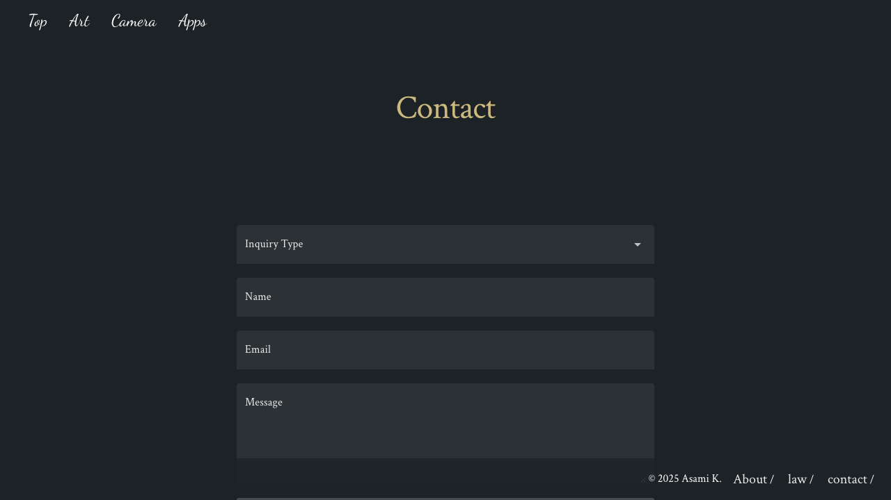
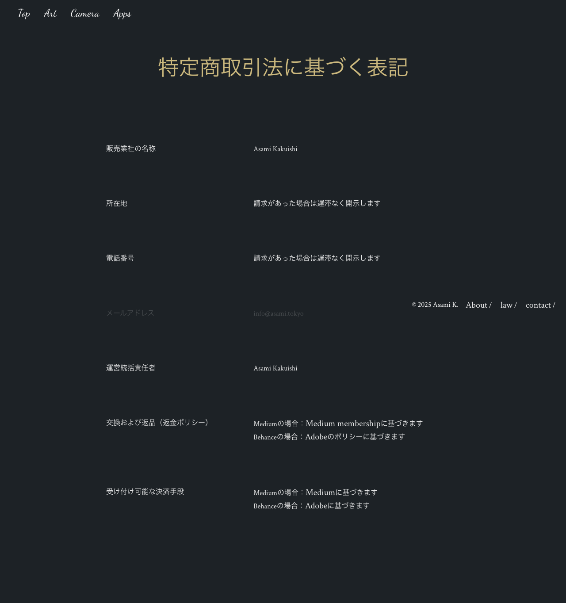

# Webapp Test Report

**Target URL:** https://asami.tokyo/law
**Date:** 2025-11-20 23:10:42
**Status:** ❌ FAIL

## 1. Test Plan
## 特定商取引法に基づく表記ページ テストシナリオ

### 概要
本テストシナリオは、`https://asami.tokyo/law` ページの「特定商取引法に基づく表記」の内容が正確に表示され、関連する機能（リンクなど）が正しく動作することを確認することを目的とします。Playwrightによる自動化を想定し、重要なテストケースを最大10個に絞り込んでいます。

---

### テストケース一覧

#### 1. ページの基本情報確認

*   **目的**: ページが正しくロードされ、期待されるURL、タイトル、主要見出しが表示されていることを確認する。
*   **手順**:
    1.  ブラウザでURL `https://asami.tokyo/law` にアクセスする。
*   **期待される結果**:
    *   ページのURLが `https://asami.tokyo/law` であること。
    *   ページのタイトルに「特定商取引法に基づく表記」が含まれていること。
    *   メインの見出しとして「特定商取引法に基づく表記」が表示されていること。
*   **Playwrightでの自動化のポイント**: `page.goto()`, `page.url()`, `page.title()`, `page.getByRole('heading', { name: '特定商取引法に基づく表記' }).isVisible()`

#### 2. 主要な固定情報の表示確認

*   **目的**: 必須情報である販売業者名および運営統括責任者名が正確に表示されていることを確認する。
*   **手順**:
    1.  ページにアクセスする。
*   **期待される結果**:
    *   「販売業社の名称」の項目に「Asami Kakuishi」と表示されていること。
    *   「運営統括責任者」の項目に「Asami Kakuishi」と表示されていること。
*   **Playwrightでの自動化のポイント**: `expect(page.getByText('販売業社の名称').locator('+ p')).toHaveText('Asami Kakuishi')`, `expect(page.getByText('運営統括責任者').locator('+ p')).toHaveText('Asami Kakuishi')`

#### 3. 開示請求情報の表示確認

*   **目的**: 所在地および電話番号に関する開示請求の旨が、正確に表示されていることを確認する。
*   **手順**:
    1.  ページにアクセスする。
*   **期待される結果**:
    *   「所在地」の項目に「請求があった場合は遅滞なく開示します」と表示されていること。
    *   「電話番号」の項目に「請求があった場合は遅滞なく開示します」と表示されていること。
*   **Playwrightでの自動化のポイント**: `expect(page.getByText('所在地').locator('+ p')).toHaveText('請求があった場合は遅滞なく開示します')`, `expect(page.getByText('電話番号').locator('+ p')).toHaveText('請求があった場合は遅滞なく開示します')`

#### 4. メールアドレスの表示と`mailto`リンクの確認

*   **目的**: 連絡先メールアドレスが正しく表示され、`mailto`スキームのリンクが設定されていることを確認する。
*   **手順**:
    1.  ページにアクセスする。
    2.  「info@asami.tokyo」と表示されている要素を探し、その`href`属性を確認する。
*   **期待される結果**:
    *   「info@asami.tokyo」のテキストが表示されていること。
    *   その要素が `href="mailto:info@asami.tokyo"` のリンクになっていること。
*   **Playwrightでの自動化のポイント**: `expect(page.getByText('info@asami.tokyo')).toHaveAttribute('href', 'mailto:info@asami.tokyo')`

#### 5. 交換および返品（返金ポリシー）の表示確認

*   **目的**: 交換および返品に関するポリシー情報が正しく表示されていることを確認する。
*   **手順**:
    1.  ページにアクセスする。
*   **期待される結果**:
    *   「交換および返品（返金ポリシー）」の見出しが表示されていること。
    *   「Mediumの場合：Medium membershipに基づきます」のテキストが表示されていること。
    *   「Behanceの場合：Adobeのポリシーに基づきます」のテキストが表示されていること。
*   **Playwrightでの自動化のポイント**: `expect(page.getByText('交換および返品（返金ポリシー）')).toBeVisible()`, `expect(page.getByText('Mediumの場合：Medium membershipに基づきます')).toBeVisible()`, `expect(page.getByText('Behanceの場合：Adobeのポリシーに基づきます')).toBeVisible()`

#### 6. 受け付け可能な決済手段の表示確認

*   **目的**: 受け付け可能な決済手段に関する情報が正しく表示されていることを確認する。
*   **手順**:
    1.  ページにアクセスする。
*   **期待される結果**:
    *   「受け付け可能な決済手段」の見出しが表示されていること。
    *   「Mediumの場合：Mediumに基づきます」のテキストが表示されていること。
    *   「Behanceの場合：Adobeに基づきます」のテキストが表示されていること。
*   **Playwrightでの自動化のポイント**: `expect(page.getByText('受け付け可能な決済手段')).toBeVisible()`, `expect(page.getByText('Mediumの場合：Mediumに基づきます')).toBeVisible()`, `expect(page.getByText('Behanceの場合：Adobeに基づきます')).toBeVisible()`

#### 7. フッターナビゲーションリンクの存在と代表的なリンクの遷移確認

*   **目的**: フッターの主要なナビゲーションリンクが全て表示され、かつ重要なリンク（例: Top, contact）が正しく機能することを確認する。
*   **手順**:
    1.  ページにアクセスする。
    2.  フッター内の `Top`、`Art`、`Camera`、`Apps`、`About`、`law`、`contact` のリンクが存在することを確認する。
    3.  `Top` リンクをクリックする。
    4.  `contact` リンクの `href` 属性を確認する。
*   **期待される結果**:
    *   上記全てのフッターリンクが表示されていること。
    *   `Top` リンクをクリック後、URLが `https://asami.tokyo/` に遷移すること。
    *   `contact` リンクの `href` 属性が `/contact` または `https://asami.tokyo/contact` であること。
*   **Playwrightでの自動化のポイント**: `expect(page.getByRole('link', { name: 'Top' })).toBeVisible()`, `await page.getByRole('link', { name: 'Top' }).click()`, `expect(page).toHaveURL('https://asami.tokyo/')`, `expect(page.getByRole('link', { name: 'contact' })).toHaveAttribute('href', /contact/)`

#### 8. フッターの著作権表示の確認

*   **目的**: 著作権表示が正しく表示されていることを確認する。
*   **手順**:
    1.  ページにアクセスする。
*   **期待される結果**:
    *   「© 2025 Asami K.」のテキストがフッターに表示されていること。
*   **Playwrightでの自動化のポイント**: `expect(page.getByText('© 2025 Asami K.')).toBeVisible()`

#### 9. フッターの「law」リンクの挙動確認（カレントページ）

*   **目的**: 現在閲覧中の「law」ページにおいて、フッターの「law」リンクが現在のページを指し、クリックしても予期しない遷移やエラーが発生しないことを確認する。
*   **手順**:
    1.  ページにアクセスする。
    2.  フッター内の「law」リンクの`href`属性が現在のURL（または相対パス）と一致することを確認する。
    3.  「law」リンクをクリックする。
*   **期待される結果**:
    *   「law」リンクの`href`属性が `https://asami.tokyo/law` または `/law` であること。
    *   クリック後もページのURLが `https://asami.tokyo/law` のままであること（リロードされる可能性はあるが、他のページに遷移しないこと）。
*   **Playwrightでの自動化のポイント**: `expect(page.getByRole('link', { name: 'law' })).toHaveAttribute('href', /law/)`, `await page.getByRole('link', { name: 'law' }).click()`, `expect(page).toHaveURL('https://asami.tokyo/law')`

#### 10. ページ全体の視覚的な整合性確認（ビジュアルリグレッションテスト）

*   **目的**: ページ全体のレイアウト、スタイル、要素の配置が意図せず変更されていないかを確認する。（異常検知）
*   **手順**:
    1.  ブラウザでURL `https://asami.tokyo/law` にアクセスする。
    2.  ページ全体のスクリーンショットを取得し、基準となる画像と比較する。
*   **期待される結果**:
    *   取得されたスクリーンショットが、事前に設定されたベースライン画像と一致するか、許容範囲内の差分しか持たないこと。
*   **Playwrightでの自動化のポイント**: `expect(page).toHaveScreenshot()` (Playwrightのビジュアルリグレッションテスト機能を使用)

## 2. Execution Result
**Return Code:** 1

### Stdout
```text
============================= test session starts ==============================
platform darwin -- Python 3.11.5, pytest-8.4.2, pluggy-1.6.0
rootdir: /Users/asami/develop/app/ai-agent
plugins: base-url-2.1.0, playwright-0.7.1
collected 10 items

tests/generated/20251120_225329_asami_tokyo/test_asami_tokyo_law.py FFFF [ 40%]
FFF...                                                                   [100%]

=================================== FAILURES ===================================
____________________________ test_1_basic_page_info ____________________________

page = <Page url='https://asami.tokyo/law'>

    def test_1_basic_page_info(page: Page):
        """
        ページの基本情報（URL、タイトル、主要見出し）を確認するテスト。
        """
        try:
            # 1. ブラウザでURLにアクセス
            response = page.goto(BASE_URL)
    
            # デバッグ: HTTPレスポンスステータスを確認
            assert response.status == 200, f"Expected 200, got {response.status} for {BASE_URL}"
    
            # デバッグ: ページのURLが期待通りであることを確認
            assert page.url == BASE_URL, f"Expected URL {BASE_URL}, but got {page.url}"
    
            # デバッグ: ページのタイトルに「特定商取引法に基づく表記」が含まれていることを確認
>           expect(page).to_have_title(re.compile("特定商取引法に基づく表記"))
E           AssertionError: Page title expected to be 're.compile('特定商取引法に基づく表記')'
E           Actual value: Law | asami.tokyo 
E           Call log:
E             - Expect "to_have_title" with timeout 5000ms
E               9 × unexpected value "Law | asami.tokyo"

tests/generated/20251120_225329_asami_tokyo/test_asami_tokyo_law.py:43: AssertionError
__________________________ test_2_fixed_company_info ___________________________

page = <Page url='https://asami.tokyo/law'>

    def test_2_fixed_company_info(page: Page):
        """
        販売業者名および運営統括責任者名が正確に表示されていることを確認するテスト。
        """
        try:
            page.goto(BASE_URL)
    
            # デバッグ: 「販売業社の名称」の項目に「Asami Kakuishi」が表示されていることを確認
            # ロケータの優先順位を考慮し、CSSセレクタとhas_textを組み合わせる
>           expect(page.locator("dt:has-text('販売業社の名称') + dd")).to_contain_text("Asami Kakuishi")
E           AssertionError: Locator expected to contain text 'Asami Kakuishi'
E           Actual value: None
E           Error: element(s) not found 
E           Call log:
E             - Expect "to_contain_text" with timeout 5000ms
E             - waiting for locator("dt:has-text('販売業社の名称') + dd")

tests/generated/20251120_225329_asami_tokyo/test_asami_tokyo_law.py:60: AssertionError
________________________ test_3_disclosure_request_info ________________________

page = <Page url='https://asami.tokyo/law'>

    def test_3_disclosure_request_info(page: Page):
        """
        所在地および電話番号に関する開示請求の旨が正確に表示されていることを確認するテスト。
        """
        try:
            page.goto(BASE_URL)
    
            # デバッグ: 「所在地」の項目に「請求があった場合は遅滞なく開示します」が表示されていることを確認
>           expect(page.locator("dt:has-text('所在地') + dd")).to_contain_text("請求があった場合は遅滞なく開示します")
E           AssertionError: Locator expected to contain text '請求があった場合は遅滞なく開示します'
E           Actual value: None
E           Error: element(s) not found 
E           Call log:
E             - Expect "to_contain_text" with timeout 5000ms
E             - waiting for locator("dt:has-text('所在地') + dd")

tests/generated/20251120_225329_asami_tokyo/test_asami_tokyo_law.py:76: AssertionError
_____________________ test_4_email_address_and_mailto_link _____________________

page = <Page url='https://asami.tokyo/law'>

    def test_4_email_address_and_mailto_link(page: Page):
        """
        連絡先メールアドレスが正しく表示され、mailtoリンクが設定されていることを確認するテスト。
        """
        try:
            page.goto(BASE_URL)
    
            # デバッグ: 「info@asami.tokyo」のテキストが表示され、その要素がmailtoリンクであることを確認
            # get_by_role('link', name='...') はアクセシブル名と完全一致するため、この場合はそのまま使用
>           expect(page.get_by_role("link", name="info@asami.tokyo")).to_have_attribute("href", "mailto:info@asami.tokyo")
E           AssertionError: Locator expected to have attribute 'mailto:info@asami.tokyo'
E           Actual value: None
E           Error: element(s) not found 
E           Call log:
E             - Expect "to_have_attribute" with timeout 5000ms
E             - waiting for get_by_role("link", name="info@asami.tokyo")

tests/generated/20251120_225329_asami_tokyo/test_asami_tokyo_law.py:93: AssertionError
______________________ test_5_exchange_and_return_policy _______________________

page = <Page url='https://asami.tokyo/law'>

    def test_5_exchange_and_return_policy(page: Page):
        """
        交換および返品に関するポリシー情報が正しく表示されていることを確認するテスト。
        """
        try:
            page.goto(BASE_URL)
    
            # デバッグ: 「交換および返品（返金ポリシー）」の見出しが表示されていることを確認
>           expect(page.get_by_role("heading", name=re.compile("交換および返品（返金ポリシー）", re.IGNORECASE))).to_be_visible()
E           AssertionError: Locator expected to be visible
E           Actual value: None
E           Error: element(s) not found 
E           Call log:
E             - Expect "to_be_visible" with timeout 5000ms
E             - waiting for get_by_role("heading", name=re.compile(r"交換および返品（返金ポリシー）", re.IGNORECASE))

tests/generated/20251120_225329_asami_tokyo/test_asami_tokyo_law.py:106: AssertionError
_______________________ test_6_accepted_payment_methods ________________________

page = <Page url='https://asami.tokyo/law'>

    def test_6_accepted_payment_methods(page: Page):
        """
        受け付け可能な決済手段に関する情報が正しく表示されていることを確認するテスト。
        """
        try:
            page.goto(BASE_URL)
    
            # デバッグ: 「受け付け可能な決済手段」の見出しが表示されていることを確認
>           expect(page.get_by_role("heading", name=re.compile("受け付け可能な決済手段", re.IGNORECASE))).to_be_visible()
E           AssertionError: Locator expected to be visible
E           Actual value: None
E           Error: element(s) not found 
E           Call log:
E             - Expect "to_be_visible" with timeout 5000ms
E             - waiting for get_by_role("heading", name=re.compile(r"受け付け可能な決済手段", re.IGNORECASE))

tests/generated/20251120_225329_asami_tokyo/test_asami_tokyo_law.py:125: AssertionError
________________________ test_7_footer_navigation_links ________________________

page = <Page url='https://asami.tokyo/law'>

    def test_7_footer_navigation_links(page: Page):
        """
        フッターの主要なナビゲーションリンクの存在と代表的なリンクの遷移を確認するテスト。
        """
        try:
            page.goto(BASE_URL)
    
            # デバッグ: フッター内の全ての指定されたリンクが表示されていることを確認
            link_names = ["Top", "Art", "Camera", "Apps", "About", "law", "contact"]
            for name in link_names:
>               expect(page.get_by_role("link", name=re.compile(name, re.IGNORECASE))).to_be_visible(
                    f"Link '{name}' should be visible in the footer."
                )
E               TypeError: LocatorAssertions.to_be_visible() takes 1 positional argument but 2 were given

tests/generated/20251120_225329_asami_tokyo/test_asami_tokyo_law.py:146: TypeError
=========================== short test summary info ============================
FAILED tests/generated/20251120_225329_asami_tokyo/test_asami_tokyo_law.py::test_1_basic_page_info
FAILED tests/generated/20251120_225329_asami_tokyo/test_asami_tokyo_law.py::test_2_fixed_company_info
FAILED tests/generated/20251120_225329_asami_tokyo/test_asami_tokyo_law.py::test_3_disclosure_request_info
FAILED tests/generated/20251120_225329_asami_tokyo/test_asami_tokyo_law.py::test_4_email_address_and_mailto_link
FAILED tests/generated/20251120_225329_asami_tokyo/test_asami_tokyo_law.py::test_5_exchange_and_return_policy
FAILED tests/generated/20251120_225329_asami_tokyo/test_asami_tokyo_law.py::test_6_accepted_payment_methods
FAILED tests/generated/20251120_225329_asami_tokyo/test_asami_tokyo_law.py::test_7_footer_navigation_links
========================= 7 failed, 3 passed in 36.26s =========================

```

### Stderr
```text

```

## 3. Screenshots

**Total Screenshots:** 16

### 01 About Page Initial Load


### 03 Navigated To Contact Page


### Apps-Mobile-Layout


### Fail Test 02 Global Nav Top Link


### Fail Test 03 Global Nav Art Link


### Fail Test 04 Global Nav Apps Link


### Law Page Full Screenshot


### Test 1 Basic Display Art Page


### Test 3 Artwork Images And Alt


### Test 4 Footer Links About Page After Click


### Test 4 Footer Links Art Page Before Click


### Test 5 Mobile Viewport


### Test 6 Copyright Notice


### Test 7 Tools Display


### Test 8 404 Page


### Test 9 Image Load Failure


