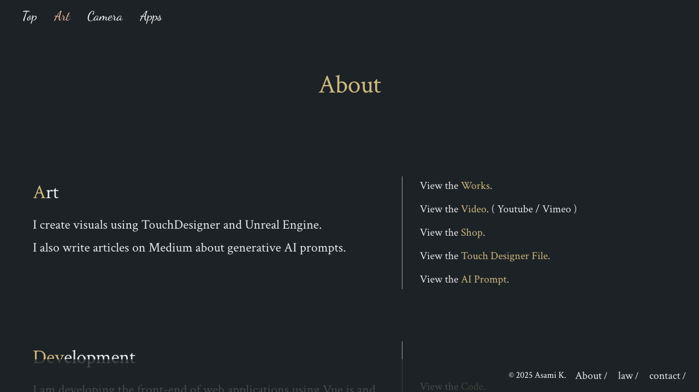
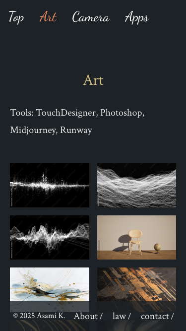

# Webapp Test Report

**Target URL:** https://asami.tokyo/art
**Date:** 2025-11-20 23:57:23
**Status:** ❌ FAIL

## 1. Test Plan
## Webページテストシナリオ

### 分析概要
このWebページは「Asami K.」のアート作品を紹介するポートフォリオサイトの「Art」セクションです。主な機能としては、アート作品の展示、グローバルナビゲーションによる他ページへの遷移、フッターの追加情報（About, law, contact）へのリンク提供が挙げられます。作品は画像とタイトルで構成されていると想定され、デザインや情報表示の正確性が重要となります。

### テストケース

#### 1. ページ主要コンテンツの表示確認 (正常系)
*   **目的**: ページロード時に、主要なテキストコンテンツ（ページタイトル、ツール一覧、作品名、フッター著作権情報）が期待通りに表示されることを確認する。
*   **手順**:
    1.  `https://asami.tokyo/art` にアクセスする。
    2.  ページタイトル「Art」が表示されていることを確認する。
    3.  「Tools: TouchDesigner, Photoshop, Midjourney, Runway」のテキストが表示されていることを確認する。
    4.  「Smoke drifting over big cities」と「Resort Pool」などの作品名がリスト表示されていることを確認する。
    5.  フッターに「© 2025 Asami K.」が表示されていることを確認する。
*   **期待される結果**: 上記のすべての要素がページに表示され、テキスト内容が一致すること。
*   **Playwrightで自動化可能か**: 可能

#### 2. グローバルナビゲーションリンクの動作確認 (正常系)
*   **目的**: グローバルナビゲーション内の各リンク（Artページ以外）が正しく機能し、対応するページへ遷移することを確認する。
*   **手順**:
    1.  `https://asami.tokyo/art` にアクセスする。
    2.  ナビゲーションメニューの「Top」リンクをクリックする。
    3.  ページがトップページ（`https://asami.tokyo/` など）に遷移することを確認する。
    4.  「Camera」リンクをクリックし、対応するURLに遷移することを確認する。
    5.  「Apps」リンクをクリックし、対応するURLに遷移することを確認する。
*   **期待される結果**: 各リンククリック後に、ブラウザのURLが対応するページのアドレスに正しく遷移すること。
*   **Playwrightで自動化可能か**: 可能

#### 3. 作品リストの表示と最初の作品リンク動作確認 (正常系)
*   **目的**: 複数のアート作品がリストとして表示され、最初の作品のリンク（もしあれば）が正しく機能することを確認する。
*   **手順**:
    1.  `https://asami.tokyo/art` にアクセスする。
    2.  複数の作品名（例：「Smoke drifting over big cities」、「Resort Pool」）が表示されていることを確認する。
    3.  リストの最初の作品名（例: 「Smoke drifting over big cities」）をクリックする。
    4.  作品詳細ページへの遷移、またはモーダル表示など、想定される動作が発生することを確認する。
*   **期待される結果**: 複数の作品名が視覚的に表示され、最初の作品クリック時に期待されるコンテンツ（詳細ページなど）が表示されること。
*   **Playwrightで自動化可能か**: 可能

#### 4. フッターリンクの動作確認 (正常系)
*   **目的**: フッターに表示されている「About」および「contact」リンクが正しく機能し、対応するページへ遷移することを確認する。
*   **手順**:
    1.  `https://asami.tokyo/art` にアクセスする。
    2.  フッターの「About」リンクをクリックする。
    3.  ページが「About」ページ（`https://asami.tokyo/about` など）に遷移することを確認する。
    4.  元のページに戻り、「contact」リンクをクリックする。
    5.  ページが「Contact」ページ（`https://asami.tokyo/contact` など）に遷移することを確認する。
*   **期待される結果**: 各リンククリック後に、ブラウザのURLが対応するページのアドレスに正しく遷移すること。
*   **Playwrightで自動化可能か**: 可能

#### 5. 画像コンテンツのロード確認 (正常系)
*   **目的**: ページ内の作品画像が正しくロードされ、壊れていないことを確認する。
*   **手順**:
    1.  `https://asami.tokyo/art` にアクセスする。
    2.  ページ内のすべての``要素が存在することを確認する。
    3.  各``要素がロードされ、`naturalWidth`が0より大きいことを確認する（画像が正しく表示されていることの簡易チェック）。
*   **期待される結果**: すべての画像が正常にロードされ、表示されていること。
*   **Playwrightで自動化可能か**: 可能

#### 6. レスポンシブデザインの基本確認 (境界値)
*   **目的**: 異なるビューポートサイズ（例: モバイルサイズ）でページレイアウトが崩れず、主要なコンテンツが適切に表示されることを確認する。
*   **手順**:
    1.  Playwrightの`setViewportSize`を使ってビューポートを一般的なモバイルサイズ（例: 幅375px, 高さ667px）に設定する。
    2.  `https://asami.tokyo/art` にアクセスする。
    3.  ページタイトル、ナビゲーションメニュー、作品リスト、フッターなど、主要なコンテンツ要素が画面内に収まり、オーバーラップやレイアウトの崩れがないことを確認する（例: `toBeVisible()`で要素の存在確認）。
*   **期待される結果**: モバイルサイズでも主要なコンテンツが適切に配置され、操作可能であること。
*   **Playwrightで自動化可能か**: 可能

#### 7. ページのタイトルとメタ情報の確認 (正常系)
*   **目的**: ページのタイトルタグが正しく設定されており、ブラウザタブや検索結果表示に適切な情報が提供されていることを確認する。
*   **手順**:
    1.  `https://asami.tokyo/art` にアクセスする。
    2.  ブラウザのページタイトル（`<title>`タグの内容）が「Art - Asami K.」など、コンテンツに即した適切なものであることを確認する。
*   **期待される結果**: ページタイトルが期待される文字列と一致すること。
*   **Playwrightで自動化可能か**: 可能

#### 8. 存在しないURLへのアクセス時の挙動 (異常系)
*   **目的**: サイトの存在しないURLにアクセスした場合に、適切なエラーページ（404 Not Foundなど）が表示されることを確認する。
*   **手順**:
    1.  `https://asami.tokyo/non-existent-page` のような、意図的に存在しないURLに直接アクセスする。
    2.  ページに「404 Not Found」や「ページが見つかりません」といったエラーメッセージ、またはカスタムエラーページが表示されることを確認する。
    3.  HTTPステータスコードが404であることを確認する。
*   **期待される結果**: ユーザーフレンドリーなエラーページが表示され、HTTPステータスコードが404であること。
*   **Playwrightで自動化可能か**: 可能

#### 9. コンソールエラーの有無 (異常系)
*   **目的**: ページロード時や基本的な操作中に、開発者コンソールに重大なJavaScriptエラーやネットワークエラーが出力されないことを確認する。
*   **手順**:
    1.  Playwrightの`page.on('console')`イベントを購読し、エラーメッセージを監視するように設定する。
    2.  `https://asami.tokyo/art` にアクセスする。
    3.  ページが完全にロードされるのを待つ。
*   **期待される結果**: ページロード中にコンソールにエラーレベルのメッセージが出力されないこと。
*   **Playwrightで自動化可能か**: 可能

#### 10. Copyright情報の正確性 (正常系/境界値)
*   **目的**: フッターに表示されている著作権情報が正しく、特に年号が意図通りに「2025」と表示されていることを確認する。
*   **手順**:
    1.  `https://asami.tokyo/art` にアクセスする。
    2.  フッターの著作権表示テキストが「© 2025 Asami K.」と完全に一致することを確認する。
*   **期待される結果**: フッターの著作権表示が「© 2025 Asami K.」と正確に表示されていること。
*   **Playwrightで自動化可能か**: 可能

## 2. Execution Result
**Return Code:** 124

### Stdout
```text
b'============================= test session starts ==============================\nplatform darwin -- Python 3.11.5, pytest-8.4.2, pluggy-1.6.0\nrootdir: /Users/asami/develop/app/ai-agent\nplugins: base-url-2.1.0, playwright-0.7.1\ncollected 10 items\n\ntests/generated/20251120_234257_asami_tokyo/test_asami_tokyo_art.py FFF'
```

### Stderr
```text

TimeoutExpired: Test execution exceeded 120 seconds.
```

## 3. Screenshots

**Total Screenshots:** 23

### 01 Main Content Display


### 02 Global Navigation Start


### 03 Works List Display


### 04 Footer Links About


### 04 Footer Links Contact


### 04 Footer Links Start


### 05 Image Loading Check


### 06 Responsive Mobile


### 07 Page Title Check


### 08 Non Existent Url


### 09 No Console Errors


### 10 Copyright Accuracy


### Fail 01 Main Content Display


### Fail 02 Global Navigation Links


### Fail 03 Works List Display


### Fail 09 No Console Errors


### Test 1 Homepage Main Elements


### Test 4 Footer About


### Test 5 Footer Law


### Test 6 Footer Contact


### Test 7 404 Page


### Test 8 Mobile View Layout


### Test 9 Copyright Year


