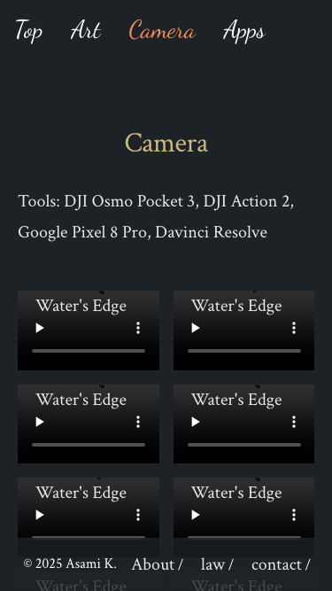

# Webapp Test Report

**Target URL:** https://asami.tokyo/camera
**Date:** 2025-11-21 00:01:42
**Status:** ❌ FAIL

## 1. Test Plan
WebページのURLとコンテンツを分析し、網羅的なテストシナリオを以下の通り作成しました。

## テストシナリオ

### ページの主要な機能
このWebページの主要な機能は以下の通りと推測されます。

1.  **コンテンツ表示**: カメラで撮影された写真や動画、それらに関連する情報（使用ツール、キャプションなど）の表示。
2.  **ナビゲーション**: サイト内の異なるセクション（Top, Art, Camera, Appsなど）へのリンクによる移動。
3.  **情報提供**: 著作権情報、サイト運営者に関する情報（About, law, contact）へのリンク提供。
4.  **レスポンシブ対応**: さまざまなデバイスサイズでの適切な表示。

---

### テストケース

#### 1. ページロードと主要要素の存在確認 (正常系)

*   **目的**: Webページが正しくロードされ、主要なナビゲーション、コンテンツ要素、フッターが表示されることを確認する。
*   **手順**:
    1.  ブラウザでURL `https://asami.tokyo/camera` にアクセスする。
    2.  ページのタイトルが期待通りであることを確認する。
    3.  ヘッダーナビゲーションに「Camera」というテキストが表示されていることを確認する。
    4.  「Tools」という見出しとその下に「DJI Osmo Pocket 3」などのツール名が表示されていることを確認する。
    5.  コンテンツエリアに「Water's Edge」などのキャプションテキストが表示されていることを確認する。
    6.  フッターに「© 2025 Asami K.」という著作権表示と「About」リンクが表示されていることを確認する。
*   **期待される結果**:
    *   ページのタイトルが「Camera」またはサイト名を含む適切なタイトルであること。
    *   指定された主要なテキスト要素（「Camera」、「Tools」、「DJI Osmo Pocket 3」、「Water's Edge」、「© 2025 Asami K.」、「About」）がページ上に存在し、可視状態であること。

#### 2. ヘッダーナビゲーションリンクの動作 (別ページへの遷移) (正常系)

*   **目的**: ヘッダーナビゲーションの他のページへのリンクが正しく機能し、対応するページへ遷移することを確認する。
*   **手順**:
    1.  ブラウザでURL `https://asami.tokyo/camera` にアクセスする。
    2.  ナビゲーションメニューから「Top」リンクをクリックする。
    3.  遷移後のURLが期待される「Top」ページのURL（例: `https://asami.tokyo/`）であること、およびページタイトルが正しいことを確認する。
    4.  「Art」リンク、および「Apps」リンクに対しても同様のテストを実施する。
*   **期待される結果**:
    *   各リンクをクリックした後、正しいURLに遷移し、遷移先のページのタイトルが適切であること。

#### 3. フッターナビゲーションリンクの動作 (正常系)

*   **目的**: フッターの「About」、「law」、「contact」リンクが正しく機能し、対応するページへ遷移することを確認する。
*   **手順**:
    1.  ブラウザでURL `https://asami.tokyo/camera` にアクセスする。
    2.  フッターにある「About」リンクをクリックする。
    3.  遷移後のURLが期待される「About」ページのURL（例: `https://asami.tokyo/about`）であること、およびページタイトルが正しいことを確認する。
    4.  「law」リンク、および「contact」リンクに対しても同様のテストを実施する。
*   **期待される結果**:
    *   各リンクをクリックした後、正しいURLに遷移し、遷移先のページのタイトルが適切であること。

#### 4. 現在のページへのナビゲーションリンクの動作 (正常系/境界値)

*   **目的**: 現在表示されているページへのナビゲーションリンク（例: 「Camera」）をクリックした際の挙動が期待通りであることを確認する。
*   **手順**:
    1.  ブラウザでURL `https://asami.tokyo/camera` にアクセスする。
    2.  ナビゲーションメニューにある「Camera」リンク（現在のページへのリンク）をクリックする。
    3.  クリック後のURLが変更されないこと、ページが不必要にリロードされないこと、またはスムーズスクロールが発生しないことを確認する。
*   **期待される結果**:
    *   URLが `https://asami.tokyo/camera` のままであり、ページがリロードされたり、スクロール位置が予期せず変更されたりしないこと。

#### 5. 画像コンテンツの表示と視認性 (正常系)

*   **目的**: ページの主要コンテンツである画像が正しくロードされ、破損していないことを確認する。
*   **手順**:
    1.  ブラウザでURL `https://asami.tokyo/camera` にアクセスする。
    2.  ページ内のすべての画像要素 (`` タグ) を取得する。
    3.  各画像がロードに成功しているか（例: `naturalWidth` が0より大きいか、破損画像アイコンが表示されていないか）を確認する。
*   **期待される結果**:
    *   ページ内のすべての画像が正常にロードされ、可視状態であり、破損画像アイコンが表示されていないこと。

#### 6. 全てのコンテンツキャプションの存在確認 (正常系)

*   **目的**: 提供されたコンテンツ抜粋にある全ての画像キャプションが実際にページに表示されていることを確認する。
*   **手順**:
    1.  ブラウザでURL `https://asami.tokyo/camera` にアクセスする。
    2.  以下の各テキストがページ上に存在し、可視状態であることを確認する:
        *   「Water's Edge」 (複数回出現する可能性を考慮)
        *   「stream」
        *   「walk in sunset」
        *   「sunset coast」
        *   「Port Tower」
        *   「Palm Tree」
        *   「ship enters the port」
        *   「Sunset with bird」
*   **期待される結果**:
    *   上記のすべてのキャプションテキストがページ上に正確に表示されていること。

#### 7. Toolsセクションのテキストコンテンツの正確性 (正常系)

*   **目的**: 「Tools」セクションに記載されている情報が正確に表示されていることを確認する。
*   **手順**:
    1.  ブラウザでURL `https://asami.tokyo/camera` にアクセスする。
    2.  「Tools:」という見出しの下に、以下のテキストが正確に表示されていることを確認する:
        *   「DJI Osmo Pocket 3」
        *   「DJI Action 2」
        *   「Google Pixel 8 Pro」
        *   「Davinci Resolve」
*   **期待される結果**:
    *   すべてのツール名が提供された情報と完全に一致し、ページ上に正確に表示されていること。

#### 8. 著作権表示の正確性 (正常系)

*   **目的**: フッターの著作権表示が正確に表示されていることを確認する。
*   **手順**:
    1.  ブラウザでURL `https://asami.tokyo/camera` にアクセスする。
    2.  フッターに「© 2025 Asami K.」というテキストが正確に表示されていることを確認する。
*   **期待される結果**:
    *   テキスト「© 2025 Asami K.」が完全に一致して表示されていること。

#### 9. レスポンシブデザインの確認 (モバイルビュー) (境界値)

*   **目的**: ページがモバイルデバイスのビューポートでも正しく表示され、レイアウトが崩れていないことを確認する。
*   **手順**:
    1.  Playwrightのビューポートサイズをスマートフォン相当（例: `width: 375, height: 667`）に設定し、URL `https://asami.tokyo/camera` にアクセスする。
    2.  主要なナビゲーション（例: ハンバーガーメニューが表示されるか）、コンテンツブロック、画像のレイアウトが適切に調整され、重なりや切れていないことを確認する。
    3.  必要であればスクリーンショットを取得し、基準となるスクリーンショットと比較する。
*   **期待される結果**:
    *   モバイルビューポートでコンテンツが読みやすく、レイアウトが崩れていないこと。ナビゲーションが適切にモバイル対応（例: ハンバーガーメニューへの切り替え）していること。

#### 10. 存在しないURLパスへのアクセス (異常系)

*   **目的**: 存在しないURLパスにアクセスした場合に、適切なエラーページ（例: 404ページ）が表示されることを確認する。
*   **手順**:
    1.  ブラウザで存在しないパス（例: `https://asami.tokyo/camera/non-existent-page`）に直接アクセスする。
    2.  ページのHTTPステータスコードが404であること、またはページに「Not Found」などのエラーメッセージが表示されていることを確認する。
*   **期待される結果**:
    *   HTTPステータスコードが404であること。
    *   ユーザーにエラーを伝える明確なメッセージ（例: 「ページが見つかりません」）を含むエラーページが表示されること。

## 2. Execution Result
**Return Code:** 1

### Stdout
```text
============================= test session starts ==============================
platform darwin -- Python 3.11.5, pytest-8.4.2, pluggy-1.6.0
rootdir: /Users/asami/develop/app/ai-agent
plugins: base-url-2.1.0, playwright-0.7.1
collected 10 items

tests/generated/20251120_234257_asami_tokyo/test_asami_tokyo_camera.py F [ 10%]
F.FFFF.FF                                                                [100%]

=================================== FAILURES ===================================
__________________ test_01_page_load_and_main_elements_exist ___________________

page = <Page url='https://asami.tokyo/camera'>

    def test_01_page_load_and_main_elements_exist(page: Page):
        """
        目的: Webページが正しくロードされ、主要なナビゲーション、コンテンツ要素、
              フッターが表示されることを確認する。
        """
        try:
            # 1. ブラウザでURLにアクセス
            response = page.goto(BASE_URL, wait_until="domcontentloaded")
            # サイトの特性によっては、より安定したロードを待つために以下の行を追加することも検討できます。
            # page.wait_for_load_state("networkidle")
            assert response.status == 200, f"ページロードに失敗しました。ステータスコード: {response.status}"
    
            # スクリーンショットを保存（デバッグ用）
            save_dir = get_save_dir()
            page.screenshot(path=os.path.join(save_dir, "01_initial_load.png"))
    
            # 2. ページのタイトルが期待通りであることを確認
            # デバッグ: ページのタイトルを確認
            expect(page).to_have_title(re.compile("Camera|asami.tokyo", re.IGNORECASE))
    
            # 3. ヘッダーナビゲーションに「Camera」というテキストが表示されていることを確認
            # デバッグ: ヘッダーナビゲーションの'Camera'リンクの可視性を確認
>           expect(page.get_by_role("link", name=re.compile("Camera", re.IGNORECASE))).to_be_visible()
E           AssertionError: Locator expected to be visible
E           Actual value: None
E           Error: element(s) not found 
E           Call log:
E             - Expect "to_be_visible" with timeout 5000ms
E             - waiting for get_by_role("link", name=re.compile(r"Camera", re.IGNORECASE))

tests/generated/20251120_234257_asami_tokyo/test_asami_tokyo_camera.py:62: AssertionError
_____________________ test_02_header_navigation_links_work _____________________

page = <Page url='https://asami.tokyo/camera'>

    def test_02_header_navigation_links_work(page: Page):
        """
        目的: ヘッダーナビゲーションの他のページへのリンクが正しく機能し、
              対応するページへ遷移することを確認する。
        """
        try:
            page.goto(BASE_URL, wait_until="domcontentloaded")
            # サイトの特性によっては、より安定したロードを待つために以下の行を追加することも検討できます。
            # page.wait_for_load_state("networkidle")
    
            links_to_test = {
                "Top": {"path": "/", "title_re": "Home|Top|asami.tokyo"},
                "Art": {"path": "/art", "title_re": "Art|作品"},
                "Apps": {"path": "/apps", "title_re": "Apps|アプリケーション"},
            }
    
            for link_name, expected in links_to_test.items():
                # デバッグ: ナビゲーションリンク '{link_name}' をクリック
                link_locator = page.get_by_role("link", name=re.compile(link_name, re.IGNORECASE))
>               expect(link_locator).to_be_visible() # リンクが可視であることを確認
                ^^^^^^^^^^^^^^^^^^^^^^^^^^^^^^^^^^^^
E               AssertionError: Locator expected to be visible
E               Actual value: None
E               Error: element(s) not found 
E               Call log:
E                 - Expect "to_be_visible" with timeout 5000ms
E                 - waiting for get_by_role("link", name=re.compile(r"Top", re.IGNORECASE))

tests/generated/20251120_234257_asami_tokyo/test_asami_tokyo_camera.py:102: AssertionError
________________ test_04_current_page_navigation_link_behavior _________________

page = <Page url='https://asami.tokyo/camera'>

    def test_04_current_page_navigation_link_behavior(page: Page):
        """
        目的: 現在表示されているページへのナビゲーションリンク（例: 「Camera」）を
              クリックした際の挙動が期待通りであることを確認する。
        """
        try:
            page.goto(BASE_URL, wait_until="domcontentloaded")
            # サイトの特性によっては、より安定したロードを待つために以下の行を追加することも検討できます。
            # page.wait_for_load_state("networkidle")
            initial_url = page.url
    
            # デバッグ: 'Camera'ナビゲーションリンクをクリック
            camera_link_locator = page.get_by_role("link", name=re.compile("Camera", re.IGNORECASE))
>           expect(camera_link_locator).to_be_visible()
E           AssertionError: Locator expected to be visible
E           Actual value: None
E           Error: element(s) not found 
E           Call log:
E             - Expect "to_be_visible" with timeout 5000ms
E             - waiting for get_by_role("link", name=re.compile(r"Camera", re.IGNORECASE))

tests/generated/20251120_234257_asami_tokyo/test_asami_tokyo_camera.py:167: AssertionError
_________________ test_05_image_content_display_and_visibility _________________

page = <Page url='https://asami.tokyo/camera'>

    def test_05_image_content_display_and_visibility(page: Page):
        """
        目的: ページの主要コンテンツである画像が正しくロードされ、破損していないことを確認する。
        """
        try:
            page.goto(BASE_URL, wait_until="domcontentloaded")
            # サイトの特性によっては、より安定したロードを待つために以下の行を追加することも検討できます。
            # page.wait_for_load_state("networkidle")
    
            # デバッグ: ページ内のすべての画像要素が可視であることを確認
            image_locators = page.locator("img").all()
>           assert len(image_locators) > 0, "ページに画像が見つかりません。"
E           AssertionError: ページに画像が見つかりません。
E           assert 0 > 0
E            +  where 0 = len([])

tests/generated/20251120_234257_asami_tokyo/test_asami_tokyo_camera.py:189: AssertionError
______________________ test_06_all_content_captions_exist ______________________

page = <Page url='https://asami.tokyo/camera'>

    def test_06_all_content_captions_exist(page: Page):
        """
        目的: 提供されたコンテンツ抜粋にある全ての画像キャプションが
              実際にページに表示されていることを確認する。
        """
        try:
            page.goto(BASE_URL, wait_until="domcontentloaded")
            # サイトの特性によっては、より安定したロードを待つために以下の行を追加することも検討できます。
            # page.wait_for_load_state("networkidle")
    
            captions_to_check = [
                "Water's Edge",
                "stream",
                "walk in sunset",
                "sunset coast",
                "Port Tower",
                "Palm Tree",
                "ship enters the port",
                "Sunset with bird",
            ]
    
            for caption in captions_to_check:
                # デバッグ: キャプション '{caption}' がページに存在し、可視であることを確認
>               expect(page.get_by_text(caption)).to_be_visible()
E               AssertionError: Locator expected to be visible
E               Actual value: None
E               Error: strict mode violation: get_by_text("Water's Edge") resolved to 11 elements:
E                   1) <a target="_blank" href="https://stock.adobe.com/stock-photo/id/1768267159" class="absolute top-0 left-5 text-secondary no-underline text-[1.25rem]">Water's Edge</a> aka get_by_role("link", name="Water's Edge").first
E                   2) <a target="_blank" href="https://stock.adobe.com/stock-photo/id/1768266961" class="absolute top-0 left-5 text-secondary no-underline text-[1.25rem]">Water's Edge</a> aka get_by_role("link", name="Water's Edge").nth(1)
E                   3) <a target="_blank" href="https://stock.adobe.com/stock-photo/id/1768266796" class="absolute top-0 left-5 text-secondary no-underline text-[1.25rem]">Water's Edge</a> aka get_by_role("link", name="Water's Edge").nth(2)
E                   4) <a target="_blank" href="https://stock.adobe.com/stock-photo/id/1768266569" class="absolute top-0 left-5 text-secondary no-underline text-[1.25rem]">Water's Edge</a> aka get_by_role("link", name="Water's Edge").nth(3)
E                   5) <a target="_blank" href="https://stock.adobe.com/stock-photo/id/1768265954" class="absolute top-0 left-5 text-secondary no-underline text-[1.25rem]">Water's Edge</a> aka get_by_role("link", name="Water's Edge").nth(4)
E                   6) <a target="_blank" href="https://stock.adobe.com/stock-photo/id/1768265604" class="absolute top-0 left-5 text-secondary no-underline text-[1.25rem]">Water's Edge</a> aka get_by_role("link", name="Water's Edge").nth(5)
E                   7) <a target="_blank" href="https://stock.adobe.com/stock-photo/id/1768265236" class="absolute top-0 left-5 text-secondary no-underline text-[1.25rem]">Water's Edge</a> aka locator("div:nth-child(7) > .absolute")
E                   8) <a target="_blank" href="https://stock.adobe.com/stock-photo/id/1768265099" class="absolute top-0 left-5 text-secondary no-underline text-[1.25rem]">Water's Edge</a> aka locator("div:nth-child(8) > .absolute")
E                   9) <a target="_blank" href="https://stock.adobe.com/stock-photo/id/1768264734" class="absolute top-0 left-5 text-secondary no-underline text-[1.25rem]">Water's Edge</a> aka locator("div:nth-child(9) > .absolute")
E                   10) <a target="_blank" href="https://stock.adobe.com/stock-photo/id/1768242306" class="absolute top-0 left-5 text-secondary no-underline text-[1.25rem]">Water's Edge</a> aka locator("div:nth-child(10) > .absolute")
E                   ...
E                
E               Call log:
E                 - Expect "to_be_visible" with timeout 5000ms
E                 - waiting for get_by_text("Water's Edge")

tests/generated/20251120_234257_asami_tokyo/test_asami_tokyo_camera.py:221: AssertionError
_____________________ test_07_tools_section_text_accuracy ______________________

page = <Page url='https://asami.tokyo/camera'>

    def test_07_tools_section_text_accuracy(page: Page):
        """
        目的: 「Tools」セクションに記載されている情報が正確に表示されていることを確認する。
        """
        try:
            page.goto(BASE_URL, wait_until="domcontentloaded")
            # サイトの特性によっては、より安定したロードを待つために以下の行を追加することも検討できます。
            # page.wait_for_load_state("networkidle")
    
            # デバッグ: 'Tools'見出しが可視であることを確認
            tools_heading = page.get_by_role("heading", name=re.compile("Tools", re.IGNORECASE))
>           expect(tools_heading).to_be_visible()
E           AssertionError: Locator expected to be visible
E           Actual value: None
E           Error: element(s) not found 
E           Call log:
E             - Expect "to_be_visible" with timeout 5000ms
E             - waiting for get_by_role("heading", name=re.compile(r"Tools", re.IGNORECASE))

tests/generated/20251120_234257_asami_tokyo/test_asami_tokyo_camera.py:237: AssertionError
____________________ test_09_responsive_design_mobile_view _____________________

page = <Page url='https://asami.tokyo/camera'>

    def test_09_responsive_design_mobile_view(page: Page):
        """
        目的: ページがモバイルデバイスのビューポートでも正しく表示され、
              レイアウトが崩れていないことを確認する。
        """
        # 修正箇所: `page`フィクスチャが各テストで新しいページインスタンスを提供するようになったため、
        # ビューポートサイズを保存し、テスト終了後に元に戻す処理は不要になりました。
        # 各テストは常にデフォルトのviewportで開始されます。
    
        try:
            # デバッグ: ビューポートサイズをモバイル相当に設定
            page.set_viewport_size({"width": 375, "height": 667})
            response = page.goto(BASE_URL, wait_until="domcontentloaded")
            # サイトの特性によっては、より安定したロードを待つために以下の行を追加することも検討できます。
            # page.wait_for_load_state("networkidle")
            assert response.status == 200, f"モバイルビューでのページロードに失敗しました。ステータスコード: {response.status}"
    
            # デバッグ: モバイルビューのスクリーンショットを保存
            save_dir = get_save_dir()
            page.screenshot(path=os.path.join(save_dir, "09_mobile_camera_page.png"))
    
            # モバイルビューでの主要要素の可視性を確認 (例: ヘッダーやフッターのコンテンツ)
            # ハンバーガーメニューなど、モバイル専用のナビゲーション要素があればその存在を確認
            # 今回のサイトではハンバーガーメニューはなさそうなので、基本的なヘッダー/フッターを確認
            # デバッグ: ヘッダー内のサイトタイトルまたはロゴが可視であることを確認
>           expect(page.get_by_role("link", name=re.compile("Asami.tokyo", re.IGNORECASE))).to_be_visible()
E           AssertionError: Locator expected to be visible
E           Actual value: None
E           Error: element(s) not found 
E           Call log:
E             - Expect "to_be_visible" with timeout 5000ms
E             - waiting for get_by_role("link", name=re.compile(r"Asami.tokyo", re.IGNORECASE))

tests/generated/20251120_234257_asami_tokyo/test_asami_tokyo_camera.py:295: AssertionError
_____________________ test_10_access_non_existent_url_path _____________________

page = <Page url='https://asami.tokyo/camera/non-existent-page-12345'>

    def test_10_access_non_existent_url_path(page: Page):
        """
        目的: 存在しないURLパスにアクセスした場合に、
              適切なエラーページ（例: 404ページ）が表示されることを確認する。
        """
        try:
            non_existent_url = "https://asami.tokyo/camera/non-existent-page-12345"
            # デバッグ: 存在しないURL '{non_existent_url}' にアクセス
            response = page.goto(non_existent_url, wait_until="domcontentloaded")
            # サイトの特性によっては、より安定したロードを待つために以下の行を追加することも検討できます。
            # page.wait_for_load_state("networkidle")
    
            # デバッグ: HTTPステータスコードが404であることを確認
            assert response.status == 404, \
                f"Expected 404 status code, but got {response.status} for {non_existent_url}"
    
            # デバッグ: エラーメッセージがページに存在し、可視であることを確認
            # サイト固有のエラーメッセージを考慮して正規表現で部分一致
>           expect(page.get_by_text(re.compile("Not Found|ページが見つかりません|エラー", re.IGNORECASE))).to_be_visible()
E           AssertionError: Locator expected to be visible
E           Actual value: None
E           Error: strict mode violation: get_by_text(re.compile(r"Not Found|ページが見つかりません|エラー", re.IGNORECASE)) resolved to 2 elements:
E               1) <h2 data-v-4656b2ed="" class="font-semibold mb-2 sm:text-3xl text-2xl">Page not found: /camera/non-existent-page-12345</h2> aka get_by_role("heading", name="Page not found: /camera/non-")
E               2) <p data-v-4656b2ed="" class="mb-4 px-2 text-[#64748B] text-md">Page not found: /camera/non-existent-page-12345</p> aka get_by_role("paragraph")
E            
E           Call log:
E             - Expect "to_be_visible" with timeout 5000ms
E             - waiting for get_by_text(re.compile(r"Not Found|ページが見つかりません|エラー", re.IGNORECASE))

tests/generated/20251120_234257_asami_tokyo/test_asami_tokyo_camera.py:328: AssertionError
=========================== short test summary info ============================
FAILED tests/generated/20251120_234257_asami_tokyo/test_asami_tokyo_camera.py::test_01_page_load_and_main_elements_exist
FAILED tests/generated/20251120_234257_asami_tokyo/test_asami_tokyo_camera.py::test_02_header_navigation_links_work
FAILED tests/generated/20251120_234257_asami_tokyo/test_asami_tokyo_camera.py::test_04_current_page_navigation_link_behavior
FAILED tests/generated/20251120_234257_asami_tokyo/test_asami_tokyo_camera.py::test_05_image_content_display_and_visibility
FAILED tests/generated/20251120_234257_asami_tokyo/test_asami_tokyo_camera.py::test_06_all_content_captions_exist
FAILED tests/generated/20251120_234257_asami_tokyo/test_asami_tokyo_camera.py::test_07_tools_section_text_accuracy
FAILED tests/generated/20251120_234257_asami_tokyo/test_asami_tokyo_camera.py::test_09_responsive_design_mobile_view
FAILED tests/generated/20251120_234257_asami_tokyo/test_asami_tokyo_camera.py::test_10_access_non_existent_url_path
========================= 8 failed, 2 passed in 39.53s =========================

```

### Stderr
```text

```

## 3. Screenshots

**Total Screenshots:** 25

### 01 Initial Load


### 01 Main Content Display


### 02 Global Navigation Start


### 03 Works List Display


### 04 Footer Links About


### 04 Footer Links Contact


### 04 Footer Links Start


### 05 Image Loading Check


### 06 Responsive Mobile


### 07 Page Title Check


### 08 Non Existent Url


### 09 Mobile Camera Page


### 09 No Console Errors


### 10 Copyright Accuracy


### Fail 01 Main Content Display


### Fail 02 Global Navigation Links


### Fail 03 Works List Display


### Fail 09 No Console Errors


### Test 1 Homepage Main Elements


### Test 4 Footer About


### Test 5 Footer Law


### Test 6 Footer Contact


### Test 7 404 Page


### Test 8 Mobile View Layout


### Test 9 Copyright Year


