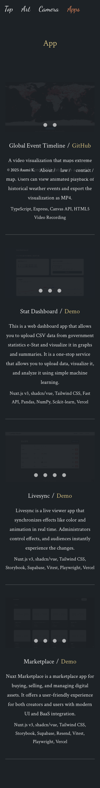
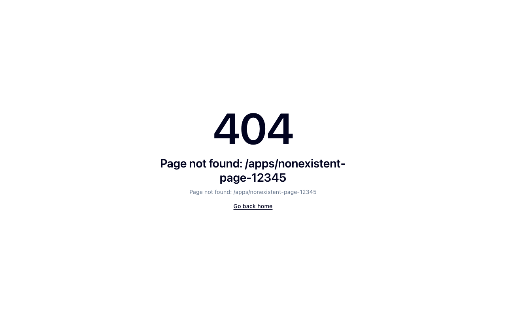
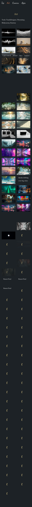
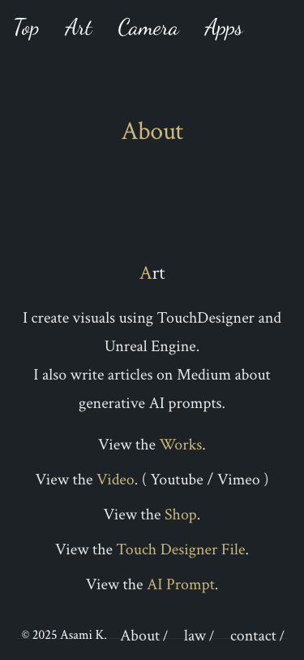

# Webapp Test Report

**Target URL:** https://asami.tokyo/about
**Date:** 2025-11-20 22:36:47
**Status:** ❌ FAIL

## 1. Test Plan
## QAエンジニアによるテストシナリオ：`https://asami.tokyo/about`

### 概要
本ドキュメントは、URL `https://asami.tokyo/about` のWebページを対象とした網羅的なテストシナリオです。ページの主要機能であるコンテンツ表示、ナビゲーション、内部・外部リンクの機能、およびレスポンシブデザインに焦点を当て、Playwrightによる自動化を前提としたテストケースを作成しました。

### 想定される主要機能
1.  **ページ表示とコンテンツ表示**: 「About」ページ自体のロードと、その中の主要なテキストコンテンツ（"Art"、"Development"セクションのテキスト、見出し）が正しく表示されること。
2.  **ヘッダーナビゲーションリンク**: ページ上部のナビゲーションメニュー（Top, Art, Camera, Apps, About）が正しく機能し、適切なページへ遷移すること。
3.  **コンテンツ内リンク**: 「Art」セクションおよび「Development」セクション内の「View the ...」リンクが正しく機能し、内部ページまたは外部サイトへ遷移すること。特に、外部サイトへのリンクは新しいタブで開くことを想定する。
4.  **フッターリンク**: ページ下部のフッターに含まれるリンク（About, law, contact）が正しく機能し、適切なページへ遷移すること。
5.  **著作権表示**: ページ下部の著作権情報が正しく表示されていること。
6.  **レスポンシブデザイン**: 異なるデバイスのビューポートサイズにおいて、ページのレイアウトが適切に調整され、崩れないこと。

### テストシナリオ

---

#### SCENARIO ID: DISP-001
**目的:** Aboutページが正しくロードされ、主要な見出しとコンテンツが表示されることを確認する。
**テストタイプ:** 正常系
**前提条件:** なし
**手順:**
1.  ブラウザで `https://asami.tokyo/about` にアクセスする。
**期待される結果:**
*   ページのタイトルが「About」またはそれに準ずるものであること。
*   ヘッダーナビゲーションバーが表示されていること。
*   「Art」見出しが表示されていること。
*   「I create visuals using TouchDesigner and Unreal Engine. I also write articles on Medium about generative AI prompts.」のテキストが表示されていること。
*   「Development」見出しが表示されていること。
*   「I am developing the front-end of web applications using Vue.js and Nuxt.js. In addition, we are developing AI applications using LLM. Recently, I've been working on electronic projects using Arduino and other devices to help with my art.」のテキストが表示されていること。
*   フッターが表示されていること。

---

#### SCENARIO ID: DISP-002
**目的:** ページの各セクション内のリンクが全て表示されていることを確認する。
**テストタイプ:** 正常系
**前提条件:** なし
**手順:**
1.  ブラウザで `https://asami.tokyo/about` にアクセスする。
**期待される結果:**
*   「View the Works.」リンクが表示されていること。
*   「View the Video.」リンクが表示されていること。
*   「View the Shop.」リンクが表示されていること。
*   「View the Touch Designer File.」リンクが表示されていること。
*   「View the AI Prompt.」リンクが表示されていること。
*   「View the Code.」リンクが表示されていること。
*   「View the DIY Electronics.」リンクが表示されていること。
*   「View the Dify Application Files.」リンクが表示されていること。

---

#### SCENARIO ID: DISP-003
**目的:** 著作権表示が正しく、最新の年で表示されていることを確認する。
**テストタイプ:** 正常系
**前提条件:** なし
**手順:**
1.  ブラウザで `https://asami.tokyo/about` にアクセスする。
2.  ページ下部のフッターにある著作権表示を確認する。
**期待される結果:**
*   「© 2025 Asami K.」と表示されていること。

---

#### SCENARIO ID: DISP-004
**目的:** 異なるビューポートサイズでページのレイアウトが崩れないことを確認する。
**テストタイプ:** 正常系 (境界値的な側面も含む)
**前提条件:** なし
**手順:**
1.  ブラウザで `https://asami.tokyo/about` にアクセスする。
2.  ビューポートのサイズをスマートフォンサイズ (例: 幅375px) に設定する。
3.  ビューポートのサイズをタブレットサイズ (例: 幅768px) に設定する。
4.  ビューポートのサイズを一般的なデスクトップサイズ (例: 幅1920px) に設定する。
**期待される結果:**
*   各ビューポートサイズで、コンテンツ、ナビゲーション、フッターが適切に配置され、テキストが途切れたり、要素が重なったりせず、スクロールバーが不必要に表示されないこと。
*   特にナビゲーションメニューが、モバイルサイズでハンバーガーメニューになる場合は、その機能も正常に動作すること。

---

#### SCENARIO ID: NAV-001
**目的:** ヘッダーの「Top」リンクが正しく機能し、トップページへ遷移することを確認する。
**テストタイプ:** 正常系
**前提条件:** なし
**手順:**
1.  ブラウザで `https://asami.tokyo/about` にアクセスする。
2.  ヘッダーの「Top」リンクをクリックする。
**期待される結果:**
*   URLが `https://asami.tokyo/` (またはサイトのトップページのURL) に遷移すること。

---

#### SCENARIO ID: NAV-002
**目的:** ヘッダーの「Art」リンクが正しく機能し、Artページへ遷移することを確認する。
**テストタイプ:** 正常系
**前提条件:** なし
**手順:**
1.  ブラウザで `https://asami.tokyo/about` にアクセスする。
2.  ヘッダーの「Art」リンクをクリックする。
**期待される結果:**
*   URLが `https://asami.tokyo/art` (またはArtページのURL) に遷移すること。

---

#### SCENARIO ID: NAV-003
**目的:** ヘッダーの「Camera」リンクが正しく機能し、Cameraページへ遷移することを確認する。
**テストタイプ:** 正常系
**前提条件:** なし
**手順:**
1.  ブラウザで `https://asami.tokyo/about` にアクセスする。
2.  ヘッダーの「Camera」リンクをクリックする。
**期待される結果:**
*   URLが `https://asami.tokyo/camera` (またはCameraページのURL) に遷移すること。

---

#### SCENARIO ID: NAV-004
**目的:** ヘッダーの「Apps」リンクが正しく機能し、Appsページへ遷移することを確認する。
**テストタイプ:** 正常系
**前提条件:** なし
**手順:**
1.  ブラウザで `https://asami.tokyo/about` にアクセスする。
2.  ヘッダーの「Apps」リンクをクリックする。
**期待される結果:**
*   URLが `https://asami.tokyo/apps` (またはAppsページのURL) に遷移すること。

---

#### SCENARIO ID: NAV-005
**目的:** ヘッダーの「About」リンクが、すでにAboutページにいる場合に、現在のページに留まる（またはリロードされる）ことを確認する。
**テストタイプ:** 正常系
**前提条件:** なし
**手順:**
1.  ブラウザで `https://asami.tokyo/about` にアクセスする。
2.  ヘッダーの「About」リンクをクリックする。
**期待される結果:**
*   URLが `https://asami.tokyo/about` のままであること。

---

#### SCENARIO ID: ART-001
**目的:** 「View the Works.」リンクが正しく機能し、Worksページへ遷移することを確認する。
**テストタイプ:** 正常系
**前提条件:** なし
**手順:**
1.  ブラウザで `https://asami.tokyo/about` にアクセスする。
2.  「View the Works.」リンクをクリックする。
**期待される結果:**
*   URLが `https://asami.tokyo/works` (またはWorksページのURL) に遷移すること。

---

#### SCENARIO ID: ART-002
**目的:** 「View the Video. ( Youtube / Vimeo )」のYouTubeリンクが正しく機能し、新しいタブでYouTubeチャンネルへ遷移することを確認する。
**テストタイプ:** 正常系
**前提条件:** なし
**手順:**
1.  ブラウザで `https://asami.tokyo/about` にアクセスする。
2.  「View the Video.」リンク内のYouTubeへのリンク（またはテキストにYouTubeが含まれるリンク）をクリックする。
**期待される結果:**
*   新しいタブが開き、そのタブのURLが `https://www.youtube.com/...` で始まること。
*   元のタブは `https://asami.tokyo/about` のままであること。

---

#### SCENARIO ID: ART-003
**目的:** 「View the Video. ( Youtube / Vimeo )」のVimeoリンクが正しく機能し、新しいタブでVimeoページへ遷移することを確認する。
**テストタイプ:** 正常系
**前提条件:** なし
**手順:**
1.  ブラウザで `https://asami.tokyo/about` にアクセスする。
2.  「View the Video.」リンク内のVimeoへのリンク（またはテキストにVimeoが含まれるリンク）をクリックする。
**期待される結果:**
*   新しいタブが開き、そのタブのURLが `https://vimeo.com/...` で始まること。
*   元のタブは `https://asami.tokyo/about` のままであること。

---

#### SCENARIO ID: ART-004
**目的:** 「View the Shop.」リンクが正しく機能し、Shopページへ遷移することを確認する。
**テストタイプ:** 正常系
**前提条件:** なし
**手順:**
1.  ブラウザで `https://asami.tokyo/about` にアクセスする。
2.  「View the Shop.」リンクをクリックする。
**期待される結果:**
*   URLが `https://asami.tokyo/shop` (またはShopページのURL) に遷移すること。

---

#### SCENARIO ID: ART-005
**目的:** 「View the Touch Designer File.」リンクが正しく機能し、関連ページまたはファイル表示へ遷移することを確認する。
**テストタイプ:** 正常系
**前提条件:** なし
**手順:**
1.  ブラウザで `https://asami.tokyo/about` にアクセスする。
2.  「View the Touch Designer File.」リンクをクリックする。
**期待される結果:**
*   URLが `https://asami.tokyo/touchdesigner` (または関連ページのURL) に遷移すること、または新しいタブでファイルが表示されること (例: PDFビューア)。

---

#### SCENARIO ID: ART-006
**目的:** 「View the AI Prompt.」リンクが正しく機能し、AI Prompt関連ページへ遷移することを確認する。
**テストタイプ:** 正常系
**前提条件:** なし
**手順:**
1.  ブラウザで `https://asami.tokyo/about` にアクセスする。
2.  「View the AI Prompt.」リンクをクリックする。
**期待される結果:**
*   URLが `https://asami.tokyo/ai-prompt` (または関連ページのURL) に遷移すること。

---

#### SCENARIO ID: DEV-001
**目的:** 「View the Code.」リンクが正しく機能し、Code関連ページへ遷移することを確認する。
**テストタイプ:** 正常系
**前提条件:** なし
**手順:**
1.  ブラウザで `https://asami.tokyo/about` にアクセスする。
2.  「View the Code.」リンクをクリックする。
**期待される結果:**
*   URLが `https://asami.tokyo/code` (または関連ページのURL) に遷移すること。

---

#### SCENARIO ID: DEV-002
**目的:** 「View the DIY Electronics.」リンクが正しく機能し、DIY Electronics関連ページへ遷移することを確認する。
**テストタイプ:** 正常系
**前提条件:** なし
**手順:**
1.  ブラウザで `https://asami.tokyo/about` にアクセスする。
2.  「View the DIY Electronics.」リンクをクリックする。
**期待される結果:**
*   URLが `https://asami.tokyo/diy-electronics` (または関連ページのURL) に遷移すること。

---

#### SCENARIO ID: DEV-003
**目的:** 「View the Dify Application Files.」リンクが正しく機能し、関連ページまたはファイル表示へ遷移することを確認する。
**テストタイプ:** 正常系
**前提条件:** なし
**手順:**
1.  ブラウザで `https://asami.tokyo/about` にアクセスする。
2.  「View the Dify Application Files.」リンクをクリックする。
**期待される結果:**
*   URLが `https://asami.tokyo/dify-applications` (または関連ページのURL) に遷移すること、または新しいタブでファイルが表示されること (例: PDFビューア)。

---

#### SCENARIO ID: FOOT-001
**目的:** フッターの「About」リンクが、すでにAboutページにいる場合に、現在のページに留まる（またはリロードされる）ことを確認する。
**テストタイプ:** 正常系
**前提条件:** なし
**手順:**
1.  ブラウザで `https://asami.tokyo/about` にアクセスする。
2.  フッターの「About」リンクをクリックする。
**期待される結果:**
*   URLが `https://asami.tokyo/about` のままであること。

---

#### SCENARIO ID: FOOT-002
**目的:** フッターの「law」リンクが正しく機能し、lawページへ遷移することを確認する。
**テストタイプ:** 正常系
**前提条件:** なし
**手順:**
1.  ブラウザで `https://asami.tokyo/about` にアクセスする。
2.  フッターの「law」リンクをクリックする。
**期待される結果:**
*   URLが `https://asami.tokyo/law` (またはlawページのURL) に遷移すること。

---

#### SCENARIO ID: FOOT-003
**目的:** フッターの「contact」リンクが正しく機能し、contactページへ遷移することを確認する。
**テストタイプ:** 正常系
**前提条件:** なし
**手順:**
1.  ブラウザで `https://asami.tokyo/about` にアクセスする。
2.  フッターの「contact」リンクをクリックする。
**期待される結果:**
*   URLが `https://asami.tokyo/contact` (またはcontactページのURL) に遷移すること。

---

#### SCENARIO ID: ERR-001 (異常系)
**目的:** 存在しないURLにアクセスした場合に、適切なエラーページが表示されることを確認する。
**テストタイプ:** 異常系
**前提条件:** なし
**手順:**
1.  ブラウザで `https://asami.tokyo/non-existent-page` のように、存在しないURLにアクセスする。
**期待される結果:**
*   HTTPステータスコードが404であること。
*   ユーザーフレンドリーなエラーメッセージ（例: 「ページが見つかりません」）が表示されること。
*   サイトのナビゲーションやフッターが表示され、トップページなどに戻るためのリンクが提供されていること。

---

#### SCENARIO ID: ERR-002 (異常系)
**目的:** 無効なセレクタを指定した際に、Playwrightがエラーを検出できることを確認する (自動テストコードの異常検知)。
**テストタイプ:** 異常系 (Playwrightテストコード側)
**前提条件:** なし
**手順:**
1.  Playwrightテストスクリプトにおいて、存在しない要素に対するセレクタ (例: `page.locator('#nonExistentElement')`) を使用し、`toBeVisible()` などのアサーションを実行する。
**期待される結果:**
*   Playwrightテストが失敗し、「要素が見つからない」という旨のエラーメッセージが表示されること。 (これはWebアプリケーションのテストというより、テストスクリプトの健全性を確認するテスト)

---

## 2. Execution Result
**Return Code:** 124

### Stdout
```text
b'============================= test session starts ==============================\nplatform darwin -- Python 3.11.5, pytest-8.4.2, pluggy-1.6.0\nrootdir: /Users/asami/develop/app/ai-agent\nplugins: base-url-2.1.0, playwright-0.7.1\ncollected 25 items\n\ntests/generated/20251120_221722_asami_tokyo/test_asami_tokyo_about.py .F [  8%]\n....FFF'
```

### Stderr
```text

TimeoutExpired: Test execution exceeded 120 seconds.
```

## 3. Screenshots

**Total Screenshots:** 18

### 1 3 Footer Content


### 3 1 Smartphone Layout


### 3 2 Tablet Layout


### 4 1 Nonexistent Url


### 4 3 Image Loading


### Art-Tc-008 Mobile Screenshot


### Art-Tc-009 Tablet Screenshot


### Art-Tc-010 Desktop Screenshot


### Disp-001 Initial Load


### Disp-003 Copyright Display


### Disp-004 Layout Desktop 1920X1080


### Disp-004 Layout Smartphone 375X812


### Disp-004 Layout Tablet 768X1024


### Fail Screenshot Tc 001 Page Load And Title


### Fail Screenshot Tc 002 Main Content Display


### Fail Screenshot Tc 003 Top Link Navigation


### Fail Screenshot Tc 004 Art Link Navigation


### Fail Screenshot Tc 005 Apps Link Navigation


