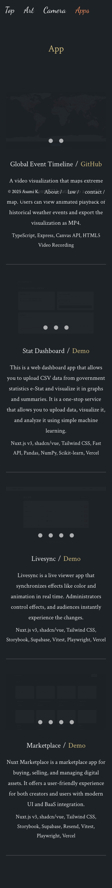

# Webapp Test Report

**Target URL:** https://asami.tokyo/about
**Date:** 2025-11-20 23:08:46
**Status:** ❌ FAIL

## 1. Test Plan
はい、QAエンジニアとして、提供されたURLとコンテンツに基づき、Playwrightでの自動化を意識したテストシナリオを最大10個作成します。

---

## Webページテストシナリオ：`https://asami.tokyo/about`

### 前提条件
*   テスト対象URL: `https://asami.tokyo/about`
*   ブラウザ: Chromium (Playwrightのデフォルトブラウザ)
*   Playwrightを使用して、エンドツーエンドのテストを自動化することを想定します。

### ページの主要機能
1.  **情報表示機能:** 作者のプロフィール、活動内容（アート、開発）に関するテキストコンテンツが正確に表示される。
2.  **内部ナビゲーション機能:** ヘッダーとフッターにある、サイト内の他のページへのリンクが正しく機能する。
3.  **外部リンク機能:** 「View the XXX」のような外部サイトへのリンクが正しく機能し、新しいタブ/ウィンドウで開かれる。
4.  **著作権情報表示機能:** 著作権表示が正しく表示される。

### テストシナリオ

#### 1. Aboutページの基本コンテンツ表示確認 (正常系)
*   **目的**: Aboutページが正しくロードされ、主要なタイトル、セクション見出し、説明文が表示されることを確認する。
*   **手順**:
    1.  `https://asami.tokyo/about` にアクセスする。
    2.  ページのタイトルが "About" または関連するテキストを含むことを確認する。
    3.  h1/h2などの見出し「Art」と「Development」が存在し、表示されていることを確認する。
    4.  各セクションの主要な説明テキスト（例: "I create visuals...", "I am developing..."）が存在し、表示されていることを確認する。
*   **期待される結果**: ページが正常にロードされ、指定されたタイトル、見出し、説明テキストが画面に表示されていること。
*   **Playwrightでの自動化のポイント**: `page.goto()`, `page.title()`, `page.locator().isVisible()`

#### 2. ヘッダーナビゲーションリンク動作確認 (Artページへの遷移) (正常系)
*   **目的**: ヘッダーのナビゲーションリンク（「Art」）が正しく機能し、対応するページへ遷移することを確認する。
*   **手順**:
    1.  Aboutページにアクセスする。
    2.  ヘッダーにある「Art」リンクをクリックする。
    3.  URLが `/art` (または類似のArtページURL) に変更されることを確認する。
    4.  Artページの主要なコンテンツ（例: 作品リストなど）が表示されることを確認する。
*   **期待される結果**: 「Art」ページに遷移し、URLが `/art` となり、Artページのコンテンツが表示されること。
*   **Playwrightでの自動化のポイント**: `page.click()`, `page.waitForURL()`, `page.locator().isVisible()`

#### 3. フッター内部リンク動作確認 (Contactページへの遷移) (正常系)
*   **目的**: フッターにある「contact」リンクが正しく機能し、対応するページへ遷移することを確認する。
*   **手順**:
    1.  Aboutページにアクセスする。
    2.  フッターにある「contact」リンクをクリックする。
    3.  URLが `/contact` (または類似のContactページURL) に変更されることを確認する。
    4.  Contactページの主要なコンテンツが表示されることを確認する。
*   **期待される結果**: 「Contact」ページに遷移し、URLが `/contact` となり、Contactページのコンテンツが表示されること。
*   **Playwrightでの自動化のポイント**: `page.click()`, `page.waitForURL()`, `page.locator().isVisible()`

#### 4. 「View the Works.」リンクの動作確認 (外部サイトへの遷移) (正常系)
*   **目的**: 「Art」セクションの「View the Works.」リンクが正しく外部サイトへ遷移することを確認する。
*   **手順**:
    1.  Aboutページにアクセスする。
    2.  「View the Works.」リンクをクリックする。
    3.  新しいタブ/ウィンドウが開かれることを確認する。
    4.  新しいタブ/ウィンドウのURLが期待される外部サイトのURLと一致することを確認する。
*   **期待される結果**: 新しいタブ/ウィンドウで外部サイトが開き、URLが想定されたものであること。
*   **Playwrightでの自動化のポイント**: `page.click()`, `context.waitForEvent('page')`, `newPage.url()`

#### 5. 「View the Video. ( Youtube / Vimeo )」リンクの動作確認 (外部サイトへの遷移) (正常系)
*   **目的**: 「Art」セクションの「View the Video. ( Youtube / Vimeo )」リンクが正しくYoutubeまたはVimeoのいずれかの動画サイトへ遷移することを確認する。
*   **手順**:
    1.  Aboutページにアクセスする。
    2.  「View the Video. ( Youtube / Vimeo )」リンクをクリックする。
    3.  新しいタブ/ウィンドウが開かれることを確認する。
    4.  新しいタブ/ウィンドウのURLがYoutubeまたはVimeoのいずれかのドメイン（例: `youtube.com` または `vimeo.com`）を含むことを確認する。
*   **期待される結果**: 新しいタブ/ウィンドウでYoutubeまたはVimeoサイトが開き、URLが想定されたものであること。
*   **Playwrightでの自動化のポイント**: `page.click()`, `context.waitForEvent('page')`, `newPage.url()`

#### 6. 「View the AI Prompt.」リンクの動作確認 (外部サイトへの遷移) (正常系)
*   **目的**: 「Art」セクションの「View the AI Prompt.」リンクがMediumなどのブログ記事サイトへ正しく遷移することを確認する。
*   **手順**:
    1.  Aboutページにアクセスする。
    2.  「View the AI Prompt.」リンクをクリックする。
    3.  新しいタブ/ウィンドウが開かれることを確認する。
    4.  新しいタブ/ウィンドウのURLがMediumまたは関連するブログサイトのURLを含むことを確認する。
*   **期待される結果**: 新しいタブ/ウィンドウでMediumまたは関連するブログサイトが開き、URLが想定されたものであること。
*   **Playwrightでの自動化のポイント**: `page.click()`, `context.waitForEvent('page')`, `newPage.url()`

#### 7. 「View the Code.」リンクの動作確認 (外部サイトへの遷移) (正常系)
*   **目的**: 「Development」セクションの「View the Code.」リンクがGitHubなどのコードリポジトリサイトへ正しく遷移することを確認する。
*   **手順**:
    1.  Aboutページにアクセスする。
    2.  「View the Code.」リンクをクリックする。
    3.  新しいタブ/ウィンドウが開かれることを確認する。
    4.  新しいタブ/ウィンドウのURLがGitHubまたは関連するコードリポジトリサイトのURLを含むことを確認する。
*   **期待される結果**: 新しいタブ/ウィンドウでGitHubまたは関連するコードリポジトリサイトが開き、URLが想定されたものであること。
*   **Playwrightでの自動化のポイント**: `page.click()`, `context.waitForEvent('page')`, `newPage.url()`

#### 8. 全ての外部リンクのリンク切れチェック (異常系)
*   **目的**: ページ内のすべての外部リンクが有効であり、リンク切れが発生していないことを確認する。
*   **手順**:
    1.  Aboutページにアクセスする。
    2.  ページ内のすべての`<a>`タグで`href`属性が`http://`または`https://`で始まるリンクを特定する。
    3.  各リンクの`href`属性のURLに対し、HTTPリクエストを送信する（実際のページ遷移は行わない）。
    4.  各リクエストのHTTPステータスコードが200（OK）または3xx（リダイレクト）であることを確認する。
*   **期待される結果**: 全ての外部リンクのURLが有効であり、HTTPステータスコードが200または3xxであること。
*   **Playwrightでの自動化のポイント**: `page.locator('a[href^="http"]').evaluateAll`, `page.request.get`

#### 9. コピーライト表示の確認 (正常系)
*   **目的**: フッターに正しい著作権情報と現在の年号（または翌年の年号）が表示されていることを確認する。
*   **手順**:
    1.  Aboutページにアクセスする。
    2.  フッターエリアに「© 2025 Asami K.」というテキストが存在し、表示されていることを確認する。
    3.  表示されている年号が、現在の年または将来の年（今回の場合は2025）であることを確認する。
*   **期待される結果**: フッターに「© 2025 Asami K.」というテキストが正しく表示されていること。
*   **Playwrightでの自動化のポイント**: `page.locator().textContent().then(text => expect(text).toContain('© 2025 Asami K.'))`

#### 10. レスポンシブデザインの基本的な確認 (モバイルビューポート) (境界値/非機能)
*   **目的**: スマートフォン相当のビューポートサイズで、Aboutページが適切に表示され、コンテンツの崩れがないことを確認する。
*   **手順**:
    1.  Aboutページにアクセスする。
    2.  ブラウザのビューポートサイズをスマートフォン相当（例: 幅375px、高さ667px）に設定する。
    3.  主要なコンテンツ（例: Art/Developmentセクションの見出し、テキスト）が画面からはみ出さずに表示されていることを確認する。
    4.  ヘッダーやフッターのナビゲーションがモバイルに適した形（例: ハンバーガーメニュー、積み重ね表示）で表示されていることを確認する（もし実装されていれば）。
*   **期待される結果**: ページコンテンツがモバイルビューポート内で適切にレイアウトされ、情報が読みやすく、主要な要素にアクセス可能であること。
*   **Playwrightでの自動化のポイント**: `page.setViewportSize()`, `page.locator().isVisible()`, `page.screenshot()` (視覚回帰テストを組み合わせるとより効果的)

---

## 2. Execution Result
**Return Code:** 124

### Stdout
```text
b'============================= test session starts ==============================\nplatform darwin -- Python 3.11.5, pytest-8.4.2, pluggy-1.6.0\nrootdir: /Users/asami/develop/app/ai-agent\nplugins: base-url-2.1.0, playwright-0.7.1\ncollected 10 items\n\ntests/generated/20251120_225329_asami_tokyo/test_asami_tokyo_about.py FF [ 20%]\nFFF'
```

### Stderr
```text

TimeoutExpired: Test execution exceeded 120 seconds.
```

## 3. Screenshots

**Total Screenshots:** 15

### 01 About Page Initial Load


### 03 Navigated To Contact Page


### Apps-Mobile-Layout


### Fail Test 02 Global Nav Top Link


### Fail Test 03 Global Nav Art Link


### Fail Test 04 Global Nav Apps Link


### Test 1 Basic Display Art Page


### Test 3 Artwork Images And Alt


### Test 4 Footer Links About Page After Click


### Test 4 Footer Links Art Page Before Click


### Test 5 Mobile Viewport


### Test 6 Copyright Notice


### Test 7 Tools Display


### Test 8 404 Page


### Test 9 Image Load Failure


