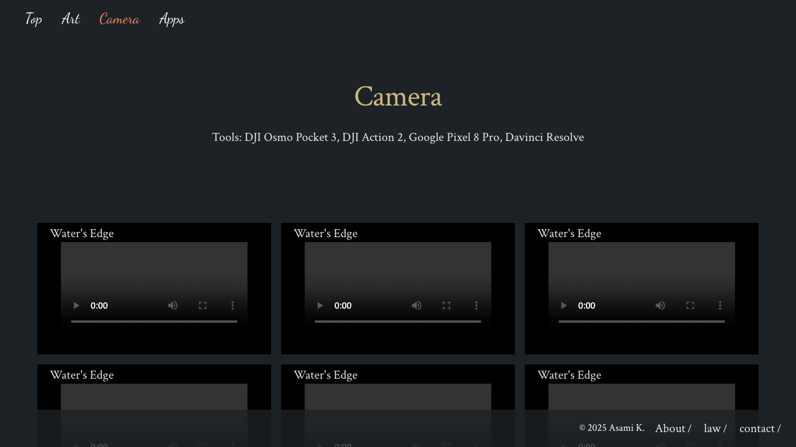

# Webapp Test Report

**Target URL:** https://asami.tokyo/camera
**Date:** 2025-11-20 23:02:30
**Status:** ❌ FAIL

## 1. Test Plan
QAエンジニアとして、提供されたWebページ「https://asami.tokyo/camera」のテストシナリオを以下に作成します。Playwrightでの自動化を念頭に置き、最も重要な10個のテストケースに絞り込みました。

---

## ページ分析と主要機能

提供されたコンテンツとURLから、以下の主要な機能を特定しました。

*   **グローバルナビゲーション:** 「Top」「Art」「Camera」「Apps」といった主要ページへのリンク。
*   **メインコンテンツ表示:** 「Tools」セクションのテキスト情報、および複数の写真コンテンツ（「Water's Edge」など）の表示。
*   **フッターナビゲーション:** 「About」「law」「contact」といった補助的なページへのリンク。
*   **著作権表示:** ページ最下部に表示される著作権情報。

このページは比較的静的であり、フォーム入力や複雑なインタラクションは含まれていないと想定されます。そのため、主にリンクの動作、コンテンツの可視性、および正確性を検証するテストケースに焦点を当てます。

## テストシナリオ

### 1. [正常系] ページロードと主要コンテンツの表示

*   **目的:** 「Camera」ページが正常にロードされ、期待される主要なテキストコンテンツおよび画像コンテンツのプレースホルダーが正しく表示されることを確認する。
*   **手順:**
    1.  ブラウザで `https://asami.tokyo/camera` にアクセスする。
    2.  ページのURLが正しいことを確認する。
    3.  ページのタイトルに「Camera」またはサイト名が含まれていることを確認する。
    4.  「Tools: DJI Osmo Pocket 3, DJI Action 2, Google Pixel 8 Pro, Davinci Resolve」というテキストが表示されていることを確認する。
    5.  「Water's Edge」など、コンテンツリストに含まれる複数の項目（画像キャプションまたは画像自体）が可視状態であることを確認する。
*   **期待される結果:**
    *   ページがエラーなくロードされ、URLが `https://asami.tokyo/camera` である。
    *   ページのタイトルに「Camera」関連の文字列が含まれている。
    *   「Tools: DJI Osmo Pocket 3, DJI Action 2, Google Pixel 8 Pro, Davinci Resolve」のテキストが画面上に可視状態で存在する。
    *   複数のコンテンツ項目（例: 「Water's Edge」）が画面上に可視状態で存在する。
*   **Playwrightで自動化可能なポイント:** `page.goto()`, `expect(page).toHaveURL()`, `expect(page).toHaveTitle()`, `expect(page.locator('text="Tools: DJI Osmo Pocket 3..."')).toBeVisible()`, `expect(page.locator('text="Water\'s Edge"').first()).toBeVisible()`

### 2. [正常系] グローバルナビゲーション「Top」への遷移

*   **目的:** ヘッダーの「Top」リンクが正しく機能し、ウェブサイトのトップページへ遷移することを確認する。
*   **手順:**
    1.  `https://asami.tokyo/camera` にアクセスする。
    2.  ヘッダーナビゲーション内の「Top」リンクをクリックする。
*   **期待される結果:**
    *   ページが `https://asami.tokyo/` へ遷移する。
*   **Playwrightで自動化可能なポイント:** `page.locator('text="Top"').click()`, `expect(page).toHaveURL('https://asami.tokyo/')`

### 3. [正常系] グローバルナビゲーション「Art」への遷移

*   **目的:** ヘッダーの「Art」リンクが正しく機能し、対応する「Art」ページへ遷移することを確認する。
*   **手順:**
    1.  `https://asami.tokyo/camera` にアクセスする。
    2.  ヘッダーナビゲーション内の「Art」リンクをクリックする。
*   **期待される結果:**
    *   ページが `https://asami.tokyo/art` へ遷移する。
*   **Playwrightで自動化可能なポイント:** `page.locator('text="Art"').click()`, `expect(page).toHaveURL('https://asami.tokyo/art')`

### 4. [正常系] グローバルナビゲーション「Apps」への遷移

*   **目的:** ヘッダーの「Apps」リンクが正しく機能し、対応する「Apps」ページへ遷移することを確認する。
*   **手順:**
    1.  `https://asami.tokyo/camera` にアクセスする。
    2.  ヘッダーナビゲーション内の「Apps」リンクをクリックする。
*   **期待される結果:**
    *   ページが `https://asami.tokyo/apps` へ遷移する。
*   **Playwrightで自動化可能なポイント:** `page.locator('text="Apps"').click()`, `expect(page).toHaveURL('https://asami.tokyo/apps')`

### 5. [正常系] 現在のページ「Camera」のナビゲーション表示

*   **目的:** 現在のページ（Camera）に対応するグローバルナビゲーション要素が、適切にアクティブ状態を示すか、または再クリックで同じページに留まることを確認する。
*   **手順:**
    1.  `https://asami.tokyo/camera` にアクセスする。
    2.  ヘッダーナビゲーション内の「Camera」要素を探し、そのスタイルやクリック挙動を確認する。
*   **期待される結果:**
    *   「Camera」要素がヘッダーナビゲーションに存在し、クリックしてもURLが変わらない（現在のページに留まる）か、または現在のページを示すアクティブなスタイルが適用されている。
*   **Playwrightで自動化可能なポイント:** `page.locator('text="Camera"').click()`, `expect(page).toHaveURL('https://asami.tokyo/camera')` (URLが変わらないことを検証), または `expect(page.locator('text="Camera"')).toHaveCSS('color', 'rgb(..., ..., ...)')` (アクティブスタイルの色などを検証)

### 6. [正常系] フッター「About」リンクへの遷移

*   **目的:** フッターの「About」リンクが正しく機能し、対応するページへ遷移することを確認する。
*   **手順:**
    1.  `https://asami.tokyo/camera` にアクセスする。
    2.  フッターナビゲーション内の「About」リンクをクリックする。
*   **期待される結果:**
    *   ページが `https://asami.tokyo/about` へ遷移する。
*   **Playwrightで自動化可能なポイント:** `page.locator('text="About"').click()`, `expect(page).toHaveURL('https://asami.tokyo/about')`

### 7. [正常系] フッター「law」リンクへの遷移

*   **目的:** フッターの「law」リンクが正しく機能し、対応するページへ遷移することを確認する。
*   **手順:**
    1.  `https://asami.tokyo/camera` にアクセスする。
    2.  フッターナビゲーション内の「law」リンクをクリックする。
*   **期待される結果:**
    *   ページが `https://asami.tokyo/law` へ遷移する。
*   **Playwrightで自動化可能なポイント:** `page.locator('text="law"').click()`, `expect(page).toHaveURL('https://asami.tokyo/law')`

### 8. [正常系] フッター「contact」リンクへの遷移

*   **目的:** フッターの「contact」リンクが正しく機能し、対応するページへ遷移することを確認する。
*   **手順:**
    1.  `https://asami.tokyo/camera` にアクセスする。
    2.  フッターナビゲーション内の「contact」リンクをクリックする。
*   **期待される結果:**
    *   ページが `https://asami.tokyo/contact` へ遷移する。
*   **Playwrightで自動化可能なポイント:** `page.locator('text="contact"').click()`, `expect(page).toHaveURL('https://asami.tokyo/contact')`

### 9. [異常系/境界値] 著作権表示の正確性

*   **目的:** ページフッターに表示される著作権情報（特に年号）が最新かつ正確であることを確認する。
*   **手順:**
    1.  `https://asami.tokyo/camera` にアクセスする。
    2.  フッターに表示されている著作権表示のテキストを取得する。
*   **期待される結果:**
    *   著作権表示のテキストが「© 2025 Asami K.」と正確に一致する。
*   **Playwrightで自動化可能なポイント:** `expect(page.locator('text=/© \\d{4} Asami K\\./')).toHaveText('© 2025 Asami K.')` (正規表現でのマッチングと具体的な年号の検証)

### 10. [異常系/境界値] メインコンテンツ画像の読み込み検証

*   **目的:** ページ内に表示される主要な画像コンテンツが、全て正しく読み込まれて表示されていることを確認する。破損した画像や読み込みに失敗した画像がないことを検証する。
*   **手順:**
    1.  `https://asami.tokyo/camera` にアクセスする。
    2.  ページ内のすべての `` 要素を特定する。
    3.  各 `` 要素について、その `naturalWidth` と `naturalHeight` が0より大きいことを検証し、画像が正常にデコードされたかを確認する。
*   **期待される結果:**
    *   ページ内の全ての主要な `` 要素が正常にロードされ、自然な幅と高さ（`naturalWidth > 0` および `naturalHeight > 0`）を持っている。
*   **Playwrightで自動化可能なポイント:** `await page.locator('img').all().then(images => Promise.all(images.map(img => expect(img.evaluate(e => e.naturalWidth > 0 && e.naturalHeight > 0))).toBeTruthy())));` (全ての `` タグに対して画像を評価)

---

## 2. Execution Result
**Return Code:** 124

### Stdout
```text
b'============================= test session starts ==============================\nplatform darwin -- Python 3.11.5, pytest-8.4.2, pluggy-1.6.0\nrootdir: /Users/asami/develop/app/ai-agent\nplugins: base-url-2.1.0, playwright-0.7.1\ncollected 10 items\n\ntests/generated/20251120_225329_asami_tokyo/test_asami_tokyo_camera.py . [ 10%]\nFFF'
```

### Stderr
```text

TimeoutExpired: Test execution exceeded 120 seconds.
```

## 3. Screenshots

**Total Screenshots:** 12

### Fail Test 02 Global Nav Top Link


### Fail Test 03 Global Nav Art Link


### Fail Test 04 Global Nav Apps Link


### Test 1 Basic Display Art Page


### Test 3 Artwork Images And Alt


### Test 4 Footer Links About Page After Click


### Test 4 Footer Links Art Page Before Click


### Test 5 Mobile Viewport


### Test 6 Copyright Notice


### Test 7 Tools Display


### Test 8 404 Page


### Test 9 Image Load Failure


