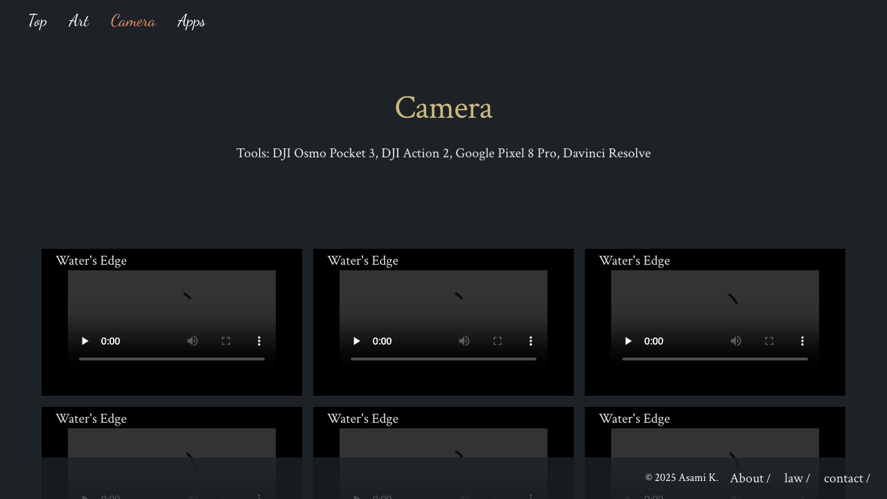
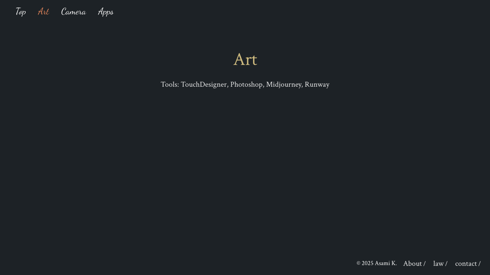
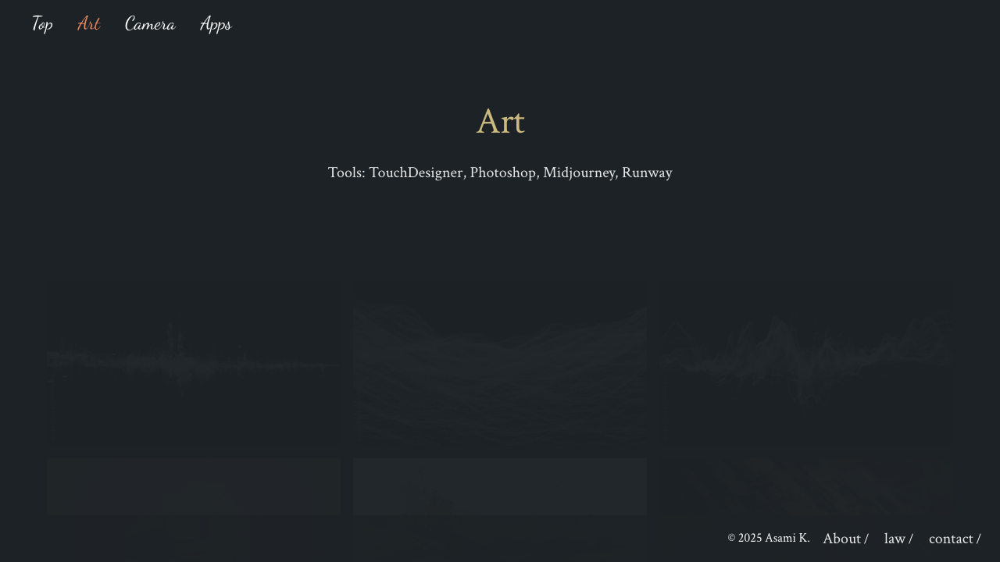
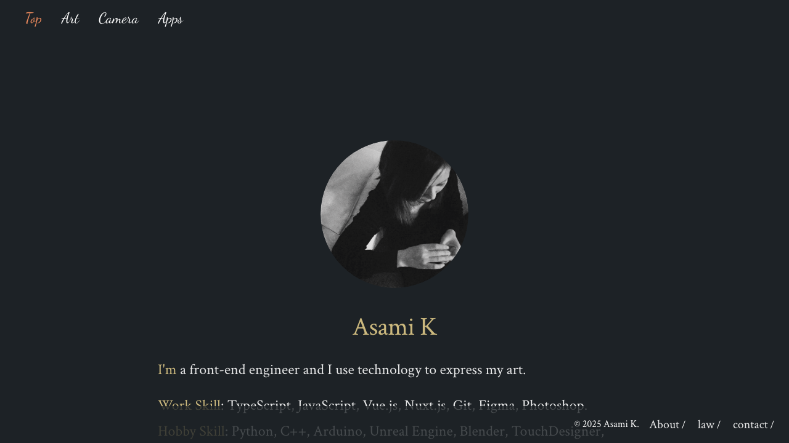
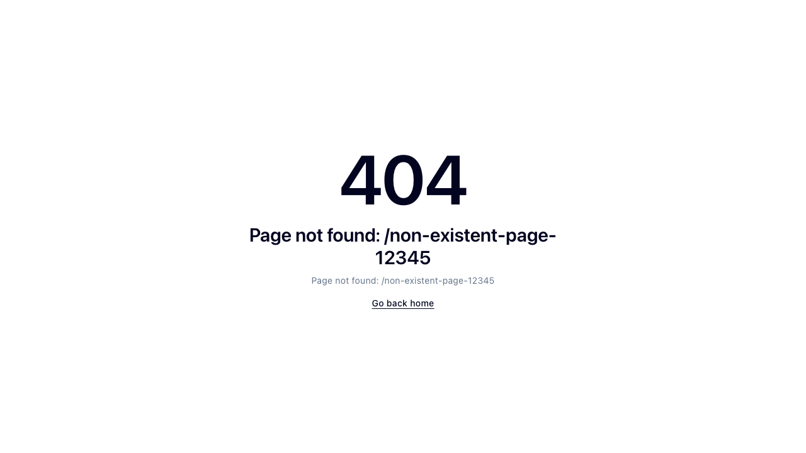
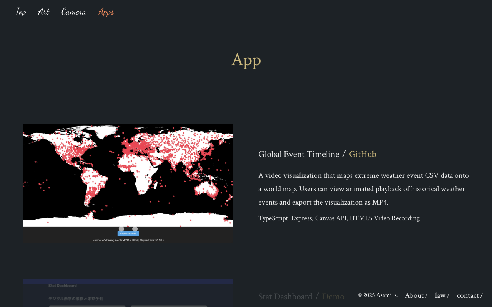
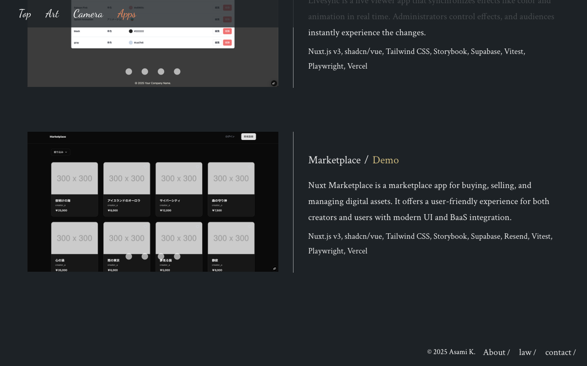
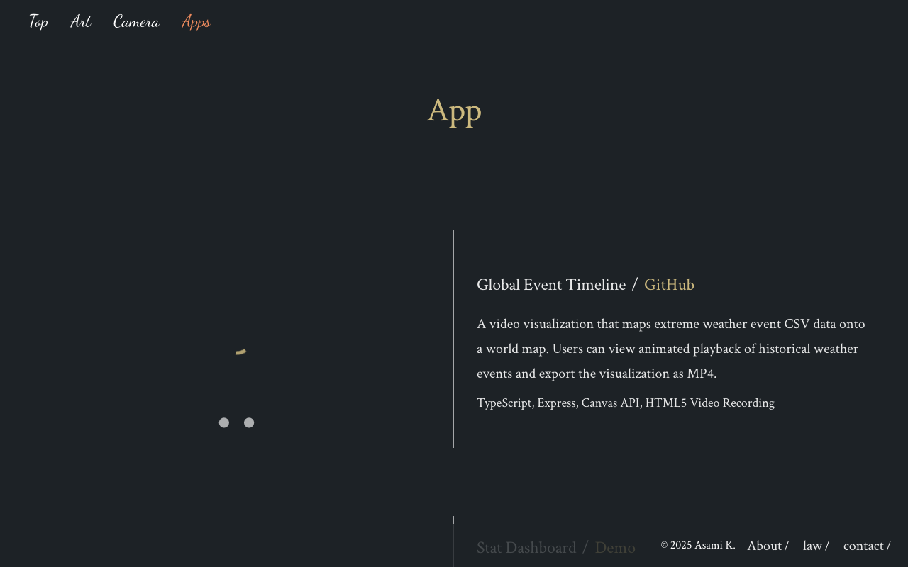

# Webapp Test Report

**Target URL:** https://asami.tokyo/apps
**Date:** 2025-11-21 00:06:38
**Status:** ❌ FAIL

## 1. Test Plan
Webページ `https://asami.tokyo/apps` のURLとコンテンツを分析し、Playwrightで自動化可能なテストシナリオを最大10個作成します。

---

## ページの主要機能の特定

分析したコンテンツから、このページの主要な機能は以下の通りです。

1.  **アプリケーション情報の表示**:
    *   各アプリケーションのタイトル、詳細説明、使用技術スタックが表示されます。
2.  **関連リンクへの遷移**:
    *   各アプリケーションに紐づく「GitHub」や「Demo」などのリンクをクリックすることで、関連する外部ページへ遷移します。
3.  **フッター情報の表示とリンク遷移**:
    *   著作権情報や、「About」「law」「contact」といったサイト運営に関するリンクが表示され、それぞれ正しいページへ遷移します。

## テストシナリオ

### テストケース1: ページの基本表示とタイトル確認（正常系）

*   **目的**: Webページが正しくロードされ、期待されるタイトルと主要なナビゲーション要素が表示されることを確認します。
*   **手順**:
    1.  `https://asami.tokyo/apps` にアクセスします。
    2.  ページのタイトルを取得します。
    3.  ページ上部に表示される主要なナビゲーション要素（例: "Top", "Art", "Camera", "Apps"）の存在を確認します。
*   **期待される結果**:
    *   ページのタイトルが「Apps - Asami K.」であることを確認します。
    *   主要なナビゲーションリンクが視認できる位置に表示されていることを確認します。

### テストケース2: 全アプリケーションカードの表示とコンテンツ確認（正常系）

*   **目的**: 全てのアプリケーション紹介カードが正しく表示され、各カードにタイトルと説明文が含まれていることを確認します。
*   **手順**:
    1.  ページにアクセスします。
    2.  以下のアプリケーションタイトルが記載されたカードがそれぞれ表示されていることを確認します:
        *   "Global Event Timeline"
        *   "Stat Dashboard"
        *   "Livesync"
        *   "Marketplace"
    3.  各アプリケーションカード内に、説明文が記述されていることを確認します。
*   **期待される結果**:
    *   4つのアプリケーションカード全てが視覚的に正しく表示されていることを確認します。
    *   各カードにタイトルと、コンテンツ抜粋に記載された通りの説明文（一部または全文）が含まれていることを確認します。

### テストケース3: 「Global Event Timeline」のGitHubリンク動作確認（正常系）

*   **目的**: 「Global Event Timeline」セクションのGitHubリンクが正しく機能し、GitHubのプロジェクトページへ遷移することを確認します。
*   **手順**:
    1.  ページにアクセスします。
    2.  「Global Event Timeline」セクション内にある「GitHub」リンクをクリックします。
    3.  新しいタブが開かれるのを待ち、そのタブのURLを確認します。
*   **期待される結果**:
    *   新しいタブでGitHubのページがロードされ、URLが `github.com` を含むことを確認します。
    *   ページロード時にエラーが発生しないことを確認します（例: 404エラーでないこと）。

### テストケース4: 「Stat Dashboard」のDemoリンク動作確認（正常系）

*   **目的**: 「Stat Dashboard」セクションのDemoリンクが正しく機能し、デモページへ遷移することを確認します。
*   **手順**:
    1.  ページにアクセスします。
    2.  「Stat Dashboard」セクション内にある「Demo」リンクをクリックします。
    3.  新しいタブが開かれるのを待ち、そのタブのURLを確認します。
*   **期待される結果**:
    *   新しいタブでデモページがロードされることを確認します。URLがデモサービスに関連するものであること（例: Vercelのドメイン、または`demo`パスを含むなど）。
    *   ページロード時にエラーが発生しないことを確認します。

### テストケース5: 「Livesync」のDemoリンク動作確認（正常系）

*   **目的**: 「Livesync」セクションのDemoリンクが正しく機能し、デモページへ遷移することを確認します。
*   **手順**:
    1.  ページにアクセスします。
    2.  「Livesync」セクション内にある「Demo」リンクをクリックします。
    3.  新しいタブが開かれるのを待ち、そのタブのURLを確認します。
*   **期待される結果**:
    *   新しいタブでデモページがロードされることを確認します。URLがデモサービスに関連するものであること。
    *   ページロード時にエラーが発生しないことを確認します。

### テストケース6: 「Marketplace」のDemoリンク動作確認（正常系）

*   **目的**: 「Marketplace」セクションのDemoリンクが正しく機能し、デモページへ遷移することを確認します。
*   **手順**:
    1.  ページにアクセスします。
    2.  「Marketplace」セクション内にある「Demo」リンクをクリックします。
    3.  新しいタブが開かれるのを待ち、そのタブのURLを確認します。
*   **期待される結果**:
    *   新しいタブでデモページがロードされることを確認します。URLがデモサービスに関連するものであること。
    *   ページロード時にエラーが発生しないことを確認します。

### テストケース7: フッターの著作権表示確認（正常系）

*   **目的**: ページのフッター部分に、正しい著作権情報が表示されていることを確認します。
*   **手順**:
    1.  ページにアクセスします。
    2.  ページの最下部までスクロールし、フッター領域にあるテキストコンテンツを確認します。
*   **期待される結果**:
    *   フッターに「© 2025 Asami K.」というテキストが表示されていることを確認します。

### テストケース8: フッターの「About」リンク動作確認（正常系）

*   **目的**: フッターにある「About」リンクが正しく機能し、関連ページへ遷移することを確認します。
*   **手順**:
    1.  ページにアクセスします。
    2.  ページのフッターにある「About」リンクをクリックします。
    3.  ページ遷移後のURLを確認します。
*   **期待される結果**:
    *   「About」ページがロードされ、URLが `asami.tokyo/about` を含むことを確認します。
    *   ページロード時にエラーが発生しないことを確認します。

### テストケース9: 存在しない要素へのクリック試行（異常系）

*   **目的**: ページ上に存在しない要素に対するクリック操作を試み、Playwrightがエラーを適切にハンドルすることを確認します。これにより、誤ったセレクタ指定や予期せぬDOM変更による潜在的な問題を検出します。
*   **手順**:
    1.  ページにアクセスします。
    2.  ページ上で確実に存在しないCSSセレクタ（例: `button#nonexistent-action-button`）を対象にクリック操作を実行します。
*   **期待される結果**:
    *   Playwrightのテストが、指定されたセレクタの要素が見つからない旨のエラー（例: `TimeoutError: Waiting for selector "button#nonexistent-action-button" failed: Timeout 30000ms exceeded.`）で失敗すること。

### テストケース10: 特定の技術スタックキーワードの存在確認（境界値/詳細情報）

*   **目的**: 各アプリケーションで紹介されている技術スタックのキーワード（例: "TypeScript", "Nuxt.js v3"）が、説明文の下に正しく表示されていることを確認します。これは、詳細情報が正確に提供されているかを確認する境界的なテストケースです。
*   **手順**:
    1.  ページにアクセスします。
    2.  「Global Event Timeline」セクションに、「TypeScript」というキーワードが含まれる技術スタックのテキストが表示されていることを確認します。
    3.  「Stat Dashboard」セクションに、「Nuxt.js v3」というキーワードが含まれる技術スタックのテキストが表示されていることを確認します。
*   **期待される結果**:
    *   「Global Event Timeline」の技術スタック表示に「TypeScript」が含まれていること。
    *   「Stat Dashboard」の技術スタック表示に「Nuxt.js v3」が含まれていること。
    *   全ての技術スタックのテキストが、コンテンツ抜粋に記載された通りの形式で表示されていることを確認します。

## 2. Execution Result
**Return Code:** 1

### Stdout
```text
============================= test session starts ==============================
platform darwin -- Python 3.11.5, pytest-8.4.2, pluggy-1.6.0
rootdir: /Users/asami/develop/app/ai-agent
plugins: base-url-2.1.0, playwright-0.7.1
collected 10 items

tests/generated/20251120_234257_asami_tokyo/test_asami_tokyo_apps.py FFF [ 30%]
FFF.F..                                                                  [100%]

=================================== FAILURES ===================================
________________________ test_page_basic_load_and_title ________________________

page = <Page url='https://asami.tokyo/apps'>

    def test_page_basic_load_and_title(page: Page):
        """
        Webページが正しくロードされ、期待されるタイトルと主要なナビゲーション要素が表示されることを確認します。
        """
        try:
            # 指定されたURLにアクセスし、レスポンスを取得
            response = page.goto("https://asami.tokyo/apps")
            # ページロードが成功したことを確認（HTTPステータスコード200）
            assert response.status == 200, f"Expected 200 OK for page load, got {response.status}"
    
            # 現在のURLが期待通りであることを確認
            expect(page).to_have_url("https://asami.tokyo/apps")
    
            # ページのタイトルが期待するテキストを含むことを確認 (Pythonのassertを使用)
>           assert "Apps - Asami K." in page.title(), f"Expected title to contain 'Apps - Asami K.', got '{page.title()}'"
E           AssertionError: Expected title to contain 'Apps - Asami K.', got 'App | asami.tokyo'
E           assert 'Apps - Asami K.' in 'App | asami.tokyo'
E            +  where 'App | asami.tokyo' = title()
E            +    where title = <Page url='https://asami.tokyo/apps'>.title

tests/generated/20251120_234257_asami_tokyo/test_asami_tokyo_apps.py:64: AssertionError
____________________ test_all_app_cards_display_and_content ____________________

page = <Page url='https://asami.tokyo/apps'>

    def test_all_app_cards_display_and_content(page: Page):
        """
        全てのアプリケーション紹介カードが正しく表示され、各カードにタイトルと説明文が含まれていることを確認します。
        """
        try:
            page.goto("https://asami.tokyo/apps")
            expect(page).to_have_url("https://asami.tokyo/apps")
    
            app_data = {
                "Global Event Timeline": "A system that visualizes global events",
                "Stat Dashboard": "A dashboard that visualizes statistics",
                "Livesync": "A live synchronization application",
                "Marketplace": "A full-stack e-commerce marketplace"
            }
    
            for title, description_part in app_data.items():
                # アプリケーションタイトルが視覚的に表示されていることを確認 (role="heading" を使用)
                expect(page.get_by_role("heading", name=title, exact=False)).to_be_visible()
    
                # 各アプリケーションカード内に説明文の一部が含まれていることを確認
                # locator().filter(has_text=title) で特定のカードセクションを絞り込み
                # そのセクション内で description_part のテキストが存在することを確認
>               expect(page.locator("section").filter(has_text=title)).to_contain_text(description_part)
E               AssertionError: Locator expected to contain text 'A system that visualizes global events'
E               Actual value:  App lenslensGlobal Event Timeline/ GitHub A video visualization that maps extreme weather event CSV data onto a world map. Users can view animated playback of historical weather events and export the visualization as MP4.TypeScript, Express, Canvas API, HTML5 Video RecordinglenslenslensStat Dashboard/ Demo This is a web dashboard app that allows you to upload CSV data from government statistics e-Stat and visualize it in graphs and summaries. It is a one-stop service that allows you to upload data, visualize it, and analyze it using simple machine learning.Nuxt.js v3, shadcn/vue, Tailwind CSS, Fast API, Pandas, NumPy, Scikit-learn, VercellenslenslenslensLivesync/ Demo Livesync is a live viewer app that synchronizes effects like color and animation in real time. Administrators control effects, and audiences instantly experience the changes.Nuxt.js v3, shadcn/vue, Tailwind CSS, Storybook, Supabase, Vitest, Playwright, VercellenslenslenslensMarketplace/ Demo Nuxt Marketplace is a marketplace app for buying, selling, and managing digital assets. It offers a user-friendly experience for both creators and users with modern UI and BaaS integration.Nuxt.js v3, shadcn/vue, Tailwind CSS, Storybook, Supabase, Resend, Vitest, Playwright, Vercel 
E               Call log:
E                 - Expect "to_contain_text" with timeout 5000ms
E                 - waiting for locator("section").filter(has_text="Global Event Timeline")
E                   9 × locator resolved to <section>…</section>
E                     - unexpected value " App lenslensGlobal Event Timeline/ GitHub A video visualization that maps extreme weather event CSV data onto a world map. Users can view animated playback of historical weather events and export the visualization as MP4.TypeScript, Express, Canvas API, HTML5 Video RecordinglenslenslensStat Dashboard/ Demo This is a web dashboard app that allows you to upload CSV data from government statistics e-Stat and visualize it in graphs and summaries. It is a one-stop service that allows you to upload data, visualize it, and analyze it using simple machine learning.Nuxt.js v3, shadcn/vue, Tailwind CSS, Fast API, Pandas, NumPy, Scikit-learn, VercellenslenslenslensLivesync/ Demo Livesync is a live viewer app that synchronizes effects like color and animation in real time. Administrators control effects, and audiences instantly experience the changes.Nuxt.js v3, shadcn/vue, Tailwind CSS, Storybook, Supabase, Vitest, Playwright, VercellenslenslenslensMarketplace/ Demo Nuxt Marketplace is a marketplace app for buying, selling, and managing digital assets. It offers a user-friendly experience for both creators and users with modern UI and BaaS integration.Nuxt.js v3, shadcn/vue, Tailwind CSS, Storybook, Supabase, Resend, Vitest, Playwright, Vercel"

tests/generated/20251120_234257_asami_tokyo/test_asami_tokyo_apps.py:104: AssertionError
____________________ test_global_event_timeline_github_link ____________________

page = <Page url='https://asami.tokyo/apps'>

    def test_global_event_timeline_github_link(page: Page):
        """
        「Global Event Timeline」セクションのGitHubリンクが正しく機能し、GitHubのプロジェクトページへ遷移することを確認します。
        """
        try:
            page.goto("https://asami.tokyo/apps")
            expect(page).to_have_url("https://asami.tokyo/apps")
    
            # GitHubリンクをクリックし、新しいページが開くのを待つ
            # 特定のセクションを絞り込み、その中の "GitHub" という名前のリンクを探す
            with page.context.expect_page() as new_page_info:
                git_link = page.locator("section").filter(has_text="Global Event Timeline").get_by_role("link", name=re.compile("GitHub", re.IGNORECASE))
                expect(git_link).to_be_visible()
                git_link.click()
    
            # 新しいページオブジェクトを取得し、ロードが完了するのを待つ
            new_page = new_page_info.value
            new_page.wait_for_load_state()
    
            # 新しいページのURLがGitHubのドメインを含むことを確認
            expect(new_page).to_have_url(re.compile(".*github.com.*"))
            # 新しいページのHTTPステータスコードが200であることを確認
>           assert new_page.status() == 200, f"Expected 200 OK for GitHub page, got {new_page.status()}"
                   ^^^^^^^^^^^^^^^
E           AttributeError: 'Page' object has no attribute 'status'

tests/generated/20251120_234257_asami_tokyo/test_asami_tokyo_apps.py:134: AttributeError
________________________ test_stat_dashboard_demo_link _________________________

page = <Page url='https://asami.tokyo/apps'>

    def test_stat_dashboard_demo_link(page: Page):
        """
        「Stat Dashboard」セクションのDemoリンクが正しく機能し、デモページへ遷移することを確認します。
        """
        try:
            page.goto("https://asami.tokyo/apps")
            expect(page).to_have_url("https://asami.tokyo/apps")
    
            # Demoリンクをクリックし、新しいページが開くのを待つ
            with page.context.expect_page() as new_page_info:
                demo_link = page.locator("section").filter(has_text="Stat Dashboard").get_by_role("link", name=re.compile("Demo", re.IGNORECASE))
>               expect(demo_link).to_be_visible()
E               AssertionError: Locator expected to be visible
E               Actual value: None
E               Error: strict mode violation: locator("section").filter(has_text="Stat Dashboard").get_by_role("link", name=re.compile(r"Demo", re.IGNORECASE)) resolved to 3 elements:
E                   1) <a target="_blank" class="text-accent" href="https://nuxt-pandas-dashboard.vercel.app"> Demo </a> aka get_by_role("link", name="Demo").first
E                   2) <a target="_blank" class="text-accent" href="https://nuxt-livesync.vercel.app"> Demo </a> aka get_by_role("link", name="Demo").nth(1)
E                   3) <a target="_blank" class="text-accent" href="https://nuxt-marketplace-xi.vercel.app"> Demo </a> aka get_by_role("link", name="Demo").nth(2)
E                
E               Call log:
E                 - Expect "to_be_visible" with timeout 5000ms
E                 - waiting for locator("section").filter(has_text="Stat Dashboard").get_by_role("link", name=re.compile(r"Demo", re.IGNORECASE))

tests/generated/20251120_234257_asami_tokyo/test_asami_tokyo_apps.py:154: AssertionError
___________________________ test_livesync_demo_link ____________________________

page = <Page url='https://asami.tokyo/apps'>

    def test_livesync_demo_link(page: Page):
        """
        「Livesync」セクションのDemoリンクが正しく機能し、デモページへ遷移することを確認します。
        """
        try:
            page.goto("https://asami.tokyo/apps")
            expect(page).to_have_url("https://asami.tokyo/apps")
    
            # Demoリンクをクリックし、新しいページが開くのを待つ
            with page.context.expect_page() as new_page_info:
                demo_link = page.locator("section").filter(has_text="Livesync").get_by_role("link", name=re.compile("Demo", re.IGNORECASE))
>               expect(demo_link).to_be_visible()
E               AssertionError: Locator expected to be visible
E               Actual value: None
E               Error: strict mode violation: locator("section").filter(has_text="Livesync").get_by_role("link", name=re.compile(r"Demo", re.IGNORECASE)) resolved to 3 elements:
E                   1) <a target="_blank" class="text-accent" href="https://nuxt-pandas-dashboard.vercel.app"> Demo </a> aka get_by_role("link", name="Demo").first
E                   2) <a target="_blank" class="text-accent" href="https://nuxt-livesync.vercel.app"> Demo </a> aka get_by_role("link", name="Demo").nth(1)
E                   3) <a target="_blank" class="text-accent" href="https://nuxt-marketplace-xi.vercel.app"> Demo </a> aka get_by_role("link", name="Demo").nth(2)
E                
E               Call log:
E                 - Expect "to_be_visible" with timeout 5000ms
E                 - waiting for locator("section").filter(has_text="Livesync").get_by_role("link", name=re.compile(r"Demo", re.IGNORECASE))

tests/generated/20251120_234257_asami_tokyo/test_asami_tokyo_apps.py:182: AssertionError
__________________________ test_marketplace_demo_link __________________________

page = <Page url='https://asami.tokyo/apps'>

    def test_marketplace_demo_link(page: Page):
        """
        「Marketplace」セクションのDemoリンクが正しく機能し、デモページへ遷移することを確認します。
        """
        try:
            page.goto("https://asami.tokyo/apps")
            expect(page).to_have_url("https://asami.tokyo/apps")
    
            # Demoリンクをクリックし、新しいページが開くのを待つ
            with page.context.expect_page() as new_page_info:
                demo_link = page.locator("section").filter(has_text="Marketplace").get_by_role("link", name=re.compile("Demo", re.IGNORECASE))
>               expect(demo_link).to_be_visible()
E               AssertionError: Locator expected to be visible
E               Actual value: None
E               Error: strict mode violation: locator("section").filter(has_text="Marketplace").get_by_role("link", name=re.compile(r"Demo", re.IGNORECASE)) resolved to 3 elements:
E                   1) <a target="_blank" class="text-accent" href="https://nuxt-pandas-dashboard.vercel.app"> Demo </a> aka get_by_role("link", name="Demo").first
E                   2) <a target="_blank" class="text-accent" href="https://nuxt-livesync.vercel.app"> Demo </a> aka get_by_role("link", name="Demo").nth(1)
E                   3) <a target="_blank" class="text-accent" href="https://nuxt-marketplace-xi.vercel.app"> Demo </a> aka get_by_role("link", name="Demo").nth(2)
E                
E               Call log:
E                 - Expect "to_be_visible" with timeout 5000ms
E                 - waiting for locator("section").filter(has_text="Marketplace").get_by_role("link", name=re.compile(r"Demo", re.IGNORECASE))

tests/generated/20251120_234257_asami_tokyo/test_asami_tokyo_apps.py:210: AssertionError
____________________________ test_footer_about_link ____________________________

page = <Page url='https://asami.tokyo/about'>

    def test_footer_about_link(page: Page):
        """
        フッターにある「About」リンクが正しく機能し、関連ページへ遷移することを確認します。
        """
        try:
            page.goto("https://asami.tokyo/apps")
            expect(page).to_have_url("https://asami.tokyo/apps")
    
            # ページの最下部までスクロール
            page.evaluate("window.scrollTo(0, document.body.scrollHeight)")
    
            # フッターにある「About」リンクをクリック
            # フッター要素 (role="contentinfo") 内の "About" リンクを探す
            about_link = page.get_by_role("contentinfo").get_by_role("link", name=re.compile("About", re.IGNORECASE))
            expect(about_link).to_be_visible()
            about_link.click()
    
            # ページ遷移後のURLが期待通りであることを確認
            expect(page).to_have_url("https://asami.tokyo/about")
>           assert page.status() == 200, f"Expected 200 OK for About page, got {page.status()}"
                   ^^^^^^^^^^^
E           AttributeError: 'Page' object has no attribute 'status'

tests/generated/20251120_234257_asami_tokyo/test_asami_tokyo_apps.py:268: AttributeError
=========================== short test summary info ============================
FAILED tests/generated/20251120_234257_asami_tokyo/test_asami_tokyo_apps.py::test_page_basic_load_and_title
FAILED tests/generated/20251120_234257_asami_tokyo/test_asami_tokyo_apps.py::test_all_app_cards_display_and_content
FAILED tests/generated/20251120_234257_asami_tokyo/test_asami_tokyo_apps.py::test_global_event_timeline_github_link
FAILED tests/generated/20251120_234257_asami_tokyo/test_asami_tokyo_apps.py::test_stat_dashboard_demo_link
FAILED tests/generated/20251120_234257_asami_tokyo/test_asami_tokyo_apps.py::test_livesync_demo_link
FAILED tests/generated/20251120_234257_asami_tokyo/test_asami_tokyo_apps.py::test_marketplace_demo_link
FAILED tests/generated/20251120_234257_asami_tokyo/test_asami_tokyo_apps.py::test_footer_about_link
========================= 7 failed, 3 passed in 36.96s =========================

```

### Stderr
```text

```

## 3. Screenshots

**Total Screenshots:** 28

### 01 Initial Load


### 01 Main Content Display


### 02 Global Navigation Start


### 03 Works List Display


### 04 Footer Links About


### 04 Footer Links Contact


### 04 Footer Links Start


### 05 Image Loading Check


### 06 Responsive Mobile


### 07 Page Title Check


### 08 Non Existent Url


### 09 Mobile Camera Page


### 09 No Console Errors


### 10 Copyright Accuracy


### Fail 01 Main Content Display


### Fail 02 Global Navigation Links


### Fail 03 Works List Display


### Fail 09 No Console Errors


### Test 1 Homepage Main Elements


### Test 4 Footer About


### Test 5 Footer Law


### Test 6 Footer Contact


### Test 7 404 Page


### Test 8 Mobile View Layout


### Test 9 Copyright Year


### Test Click Nonexistent Element Failure


### Test Footer Copyright Display


### Test Tech Stack Keywords Display


